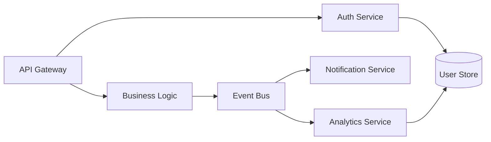

# Tiered Context Architecture: A Guideline for Designing Information Systems That AI Agents Can Efficiently Produce and Consume

## Purpose

This guideline enables you to take any corpus of informational artifacts — PRDs, specifications, code maps, research documents, architectural decision records, runbooks, or domain knowledge — and restructure it into a tiered information system that AI agents can efficiently generate, navigate, and consume on demand. The result is a context management strategy where agents load the minimum tokens required for any given task, rather than ingesting entire artifact collections into their working memory.

---

## Part 1: Theoretical Foundations

### 1.1 Why Tiered Context Matters

Large language models process context through transformer attention, where every token attends to every other token — creating n² pairwise relationships. Research on "context rot" demonstrates that as token count increases, retrieval accuracy and reasoning quality degrade in non-linear, unpredictable ways. Even models with 200K+ token windows suffer from the "lost in the middle" effect, where information in the center of large contexts is effectively invisible.

This creates a three-way pressure on monolithic artifacts:

- **Cost and latency** scale with context size — passing a 2,000-line architecture doc to every agent invocation wastes both
- **Signal degradation** — critical constraints buried in page 47 of a specification may be ignored while irrelevant boilerplate steals attention
- **Context pollution** — stale information, redundancy across artifacts, and verbose prose all consume tokens without adding signal

The solution, converged upon independently by Google's Agent Development Kit, Anthropic's context engineering research, LangChain's agent patterns, and the ACE framework from academic research, is the same: **treat context as a tiered, compiled system rather than a flat text buffer.**

### 1.2 Core Principles from the Literature

**From Google ADK's tiered architecture:**

- Separate storage from presentation — durable state and per-call working context evolve independently
- Build context through explicit, named transformations — not ad-hoc string concatenation
- Scope by default — every model call sees the minimum context required; agents reach for more via tools

**From Anthropic's context engineering guidance:**

- Context is a finite resource with diminishing marginal returns — optimize for the smallest set of high-signal tokens
- Use "just in time" retrieval — maintain lightweight identifiers (paths, queries, links) and load data at runtime
- Progressive disclosure enables incremental discovery — each interaction yields context that informs the next
- Compaction distills conversation history; structured note-taking persists state outside the window

**From the ACE framework (arXiv 2510.04618):**

- Contexts should be treated as "evolving playbooks" with structured, incremental updates
- Beware brevity bias (compression that drops domain insights) and context collapse (iterative rewriting that erodes detail)
- Modular process: generate → reflect → curate, with deterministic merge logic

**From UX progressive disclosure (Nielsen, 1995):**

- Show the most important options first; defer secondary material
- Get the right split between primary and secondary features
- Limit to 2-3 layers — deeper nesting causes disorientation
- The fact that something appears at the initial level signals its importance

### 1.3 The Four Context Operations

All context engineering strategies decompose into four operations (per LangChain/Anthropic convergent taxonomy):

| Operation | Definition | Tiered Equivalent |
|-----------|-----------|-------------------|
| **Write** | Save context outside the window for later use | Artifacts are written to tiered storage at generation time |
| **Select** | Pull relevant context into the window | Agent reads manifest → selects domain brief → loads reference |
| **Compress** | Retain only tokens required for the task | Telegraphic encoding, pipe-delimited tables, summary layers |
| **Isolate** | Partition context across specialized scopes | Each agent/sub-agent gets its own minimal working context |

---

## Part 2: The Producer-Consumer Analysis

Before designing tiers, you must understand how your artifacts are produced and consumed. This analysis is the critical step most teams skip.

### 2.1 Map Your Artifacts

For each artifact type in your corpus, capture:

| Attribute | Question |
|-----------|----------|
| **Name** | What is this artifact called? (PRD, Spec, Code Map, etc.) |
| **Producer** | Who/what creates it? (human, agent, pipeline, hybrid) |
| **Consumers** | Who/what reads it? List all agents and humans |
| **Consumption pattern** | Full read? Section lookup? Key-value extraction? Existence check? |
| **Freshness** | How often does it change? Per-sprint? Per-commit? Once? |
| **Token size** | How large is it typically? |
| **Signal density** | What fraction of its content matters for a typical consumer task? |
| **Cross-references** | What other artifacts does it link to or depend on? |

### 2.2 Identify Producer-Consumer Mismatches

The most wasteful pattern in AI-assisted workflows is **artifacts optimized for production but not consumption.** Common mismatches:

| Mismatch | Symptom | Cause |
|----------|---------|-------|
| **Prose bloat** | 2,000-token PRD where 400 tokens are actionable | Written for human stakeholder review, consumed by coding agent |
| **Monolithic scope** | Architecture doc covers 12 domains, agent only needs 1 | One artifact serves multiple consumers with different needs |
| **Redundant overlap** | Same constraint stated in PRD, spec, and code map | No single source of truth; each artifact independently authored |
| **Stale references** | Spec references API endpoints that no longer exist | Artifact updated independently of the things it references |
| **Wrong abstraction level** | Implementation agent receives business requirements prose | Producer writes for decision-makers, consumer needs technical constraints |

### 2.3 Derive the Tier Boundaries

Once you understand the mismatches, the tier boundaries become apparent. Ask these questions for each consumer:

**Tier 0 (always loaded) — "What does this consumer need to know before starting any task?"**

- Which domains exist and where to find detail
- Which constraints are absolute and cross-cutting
- What tools/capabilities are available
- What operating mode to adopt

**Tier 1 (loaded per-domain) — "What does this consumer need to know to work in a specific area?"**

- Mental model: how to think about this domain
- Invariants: constraints that must never be violated here
- Patterns: named approaches with examples
- References: where to find the full detail

**Tier 2 (loaded on demand) — "What does this consumer need only in specific situations?"**

- Complete API specifications
- Full schema definitions
- Historical decision records
- Example implementations
- Detailed procedures

---

## Part 3: Artifact Lifecycle and Temporal Strategy

The producer-consumer analysis (Part 2) tells you who makes and uses each artifact. But artifacts also have a _temporal dimension_ that fundamentally shapes how they should be tiered, indexed, and maintained. A research finding from six months ago and a PRD for the current sprint have completely different lifecycle characteristics — and treating them identically wastes tokens, creates staleness risk, and prevents agents from reasoning about what they know vs. what they don't.

Recent research on agent memory systems converges on three lifecycle operations that apply to all persistent knowledge (per the 2025 survey "Rethinking Memory in AI"):

- **Formation** — how knowledge is extracted, encoded, and stored (corresponds to artifact production + tiering)
- **Evolution** — how knowledge is consolidated, updated, or forgotten over time (corresponds to staleness management + promotion/demotion)
- **Retrieval** — how knowledge is accessed when needed (corresponds to tier selection + on-demand loading)

The critical insight from cognitive science, now being applied to agent architectures: **forgetting is not failure — it's active memory management.** Systems that never forget accumulate noise. Effective lifecycle strategies incorporate intentional decay, where the index actively signals what's stale, superseded, or no longer worth loading. Temporal Knowledge Graph research formalizes this with timestamped edges, decay/aging policies, and provenance tracking — concepts we can apply to our tiered artifact system without the graph infrastructure.

### 3.1 The Five Lifecycle Archetypes

Every artifact in your corpus fits one of five temporal patterns:

#### Archetype 1: Cumulative (Research, Knowledge Bases, Competitive Intel)

**Behavior:** Grows monotonically. New entries add to the corpus; old entries are rarely deleted but may be superseded. The corpus as a whole represents organizational memory.

**Key characteristics:**

- Each entry has a discovery/creation date that affects its reliability
- The _gaps_ — what hasn't been researched — are as valuable as what has been
- Staleness is date-driven: findings older than N months may need re-validation
- Agents need to answer "what do we already know about X?" before doing new work

**Tiering implications:**

| Tier | Content | Special Requirements |
|------|---------|---------------------|
| 0 | Topic index with dates: `\|topic\|date\|status:current/stale/superseded\|path` | Must support gap detection — agent scans index to see what's missing |
| 1 | Per-topic summary: key findings, confidence level, date, supersession chain | Include `last_validated` date and `superseded_by` pointer |
| 2 | Full research with sources, methodology, data | Immutable once published; superseded, not edited |

**Agent consumption pattern:** Before starting new research, agent loads Tier 0 topic index → identifies existing coverage and gaps → loads relevant Tier 1 summaries → decides whether to build on existing findings, re-validate stale ones, or explore gaps. This prevents the most expensive failure mode: an agent re-researching something that's already known.

**Example Tier 0 entries for a research corpus:**

```
## Research Corpus
|competitor-analysis-copilot|2025-11|current|research/competitors/copilot.md|Pricing, features, market position
|competitor-analysis-cursor|2025-08|stale|research/competitors/cursor.md|Pre-v2.0 analysis, needs refresh
|market-sizing-enterprise|2025-12|current|research/market/enterprise-sizing.md|TAM/SAM/SOM for enterprise AI tools
|regulatory-eu-ai-act|—|gap|—|No research conducted yet
```

The `gap` entry is the critical innovation: by explicitly representing what's _not_ known, you enable agents to identify research needs without negative-inference reasoning (which LLMs are poor at).

#### Archetype 2: Task-Scoped (PRDs, Sprint Plans, Implementation Tickets)

**Behavior:** Created for a specific initiative, intensely relevant during active work, then either archived or absorbed into permanent documentation. Has a clear lifecycle with discrete states.

**Key characteristics:**

- Relevance is lifecycle-state-driven, not date-driven
- A draft PRD and a shipped PRD have the same age but radically different tier positions
- Upon completion, valuable content should promote into permanent artifacts (architecture docs, runbooks)
- Dead-weight accumulation: completed task artifacts clog the index if not demoted

**Lifecycle states and tier allocation:**

| State | Tier 0 Presence | Tier 1 Presence | Notes |
|-------|----------------|----------------|-------|
| **Draft** | No | No | Not yet actionable; author's working space |
| **Active** | Yes — full entry | Yes — full brief | Primary consumer focus; constraints and acceptance criteria loaded |
| **In Review** | Yes — flagged | Yes — with review status | Agents should know review is pending before making assumptions |
| **Shipped** | Demote to archive section | Demote or remove | Content promotes into permanent docs |
| **Archived** | Remove from active manifest | Remove | Available via search but not in navigation index |

**Promotion pattern:** When a feature ships, don't just archive the PRD. Extract durable knowledge and promote it:

- Architectural decisions → ADRs (Archetype 3)
- API contracts → Technical specification (Archetype 4)
- Operational procedures → Runbooks (Archetype 4)
- Lessons learned → Research corpus (Archetype 1)

This prevents the common failure where valuable decisions are buried in completed PRDs that no agent will ever load again.

#### Archetype 3: Decision Records (ADRs, Design Decisions, Policy Documents)

**Behavior:** Created at a point in time, permanently relevant, but with context-dependent salience. An ADR governs a specific area of the system — it's critical when working in that area, background noise otherwise.

**Key characteristics:**

- Never deleted, but may be superseded by later decisions
- Salience is proximity-driven: relevant when working near the decision's scope
- Status matters: proposed → accepted → deprecated → superseded
- The _chain_ of decisions tells a story — why something changed matters

**Tiering implications:**

- Tier 0: Only _active_ decisions that affect cross-cutting behavior. Include decision ID, title, scope, and status.
- Tier 1: Decisions relevant to a specific domain appear in that domain's brief Reference Index, not in a separate ADR brief. This co-locates decisions with the domain they govern.
- Tier 2: Full decision record with context, alternatives considered, consequences.

**Anti-pattern:** Creating a dedicated "Decisions" domain brief. This forces agents to load all decisions regardless of which area they're working in. Instead, distribute decision references across domain briefs and only elevate truly cross-cutting decisions (technology choices, error handling philosophy, security model) to Tier 0.

#### Archetype 4: Living Documents (Architecture Docs, System Specs, Code Maps, Runbooks)

**Behavior:** Persist indefinitely but undergo continuous revision. Represent the current state of a system or process. The document itself is a living artifact — it's updated, not superseded.

**Key characteristics:**

- Staleness is change-detection-driven: has the source of truth changed since the tier extracts were generated?
- Version awareness matters — agents should know if a spec has been modified since they last consulted it
- The Tier 1 brief must stay synchronized with the Tier 2 source; drift is the primary risk
- These are typically the largest artifacts and benefit most from tiering

**Tiering implications:**

- Tier 0: Entry includes `last_modified` date or content hash for drift detection
- Tier 1: Brief is re-derived from Tier 2 source whenever significant changes occur
- Tier 2: The source of truth. Changes here trigger re-tiering of Tier 0/1

**Freshness strategy:**

```
## Architecture (Living)
|arch|.ctx/arch/BRIEF.md|hash:a3f2c1|modified:2025-12-15|System design, service topology
```

An agent comparing the hash against the current document can detect when the brief is stale without loading the full document.

#### Archetype 5: Episodic (Incident Reports, Retrospectives, Lessons Learned)

**Behavior:** Captures what happened during a specific event — what went wrong, what was tried, what worked. Each entry is a self-contained narrative tied to a moment in time. Unlike cumulative research (which builds domain knowledge), episodic artifacts build _process wisdom_.

**Key characteristics:**

- High value immediately after the event, then decays gradually
- Value spikes again when a similar situation arises (pattern matching)
- Should be consolidated over time: 10 individual incident reports → 1 "common failure patterns" synthesis
- The synthesis (abstract pattern) outlives the individual episodes

**Tiering implications:**

| Tier | Content | Special Requirements |
|------|---------|---------------------|
| 0 | Category count and recency: `\|incidents\|12 entries\|last:2025-11\|patterns extracted:3\|path` | Agents need to know patterns exist, not individual episodes |
| 1 | Consolidated pattern briefs: "When X happens, try Y before Z" | Patterns promoted from episodes; individual episodes demoted |
| 2 | Individual incident reports, full retrospective documents | Loaded only when agent encounters a matching situation |

**Consolidation lifecycle:** Individual episodic artifacts should be periodically reviewed and consolidated. This mirrors the cognitive science concept of memory consolidation — where episodic memories (specific events) are gradually abstracted into semantic memories (general knowledge). In practice:

1. New incident → Tier 2 individual report + Tier 0 index entry
2. After 3+ similar incidents → Extract pattern into Tier 1 brief
3. Individual reports demote from Tier 0 index (pattern entry replaces them)
4. Individual reports remain in Tier 2 as evidence behind the pattern

### 3.2 Lifecycle-Aware Index Design

The Tier 0 manifest should encode lifecycle metadata so agents can make temporal reasoning decisions:

```
## Active Features (Task-Scoped)
|payment-v2|active|.ctx/features/payment-v2.md|Redesign payment flow, Sprint 24

## Research Corpus (Cumulative)
|competitor-analysis|6 topics|last:2025-11|.ctx/research/INDEX.md|Competitive landscape
|market-research|3 topics, 1 gap|last:2025-12|.ctx/research/INDEX.md|Market sizing and trends

## Architecture (Living)
|system-design|hash:a3f2c1|modified:2025-12-15|.ctx/arch/BRIEF.md|Service topology, patterns

## Active Decisions (Decision Records)
|ADR-007|accepted|Event sourcing for audit|_kb/decisions/007.md
|ADR-012|accepted|CQRS read/write split|_kb/decisions/012.md

## Operational Patterns (Episodic → Consolidated)
|deploy-failures|3 patterns extracted|last-incident:2025-11|.ctx/ops/deploy-patterns.md
|perf-incidents|2 patterns, 1 unresolved|last-incident:2025-12|.ctx/ops/perf-patterns.md
```

Notice how each archetype uses different metadata in its Tier 0 entry:

- Task-scoped: lifecycle state
- Cumulative: topic count, gap count, last-updated date
- Living: content hash, last-modified date
- Decision records: status
- Episodic: pattern count, last-incident date, resolution status

**Summary: The Five Archetypes at a Glance**

| Archetype | Growth Pattern | Staleness Signal | Key Tier 0 Metadata | Index Strategy |
|-----------|---------------|-----------------|---------------------|----------------|
| Cumulative | Monotonic growth | Date-driven decay | topic count, gaps, last-updated | Coverage map with explicit gaps |
| Task-Scoped | Create → use → archive | Lifecycle state change | status (draft/active/shipped) | Promote durable knowledge, demote on completion |
| Decision Records | Append-only (superseded, not deleted) | Supersession chain | status (accepted/deprecated) | Distribute into domain briefs by scope |
| Living Documents | Continuous revision | Content drift from tier extracts | content hash, last-modified | Re-derive tiers on significant change |
| Episodic | Individual → consolidated patterns | Consolidation opportunity | pattern count, last-incident | Consolidate episodes into patterns over time |

### 3.3 Lifecycle Transitions and Agent Behavior

Agents should understand lifecycle transitions and act on them:

**For cumulative artifacts:** "Before researching topic X, check the research index. If coverage exists and is current, load the summary. If stale, flag for re-validation. If a gap, proceed with new research and add the entry upon completion."

**For task-scoped artifacts:** "When a feature ships, extract durable knowledge into permanent artifacts and demote the PRD from the active manifest. Don't leave shipped features occupying Tier 0 space."

**For living documents:** "Before working in a domain, compare the brief's hash/date against the source. If stale, either re-derive the brief or load the full Tier 2 document directly."

**For decision records:** "When proposing a change that contradicts an active decision, load the full ADR to understand the original rationale before proceeding."

**For episodic artifacts:** "When encountering a failure or operational issue, check the patterns index for matching consolidated patterns before improvising. After resolution, write an incident entry and flag if 3+ similar episodes now warrant pattern extraction."

### 3.4 The Cumulative Corpus Pattern in Detail

The research corpus deserves special attention because it's the archetype most likely to grow unbounded and because its unique property — the importance of gaps — requires deliberate design.

**Structure for a research index (Tier 1):**

```markdown
# Research Index

## Coverage Map
|topic|subtopics|last_updated|status|confidence|path
|competitor-landscape|5 competitors analyzed|2025-11|current|high|research/competitors/
|market-sizing|TAM, SAM, SOM|2025-12|current|medium|research/market/sizing.md
|regulatory|EU AI Act only|2025-09|stale|low|research/regulatory/eu-ai-act.md
|pricing-strategy|—|—|gap|—|—

## Recently Added
|2025-12-15|market-sizing|Initial TAM/SAM/SOM analysis
|2025-11-20|competitor-copilot|Updated pricing and feature comparison

## Known Gaps (prioritized)
1. Pricing strategy research — needed for Q1 planning
2. US regulatory landscape — EU-only coverage insufficient
3. Customer interview synthesis — raw notes exist, no analysis
```

This structure lets a research agent:

1. Scan the coverage map to avoid redundant work (~200 tokens to load)
2. Check freshness of existing research before citing it
3. Identify and prioritize gaps without being told what to research
4. Add entries when new research is completed (the index is a living artifact itself)

---

## Part 4: Designing the Tiered Architecture

### 4.1 Tier 0 — The Navigation Manifest

**Purpose:** Orient the agent. Enable routing decisions without loading domain-specific content.

**Token budget:** 400-2,000 tokens (absolute ceiling). This is always in context, so every token must earn its place.

**Content pattern:**

```
|DIRECTIVE: <single-sentence operating principle for this corpus>
|MODE: <how consumers should use this manifest>

## Domains
|domain_name|path/to/brief|One-line summary of what this domain covers

## Cross-Cutting Constraints
|constraint_category:value|constraint_category:value

## Active Decisions
|decision_id|title|path/to/detail

## Available Tools / Capabilities
|name|path|one-line description
```

**Design rules:**

- Pipe-delimited notation: ~60% savings vs equivalent prose
- One entry per line — agents scan linearly
- Identifier first, path second, description last
- Descriptions capped at 60-80 characters
- Group by function (domains, constraints, tools) not by source artifact
- Include a DIRECTIVE that tells the agent how to behave (e.g., "retrieval-led reasoning: read the relevant brief before starting work")

**What goes here vs. Tier 1:**

- If every consumer needs it regardless of task → Tier 0
- If only consumers working in a specific domain need it → Tier 1
- When in doubt, push down to Tier 1 (Tier 0 is precious real estate)

### 4.2 Tier 1 — Domain Briefs

**Purpose:** Give the agent enough context to work confidently in one domain without loading full reference material.

**Token budget:** 300-800 tokens per brief. A corpus of 6-10 domains yields 1,800-8,000 tokens of Tier 1 content, but any individual agent invocation only loads 1-3 briefs.

**Content pattern:**

```markdown
# Domain Name

## Mental Model
(2-3 compressed sentences: how to think about this domain.
 Not what it is — how it works and why it's shaped this way.)

## Invariants
- Constraint that must never be violated
- Another hard constraint
- (These are the "guardrails on the narrow bridge")

## Key Patterns
|pattern_name|when_to_use|example_or_path

## Reference Index
|reference_name|path|when_to_load

## Keywords
comma-separated terms enabling cross-domain search (see §4.6)
```

**Design rules:**

- Mental Model section is mandatory — it's the single highest-value compression. A good mental model lets agents reason about edge cases not explicitly covered.
- Invariants are constraints, not descriptions. Write them as rules: "Never X", "Always Y", "X must precede Y".
- Patterns name recurring solutions — agents can reference them by name in their reasoning.
- Reference Index tells the agent what exists and _when_ to load it, preventing speculative loading.
- Keywords section lists 5-15 terms that an agent might search for when it doesn't know which domain to consult. Include synonyms, abbreviations, and related concepts — not just the terms used in the brief's prose. This section costs ~30-50 tokens and enables the cross-domain discovery pattern described in §4.6.

**Compression technique (telegraphic encoding):**

| Remove | Keep |
|--------|------|
| Articles (a, an, the) unless ambiguous | Entity names verbatim |
| Copulas (is, are, was, were) | File paths verbatim |
| Filler ("in order to" → "to") | Code literals verbatim |
| Hedging ("it's important to note that") | Technical terms |
| Redundant context ("as mentioned above") | Numerical values and units |
| Passive voice constructions | Constraint keywords (must, never, always) |

### 4.3 Tier 2 — Deep References

**Purpose:** Complete source material loaded only when the agent determines it needs full detail.

**Token budget:** Unlimited per file, but each file should be self-contained and independently loadable.

**Content:** These are your existing artifacts — specifications, schemas, ADRs, code examples, runbooks — restructured for independent consumption.

**Design rules:**

- Every Tier 2 file must be discoverable from a Tier 0 or Tier 1 entry
- Files should have clear headings so agents can grep/scan before full loading
- Large files (>5,000 tokens) should include a table of contents at the top
- Each file should be scoped to one concern — split multi-concern documents

### 4.4 The Tier Interaction Model

```
Agent receives task
    │
    ▼
┌─────────────────────┐
│ Tier 0: Manifest     │  ← Always loaded. Agent identifies relevant domain(s)
│ (400-2K tokens)      │
└──────────┬──────────┘
           │
           ├── Domain clear? → Agent selects 1-3 domain briefs
           │
           ├── Domain unclear? → grep keywords across briefs or search index (§4.6)
           │                     → identifies matching domain(s)
           │
           ▼
┌─────────────────────┐
│ Tier 1: Brief(s)    │  ← Loaded per-domain. Agent has mental model + constraints
│ (300-800 tok each)  │
└──────────┬──────────┘
           │ Agent identifies specific need (schema? ADR? API spec?)
           ▼
┌─────────────────────┐
│ Tier 2: Reference   │  ← Loaded on demand. Full specification for targeted need
│ (unlimited)         │
└─────────────────────┘
```

**Typical token economics:** A monolithic 5,000-token CLAUDE.md becomes a 500-token manifest + 2 x 500-token briefs loaded per task = 1,500 tokens (70% reduction), with full detail available on demand.

### 4.5 Format Selection for Leaf Artifacts

The tiering system gets agents to the right artifact efficiently, but the artifact's internal format determines how many tokens it consumes and how accurately agents extract information from it. Empirical research shows that representing identical data in different formats can cause 2-3x variation in token cost and up to 40% accuracy differences.

**Key findings from format research:**

Microsoft's SUC benchmark (WSDM 2024) found that HTML table format with format explanations achieved the highest structural understanding accuracy (65.43%) for tabular data. A separate study of 11 table formats found markdown key-value pairs outperformed CSV by 16 percentage points. Token efficiency measurements consistently show: **Markdown > YAML > JSON > XML**, with markdown using 34-38% fewer tokens than JSON for equivalent content. Larger models (GPT-4 class) show greater resilience to format variation, but the token cost difference remains regardless of model capability.

**Format selection principles:**

**1. Match format to information type, not artifact type.** A code map is a _relationship graph_ — it should be represented as a diagram (mermaid) or structured table, not prose paragraphs. A decision record contains _narrative reasoning_ — prose is appropriate there. The question isn't "what is this artifact?" but "what kind of information does this section contain?"

**2. Use prose only when reasoning, narrative, or nuance is the signal.** Prose excels at capturing _why_ (rationale, tradeoffs, mental models) and _how_ (procedures with conditional logic). It is wasteful for enumerating properties, listing capabilities, or describing structural relationships.

**3. Use tables for any content that has repeating structure.** If you find yourself writing "Service A handles X. Service B handles Y. Service C handles Z..." — that's a table. Tables compress redundant structural language and let agents do precise lookup. Pipe-delimited markdown tables are the most token-efficient tabular format.

**4. Use diagrams (mermaid, ASCII) for relationships and flows.** Dependency graphs, service topologies, state machines, and data flows are more accurately and compactly expressed as diagrams than as prose descriptions. LLMs trained on code repositories parse mermaid syntax natively.

**5. Use YAML or markdown key-value pairs for structured metadata.** Configuration-like content (properties, settings, parameters) is more compact and parseable in YAML or key-value format than in prose or JSON.

**Format decision table:**

| Information Type | Preferred Format | Avoid | Token Savings vs. Prose |
|-----------------|-----------------|-------|------------------------|
| Relationships / dependencies | Mermaid diagram or adjacency table | Prose paragraphs describing connections | 40-60% |
| Properties / attributes | Pipe-delimited table or YAML | Prose sentences listing properties | 50-70% |
| Enumerations / lists | Markdown list or table | Prose with inline enumerations | 30-50% |
| Procedures with branching | Numbered steps with conditions | Long-form narrative | 20-40% |
| Rationale / tradeoffs | Prose (this is where prose belongs) | Tables or bullet points | — |
| API contracts / schemas | YAML or compact table | Prose descriptions of fields | 50-70% |
| State machines / workflows | Mermaid stateDiagram or flowchart | Prose describing transitions | 40-60% |
| Configuration / settings | YAML or key-value pairs | JSON (20-35% more tokens) or prose | 30-50% |

**Example: Code map as prose vs. mermaid**

Prose (147 tokens):

```
The API gateway receives requests and routes them to either the auth service
or the business logic service. The auth service validates tokens against the
user store. The business logic service processes requests and writes results
to the event bus. The event bus dispatches events to the notification service
and the analytics service. The analytics service also reads from the user store.
```

Mermaid (72 tokens):



Same information, ~50% fewer tokens, and the structural relationships are unambiguous rather than requiring the agent to parse them from natural language.

**Practical guidance for Tier 2 artifacts:** When restructuring existing artifacts, review each major section and ask: "Is this section prose because prose is the right format, or because the author defaulted to writing paragraphs?" Convert structural/tabular/relational content to the appropriate compact format while keeping narrative content (rationale, explanations, mental models) in prose.

### 4.6 Cross-Domain Discovery

The primary navigation path — manifest → domain brief → reference — works well when the agent can identify the relevant domain from Tier 0 alone. But agents sometimes know _what concept they need_ without knowing _which domain it lives in_. A task involving "rate limiting" might touch the API domain, the infrastructure domain, or both. Without a cross-domain discovery mechanism, the agent either loads every brief (wasteful) or guesses (unreliable).

This section describes three filesystem-native approaches to cross-domain search, ordered from simplest to most capable. All use the agent's existing `grep`, `cat`, and `bash` tools — no external infrastructure required.

**Approach 1: Keywords in Briefs (Recommended Starting Point)**

Add a `Keywords` section to each Tier 1 brief (see §4.2 template) listing 5-15 terms an agent might search for:

```markdown
## Keywords
authentication, OAuth2, JWT, session, token-refresh, RBAC, permissions, login, SSO, SAML
```

The agent's search behavior becomes a grep across brief files:

```
grep -rl "rate.limit" .ctx/*/BRIEF.md
```

This returns the matching brief file path(s). The agent reads the brief header to confirm relevance, then proceeds normally. This approach costs ~30-50 tokens per brief, requires no additional files, and degrades gracefully — if the agent never searches, keywords are ignored.

**Keyword selection rules:**

- Include the canonical term _and_ common synonyms (e.g., "auth" and "authentication")
- Include abbreviations agents might encounter in task descriptions (e.g., "SSO", "RBAC")
- Include terms from adjacent concerns that route _to_ this domain (e.g., a billing domain brief might include "invoice", "payment", "Stripe", "PCI")
- Don't duplicate terms already prominent in the Mental Model or Invariants sections — grep will find those naturally
- Separate with commas on a single line to keep the section compact

**Approach 2: Search Index File (For Larger Corpora)**

When the corpus exceeds ~10 domains, grepping across all brief files becomes scattered. Add a dedicated `.ctx/SEARCH_INDEX.md` file — a flat inverted index mapping key terms to tier locations:

```markdown
# Search Index
|term|domain|tier|path|context
|authentication|auth|1|.ctx/auth/BRIEF.md|OAuth2, JWT, session management
|rate-limiting|api|1|.ctx/api/BRIEF.md|Per-client throttling, 429 responses
|rate-limiting|infrastructure|2|docs/infra/rate-limits.md|Implementation details, Redis config
|CQRS|architecture|1|.ctx/arch/BRIEF.md|Read/write separation pattern
|CQRS|decisions|2|_kb/decisions/012-cqrs.md|Full decision record
|payment|billing|1|.ctx/billing/BRIEF.md|Stripe integration, webhook handling
|PCI compliance|billing|2|docs/billing/pci-requirements.md|Full compliance checklist
```

The agent greps this single file instead of scanning all briefs. The `tier` column tells the agent which level it's being pointed to, enabling it to decide whether a brief-level summary is sufficient or whether it needs the full Tier 2 reference. The `context` column gives a minimal preview so the agent can judge relevance before loading.

This index is generated from the Tier 1 briefs' Keywords, Invariants, and Patterns sections. For a 15-domain corpus, the index is typically 150-300 lines (~800-1,500 tokens) — small enough to load on demand but not included in every context window by default.

**Reference the search index from Tier 0:**

```
## Tools
|search-index|.ctx/SEARCH_INDEX.md|Cross-domain concept lookup — grep before loading briefs
```

**Approach 3: Search Script (For Structured Queries)**

For corpora where agents frequently perform cross-domain searches, add a lightweight script that wraps the grep pattern:

```bash
#!/bin/bash
# .ctx/search.sh — cross-domain context search
# Usage: .ctx/search.sh <query> [detail_level]
#   detail_level: 0=domain names, 1=brief paths, 2=all matching paths
QUERY="$1"
LEVEL="${2:-1}"

case "$LEVEL" in
  0) grep -rli "$QUERY" .ctx/*/BRIEF.md | sed 's|.ctx/\(.*\)/BRIEF.md|\1|' ;;
  1) grep -rli "$QUERY" .ctx/*/BRIEF.md ;;
  2) grep -rli "$QUERY" .ctx/ docs/ ;;
esac
```

The agent invokes this via bash tool call. The detail-level parameter mirrors the pattern Anthropic describes for tool-mediated context discovery — name only, summary-level, or full-detail — but implemented as a filesystem operation rather than an API call.

**When to use which approach:**

| Corpus Size | Domains | Recommended Approach |
|-------------|---------|---------------------|
| Small (<5K tokens) | 2-5 | Keywords in briefs only |
| Medium (5-20K tokens) | 5-10 | Keywords in briefs + grep convention |
| Large (20-100K tokens) | 10-15 | Search index file + keywords in briefs |
| Very large (100K+) | 15+ | Search script + search index + keywords |

**Integration with the primary navigation path:**

Cross-domain discovery is a _fallback_, not a replacement for manifest-based routing. The agent's default behavior remains: read Tier 0 manifest → identify domain → load brief. The search mechanism activates when:

- The task doesn't map cleanly to a single domain name visible in the manifest
- The agent needs to locate a specific concept, constraint, or pattern across domains
- The agent encounters a term during work that it needs to trace back to its governing brief

A well-designed manifest will handle 80-90% of routing. The search fallback catches the remaining cases where domain names alone don't provide enough signal.

---

## Part 5: Applying to Common Artifact Types

### 5.1 Product Requirements (PRDs)

| Tier | Content | Token Target |
|------|---------|-------------|
| 0 | Feature name, status, owner, one-line objective | 30-50 per feature |
| 1 | User stories (compressed), acceptance criteria, constraints, dependencies | 400-600 per feature |
| 2 | Full PRD with business context, stakeholder analysis, market research | Original document |

**Key insight:** Coding agents need acceptance criteria and constraints. They don't need market analysis or stakeholder narratives. Tier 1 extracts what the implementation agent actually consumes.

### 5.2 Technical Specifications

| Tier | Content | Token Target |
|------|---------|-------------|
| 0 | System name, architecture style, key technology choices | 50-100 per system |
| 1 | Component mental model, interface contracts, data flow invariants, error handling patterns | 500-800 per domain |
| 2 | Complete API schemas, protocol buffers, database DDL, sequence diagrams | Original documents |

**Key insight:** The mental model ("event-sourced CQRS with eventual consistency") is worth more than 500 lines of endpoint definitions for most agent tasks. Agents that understand the model can reason about novel situations.

### 5.3 Code Maps / Architecture Docs

| Tier | Content | Token Target |
|------|---------|-------------|
| 0 | Module index with one-line purpose per module, dependency direction | 200-500 |
| 1 | Module brief: responsibility, key abstractions, integration patterns, test strategy | 400-700 per module |
| 2 | Source code, detailed class diagrams, migration guides | Original files |

### 5.4 Research Documents

| Tier | Content | Token Target |
|------|---------|-------------|
| 0 | Research question, conclusion, confidence level, decision made | 40-80 per topic |
| 1 | Key findings (compressed), methodology summary, implications, open questions | 300-600 per topic |
| 2 | Full research with data, sources, analysis, appendices | Original document |

### 5.5 Process / Runbook Documents

| Tier | Content | Token Target |
|------|---------|-------------|
| 0 | Process name, trigger condition, owner, estimated duration | 30-50 per process |
| 1 | Step summary (numbered, compressed), critical decision points, rollback criteria | 300-500 per process |
| 2 | Detailed step-by-step with screenshots, troubleshooting trees, escalation paths | Original document |

---

## Part 6: Multi-Agent Orchestration Patterns

### 6.1 Index-Driven Agent Routing

In a multi-agent system, the orchestrator agent receives only Tier 0. It uses the manifest to:

1. Identify which domain(s) the task touches
2. Select the appropriate specialist agent
3. Pass domain brief path(s) to the specialist
4. Specialist loads Tier 1 brief(s) + relevant Tier 2 references

This means the orchestrator never loads domain-specific content, and specialist agents never load content from irrelevant domains. Total system context usage drops dramatically.

### 6.2 Scoped Handoffs

When Agent A hands work to Agent B:

- Don't pass Agent A's full conversation history
- Instead, Agent A writes a compressed handoff note (following the compaction pattern)
- Include: task objective, decisions made, constraints discovered, current state
- Agent B starts with fresh context: Tier 0 manifest + handoff note + relevant Tier 1 brief

### 6.3 Parallel Specialist Pattern

For tasks spanning multiple domains:

- Orchestrator spawns parallel specialist agents, each with its own Tier 1 brief
- Each specialist works in isolated context (1,000-2,000 tokens)
- Specialists return compressed results (200-500 tokens each)
- Orchestrator synthesizes results in its own focused context

### 6.4 Context Budget Allocation

A practical allocation model for a 100K-token window agent:

| Component | Budget | Notes |
|-----------|--------|-------|
| System prompt | 2,000-5,000 | Fixed instructions |
| Tier 0 manifest | 500-2,000 | Always loaded |
| Tier 1 briefs (1-3) | 500-2,400 | Per-task selection |
| Tier 2 references (0-2) | 0-10,000 | On-demand only |
| Conversation history | 10,000-30,000 | Subject to compaction |
| Tool results | 10,000-30,000 | Subject to clearing |
| Working space | 20,000-40,000 | For reasoning |

This leaves 40-60% of the window for active reasoning — compared to <20% when monolithic artifacts consume most of the budget.

---

## Part 7: Building the Tiered System

### 7.1 The Transformation Process

To convert an existing corpus into a tiered system:

**Step 1: Inventory** — Catalog every artifact with its producer, consumers, size, signal density, and cross-references.

**Step 2: Domain decomposition** — Group artifact content into cohesive domains. A domain is a cluster of content that is typically consumed together. Domains should be:

- Cohesive (content within a domain is related)
- Distinct (minimal overlap between domains)
- Substantial (>200 tokens of source material per domain)
- Named (agents reference domains by name)

**Step 3: Extract Tier 0** — For each domain, write one pipe-delimited line: identifier, path to brief, one-line summary. Add cross-cutting constraints and capability catalogs. Validate total is under 2,000 tokens.

**Step 4: Compress Tier 1** — For each domain, write a brief with Mental Model, Invariants, Patterns, and Reference Index. Apply telegraphic compression. Validate each brief is 300-800 tokens.

**Step 5: Restructure Tier 2** — Split monolithic documents into per-concern files. Ensure every file is discoverable from Tier 0 or Tier 1. Add tables of contents to large files.

**Step 6: Validate** — Check completeness (everything discoverable), consistency (no contradictions), and freshness (Tier 0/1 reflect current Tier 2 content).

### 7.2 Keeping It Fresh

Tiered systems rot when Tier 0/1 diverge from Tier 2. Mitigation strategies:

- **Generation-time tiering:** When an artifact is produced, simultaneously produce its Tier 0 entry and Tier 1 brief. Make this part of the artifact template.
- **Staleness detection:** Automated checks that Tier 0/1 references still resolve and Tier 2 files haven't changed without corresponding Tier 0/1 updates.
- **Re-tiering as a workflow step:** After significant changes to Tier 2 content, re-run the compression step.

### 7.3 Artifact Templates for Tier-Aware Production

When designing artifact templates (e.g., a PRD template), embed tiering into the template itself:

```markdown
<!-- TIER 0 EXTRACT — automatically pulled into manifest -->
|feature_name|status:active|owner:@team|One-line objective

<!-- TIER 1 EXTRACT — automatically pulled into domain brief -->
## Compressed Summary
(Mental model, constraints, acceptance criteria in telegraphic form)

---
<!-- TIER 2 — Full document below this line -->
## Business Context
...
## User Research
...
## Detailed Requirements
...
```

This makes producers responsible for maintaining the tiered extracts alongside the full content, rather than requiring a separate compression step.

---

## Part 8: Anti-Patterns and Failure Modes

### 8.1 Anti-Patterns

| Anti-Pattern | Description | Fix |
|-------------|-------------|-----|
| **Kitchen-sink Tier 0** | Manifest exceeds 2K tokens because "everything is important" | Ruthlessly push detail to Tier 1. If the manifest is too long to scan in 2 seconds, it's too long. |
| **Lossy compression** | Tier 1 brief omits a critical constraint present in Tier 2 | Invariants must be complete. When in doubt, include the constraint. |
| **Orphaned Tier 2** | Reference file exists but no Tier 0/1 entry points to it | Every file must be discoverable. Run link validation. |
| **Phantom references** | Tier 0/1 references a file that doesn't exist or has moved | Automated staleness detection. |
| **Redundant tiers** | Tier 1 brief is a copy-paste of Tier 2 content, not a compression | Tier 1 must be independently authored with a different structure (Mental Model + Invariants). |
| **Over-tiering** | 4+ tier levels create navigation overhead that exceeds savings | Limit to 3 tiers. If you need more, your domains are too broad — split them. |
| **Compression-only thinking** | Focus on token savings while ignoring signal quality | The goal isn't fewer tokens — it's better signal-to-noise ratio. A 300-token brief that captures the right mental model beats a 150-token brief that lost the nuance. |
| **Zombie index entries** | Completed/archived task-scoped artifacts still occupying Tier 0 manifest space | Enforce demotion on lifecycle state change. Shipped features leave the active manifest. |
| **Undated research** | Cumulative corpus entries without timestamps, making staleness invisible | Every cumulative entry must carry a creation date and a `last_validated` date. No date = no trust signal. |
| **Unconsolidated episodes** | 20+ individual incident reports with no extracted patterns | Consolidation is a maintenance task: review episodic entries periodically, extract patterns, demote individuals. |
| **Gap blindness** | Cumulative index only tracks what exists, not what's missing | Explicitly represent gaps. An agent that doesn't know what it doesn't know will either guess or duplicate work. |
| **Prose-by-default** | Tier 2 artifacts use prose for content that would be more compact and accurate as tables, diagrams, or YAML | Audit each section: is this prose because it needs to be, or because the author defaulted to paragraphs? Convert structural content to the appropriate format. |
| **Cross-domain blindness** | Agent can only find context by domain name; concepts spanning multiple domains are invisible without loading all briefs | Add Keywords sections to Tier 1 briefs. For larger corpora, add a search index file. See §4.6. |

### 8.2 Failure Modes from Research

**Brevity bias** (ACE framework): Compression that drops domain-specific insights in favor of generic summaries. The compressed version reads well but loses the specifics that made the original valuable. Counter by testing: can an agent solve domain-specific edge cases using only Tier 0+1?

**Context collapse** (ACE framework): Iterative rewriting of compressed content erodes detail over time. Each compression pass loses a little more nuance until the brief is a hollow shell. Counter by always compressing from Tier 2 source, never from previous Tier 1.

**Signal degradation** (Anthropic): Even well-compressed context degrades agent performance if the window is too full. Counter by enforcing budgets and measuring task success rates at different context loads.

---

## Part 9: Evaluation Checklist

Use this checklist to validate your tiered context system:

**Completeness**

- [ ] Every artifact in the corpus is represented in Tier 0 (directly or via its domain)
- [ ] Every Tier 2 file is reachable from a Tier 0 or Tier 1 entry
- [ ] Every domain has a Tier 1 brief with at least Mental Model + Invariants

**Compression Quality**

- [ ] Tier 0 manifest is under 2,000 tokens
- [ ] Each Tier 1 brief is 300-800 tokens
- [ ] Telegraphic compression preserves technical terms, paths, and code literals verbatim
- [ ] An agent reading only Tier 0+1 could correctly identify which domain to work in and what constraints to respect

**Signal Integrity**

- [ ] No constraint present in Tier 2 is missing from the corresponding Tier 1 Invariants section
- [ ] Cross-cutting constraints appear in Tier 0, not buried in a single domain's Tier 1
- [ ] Mental model sections capture _how_ and _why_, not just _what_

**Freshness**

- [ ] All Tier 0/1 references resolve to existing files
- [ ] Tier 1 briefs reflect current Tier 2 content (no stale summaries)
- [ ] Timestamp or hash in Tier 0 enables staleness detection

**Multi-Agent Readiness**

- [ ] An orchestrator agent can route tasks using only Tier 0
- [ ] A specialist agent can start working using Tier 0 + one Tier 1 brief
- [ ] Agent handoff notes contain enough context for the receiving agent to load the right briefs

**Lifecycle Management**

- [ ] Every artifact has a classified lifecycle archetype (cumulative, task-scoped, decision, living, episodic)
- [ ] Tier 0 entries include archetype-appropriate metadata (status, date, hash, gap count, pattern count)
- [ ] Completed task-scoped artifacts are demoted from the active manifest
- [ ] Cumulative corpus indexes include explicit gap entries for what's not yet covered
- [ ] Episodic artifacts have a consolidation pathway (3+ similar episodes → extracted pattern)
- [ ] Stale research entries are flagged with confidence degradation, not silently served as current
- [ ] Living document entries include a drift-detection mechanism (hash or date comparison)

**Format Efficiency**

- [ ] Structural/relational content uses tables, diagrams, or YAML — not prose
- [ ] Code maps and dependency graphs use mermaid or adjacency tables
- [ ] Repetitive-structure content (API fields, config properties, service lists) uses tables
- [ ] Prose is reserved for rationale, explanations, and conditional procedures
- [ ] No JSON used where YAML or markdown would be more token-efficient

**Cross-Domain Discovery**

- [ ] Every Tier 1 brief includes a Keywords section with 5-15 search terms
- [ ] Keywords include synonyms, abbreviations, and adjacent-concern terms — not just canonical names
- [ ] An agent that doesn't know the domain name can locate the relevant brief via grep
- [ ] For corpora with 10+ domains: a search index file exists and is referenced from Tier 0
- [ ] Cross-domain concepts (appearing in multiple domains) are findable from any entry point

---

## Appendix A: Quick Reference — Token Budget Guide

| Corpus Size | Tier 0 Target | Domains | Brief Size | Typical Savings |
|-------------|---------------|---------|------------|-----------------|
| Small (<5K tokens total) | 200-500 | 2-3 | 200-400 each | 40-60% |
| Medium (5-20K tokens) | 500-1,000 | 4-8 | 300-600 each | 60-75% |
| Large (20-100K tokens) | 1,000-2,000 | 8-15 | 500-800 each | 75-90% |
| Very large (100K+) | 1,500-2,000 | 10-20+ | 500-800 each | 85-95% |

## Appendix B: Glossary

| Term | Definition |
|------|-----------|
| **Context rot** | Degradation of LLM retrieval accuracy and reasoning quality as context token count increases |
| **Attention budget** | The finite capacity of transformer attention mechanisms to maintain pairwise token relationships |
| **Progressive disclosure** | Information architecture pattern: show essentials first, reveal detail on demand |
| **Compaction** | Summarizing conversation history to reinitiate a new context window with compressed state |
| **Telegraphic compression** | Removing articles, copulas, filler while preserving technical terms and constraints |
| **Domain brief** | A 300-800 token compressed summary providing mental model, invariants, and patterns for one area |
| **Navigation manifest** | A 400-2,000 token index listing all domains, constraints, and capabilities |
| **Signal density** | The ratio of tokens that contribute to task completion vs. total tokens in an artifact |
| **Scoped handoff** | Passing compressed state rather than full history when transferring work between agents |
| **Lifecycle archetype** | Temporal pattern of an artifact: cumulative, task-scoped, decision record, living document, or episodic |
| **Active forgetting** | Intentional demotion or removal of stale/superseded content from indexes to prevent noise accumulation |
| **Gap entry** | Explicit representation of missing knowledge in a cumulative index, enabling agents to detect what hasn't been researched |
| **Episodic consolidation** | Abstracting repeated individual events into generalized patterns (mirroring episodic → semantic memory in cognitive science) |
| **Memory lifecycle** | The three operations governing persistent knowledge: Formation (creation/encoding), Evolution (update/decay/forget), Retrieval (access/selection) |
| **Drift detection** | Mechanism (hash, date, or diff) for identifying when Tier 0/1 extracts no longer match their Tier 2 source |
| **Prose-by-default** | Anti-pattern where authors use paragraph prose for content that would be more compact and accurate as tables, diagrams, or structured formats |
| **Cross-domain discovery** | Mechanism for locating context by concept rather than by domain name — enables agents to find relevant briefs when the task doesn't map cleanly to a single domain |
| **Search index** | A flat inverted index mapping key terms to tier locations, enabling cross-domain grep-based lookup without loading all briefs |
| **Keywords section** | A lightweight addition to Tier 1 briefs listing 5-15 searchable terms (synonyms, abbreviations, adjacent concepts) to support cross-domain discovery |

## Appendix C: Sources and Further Reading

**Context Engineering**

- Anthropic, "Effective context engineering for AI agents" (Sep 2025) — context as finite resource, just-in-time retrieval, compaction
- Google ADK, "Architecting efficient context-aware multi-agent framework for production" (Dec 2025) — tiered storage, compiled views, scoped handoffs
- Zhang et al., "Agentic Context Engineering (ACE)" (arXiv 2510.04618, Oct 2025) — evolving playbooks, brevity bias, context collapse
- LangChain, "Context Engineering for Agents" (Jun/Oct 2025) — write/select/compress/isolate taxonomy
- Karpathy — "Context engineering is the delicate art and science of filling the context window with just the right information for the next step"

**Memory and Lifecycle**

- Xiong et al., "Rethinking Memory in AI: Taxonomy, Operations, Topics, and Future Directions" (arXiv, May 2025) — Formation/Evolution/Retrieval lifecycle, memory management operations
- Liu et al., "Memory in the Age of AI Agents: A Survey" (arXiv 2512.13564, Dec 2025) — factual/experiential/working memory taxonomy, consolidation/forgetting mechanisms
- MemOS, "A Memory OS for AI System" (Jul 2025) — memory as schedulable system resource, lifecycle management, lazy loading
- Ghosh, "Agents That Remember: Temporal Knowledge Graphs as Long-Term Memory" (Apr 2025) — timestamped edges, decay/aging policies, provenance tracking
- "Memory Management and Contextual Consistency for Long-Running Low-Code Agents" (arXiv, Sep 2025) — intelligent decay, utility scoring, cognitive-inspired active forgetting
- OpenAI Agents SDK Cookbook, "Context Engineering for Personalization" — state-based memory with `last_updated` timestamps and keyword-driven pruning

**Information Architecture**

- Chroma Research, "Context Rot" — empirical measurement of degradation across models
- Nielsen, "Progressive Disclosure" (NN/g, 1995/2022) — primary/secondary split, 2-3 layer limit

**Format Efficiency**

- Sui et al., "Table Meets LLM" (WSDM 2024) — HTML table format achieves 65.43% structural understanding accuracy; benchmark for tabular data comprehension
- Agarwal et al., "Does Prompt Formatting Have Any Impact on LLM Performance?" (arXiv 2411.10541, Nov 2024) — up to 40% accuracy variation by format; GPT-4 favors Markdown, GPT-3.5 favors JSON
- Improving Agents, "Which Table Format Do LLMs Understand Best?" (Sep 2025) — Markdown-KV outperforms CSV by 16 points; 11-format comparison
- Improving Agents, "Which Nested Data Format?" (Oct 2025) — Markdown 34-38% fewer tokens than JSON; YAML best accuracy for nested data
- OpenAI Community / tiktoken measurements — JSON: 13,869 tokens, YAML: 12,333, Markdown: 11,612 for equivalent content
