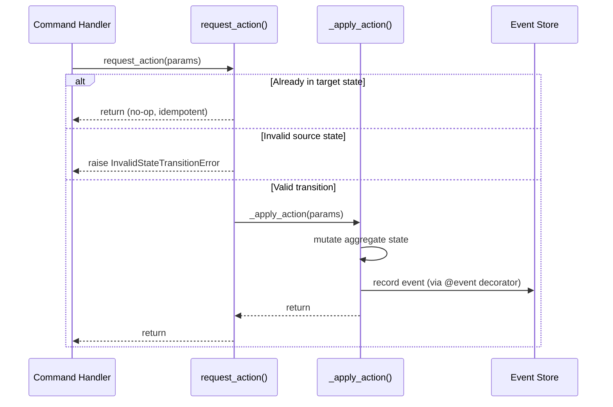

# Aggregate Lifecycle State Machine Pattern

> Two-method command pattern with idempotent state transitions for event-sourced aggregates

**Pattern Type:** Domain
**Introduced:** Tenant Lifecycle, Order Management
**Status:** Active

---

## Problem

Event-sourced aggregates with lifecycle states need to:

1. **Enforce valid transitions** — prevent illegal state changes (e.g., shipping a cancelled order)
2. **Record events only for valid transitions** — the `@event` decorator records immutable events, so invalid state changes must be caught _before_ the event method is called
3. **Support idempotency** — retried commands should not produce duplicate events (e.g., confirming an already-confirmed order is a no-op)
4. **Maintain clear separation** — validation logic should not be mixed with event recording logic

Naive implementations that validate inside `@event` methods record invalid events. Implementations that skip idempotency produce duplicate events on retry.

---

## Solution

Split each state transition into two methods:

1. **Public `request_*()` method** — validates invariants, checks idempotency, delegates to private method
2. **Private `_apply_*()` method** — decorated with `@event`, performs state mutation only



---

## Implementation

### Structure

```python
class MyAggregate(BaseAggregate):
    """Aggregate with N-state lifecycle."""

    @event("Created")
    def __init__(self, *, tenant_id: str, ...) -> None:
        self.status: str = InitialStatus.value
        # ... other fields

    # -- Public command: validate then delegate --

    def request_transition(self, ...) -> None:
        """Transition from SOURCE to TARGET state.

        Idempotent: calling on an already-TARGET aggregate is a no-op.

        Raises:
            InvalidStateTransitionError: If not in SOURCE state.
        """
        if self.status == TargetStatus.value:
            return  # idempotent
        if self.status != SourceStatus.value:
            raise InvalidStateTransitionError(
                f"Cannot transition {self.id}: "
                f"current state is {self.status}, expected {SourceStatus.value}"
            )
        self._apply_transition(...)

    # -- Private @event mutator --

    @event("Transitioned")
    def _apply_transition(self, ...) -> None:
        self.status = TargetStatus.value
```

### Tenant Aggregate (4-State Machine)

From `src/{project}/shared/domain/tenant.py`:

```python
class Tenant(BaseAggregate):
    @event("Provisioned")
    def __init__(self, *, tenant_id: str, name: str, slug: str, ...) -> None:
        self.status: str = TenantStatus.PROVISIONING.value

    def request_suspend(self, reason: str | None = None) -> None:
        if self.status == TenantStatus.SUSPENDED.value:
            return  # idempotent
        if self.status != TenantStatus.ACTIVE.value:
            raise InvalidStateTransitionError(...)
        self._apply_suspend(reason=reason or "")

    @event("Suspended")
    def _apply_suspend(self, reason: str) -> None:
        self.status = TenantStatus.SUSPENDED.value
        self.suspension_reason = reason if reason else None
```

**States:** PROVISIONING -> ACTIVE <-> SUSPENDED -> DECOMMISSIONED (terminal)

### Order Aggregate (4-State Machine)

Example from an order management context:

```python
class Order(BaseAggregate):
    @event("Placed")
    def __init__(self, *, tenant_id: str, customer_id: UUID, ...) -> None:
        self.status: str = OrderStatus.PENDING.value

    def request_confirm(self) -> None:
        if self.status == OrderStatus.CONFIRMED.value:
            return  # idempotent
        if self.status != OrderStatus.PENDING.value:
            raise InvalidStateTransitionError(...)
        self._apply_confirm()

    @event("Confirmed")
    def _apply_confirm(self) -> None:
        self.status = OrderStatus.CONFIRMED.value

    def request_cancel(self, reason: str | None = None) -> None:
        if self.status == OrderStatus.CANCELLED.value:
            return  # idempotent
        if self.status == OrderStatus.SHIPPED.value:
            raise InvalidStateTransitionError(...)
        self._apply_cancel(reason=reason or "")

    @event("Cancelled")
    def _apply_cancel(self, reason: str) -> None:
        self.status = OrderStatus.CANCELLED.value
        self.cancellation_reason = reason if reason else None
```

**States:** PENDING -> CONFIRMED -> SHIPPED -> DELIVERED (terminal); PENDING/CONFIRMED -> CANCELLED (terminal)

---

## When to Use

- Any event-sourced aggregate with **3 or more lifecycle states**
- Aggregates with **terminal states** (no transitions out)
- Commands that may be **retried** (idempotency required)
- State transitions that carry **parameters** (e.g., suspension reason)

## When NOT to Use

- Simple CRUD entities without lifecycle (use direct @event methods)
- Aggregates with only 2 states (create/delete) where guard logic is trivial
- Read models and projections (no state machine)

---

## Trade-offs

| Pro | Con |
|-----|-----|
| Events only recorded for valid transitions | Two methods per transition (more boilerplate) |
| Idempotent by design (safe retries) | Must keep guard logic synchronized with state machine |
| Clear separation of validation and mutation | `reason` params stored as empty string in events (converted to None on aggregate) |
| Terminal states prevent invalid operations | Idempotency hides potential caller bugs (silent no-op) |

---

## Conventions

1. **Naming:** Public methods use `request_*()`, private methods use `_apply_*()`
2. **Idempotency check first:** Check target state before source state to enable safe retries
3. **Error type:** Use `InvalidStateTransitionError` (maps to HTTP 409 Conflict)
4. **Status storage:** Store as `StrEnum.value` (string), not the enum instance, for event serialization
5. **Terminal states:** Check terminal state in all `request_*()` methods that cannot exit it
6. **Event naming:** Past tense verbs matching the transition (Activated, Suspended, Decommissioned)
7. **Reason parameters:** Pass as empty string to `@event` methods, convert to `None` on aggregate

---

## Related

- [con-domain-model.md](con-domain-model.md) — Aggregate design principles
- [PADR-001](../../decisions/strategic/PADR-001-event-sourcing.md) — Core event sourcing pattern
- [PADR-109](../../decisions/patterns/PADR-109-sync-first-eventsourcing.md) — Command endpoints use sync `def`
- [PADR-114](../../decisions/patterns/PADR-114-aggregate-lifecycle-state-machine.md) — Formalizes this pattern
