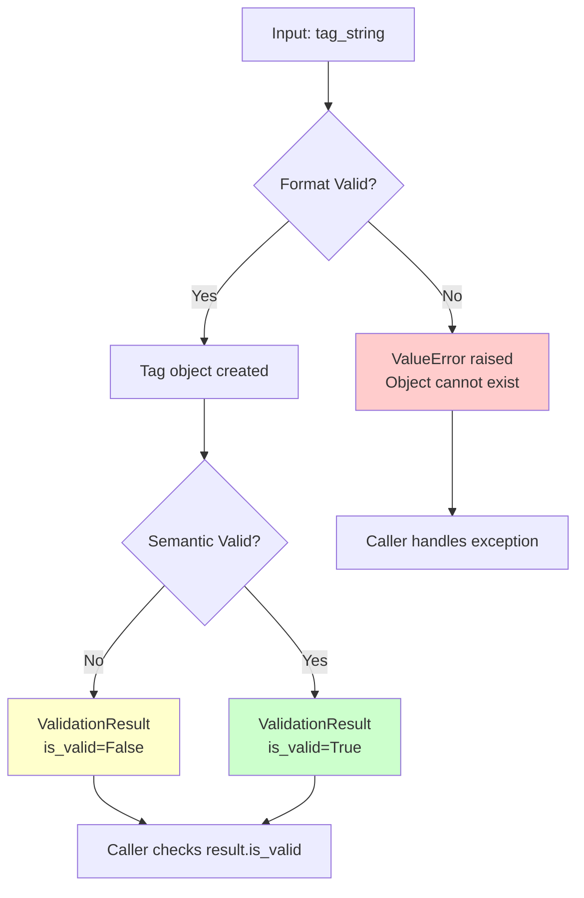

# Two-Tier Validation Pattern

> Separating format validation from semantic validation for composable validation pipelines

**Pattern Type:** Domain
**Introduced:** F-100-002 Tag System (S-100-002-001, S-100-002-002)
**Status:** Active

---

## Problem

Domain value objects often require two distinct levels of validation:

1. **Format Validation**: Structural checks that determine if the input can even exist as a valid object (e.g., regex patterns, required fields, type constraints)
2. **Semantic Validation**: Business rule checks that determine if the object is meaningful in the domain (e.g., controlled vocabularies, referential integrity, business constraints)

Mixing these two levels creates coupling problems:

- Format validation cannot be performed without domain knowledge
- Semantic validation cannot be composed or deferred
- Error handling becomes inconsistent (some errors throw, others return results)
- Testing requires full domain context even for simple format checks

**When exception-based validation fails:**

- You want to collect multiple validation errors before failing
- Validation results need to be passed through multiple layers
- Some validations are advisory (warnings) rather than blocking
- Validation is part of a pipeline with branching logic

---

## Solution

**Separate validation into two stages with different error signaling mechanisms:**

### Stage 1: Format Validation (Constructor)

- **Where:** Value object `__init__` or factory method
- **Scope:** Structural integrity only (regex, type checks, required fields)
- **Error Signaling:** **Raise `ValueError`** immediately
- **Philosophy:** "If format is invalid, the object cannot exist"

### Stage 2: Semantic Validation (Pure Function)

- **Where:** Separate pure function (e.g., `validate_tag()`)
- **Scope:** Business rules, controlled vocabularies, domain constraints
- **Error Signaling:** **Return `ValidationResult` dataclass**
- **Philosophy:** "Object is structurally valid but may not be semantically meaningful"

```python
@dataclass(frozen=True)
class ValidationResult:
    """Result of semantic validation."""
    is_valid: bool
    error_message: str | None = None
    tag: Tag | None = None  # The validated object (if applicable)
```

---

## Implementation

### Example: Tag Value Object

**Format Validation (in `Tag.__init__`):**

```python
import re
from dataclasses import dataclass

_TAG_PATTERN = re.compile(
    r"^[a-z][a-z0-9-]*:[a-z][a-z0-9-]*(:[a-z][a-z0-9-]*)?$"
)

@dataclass(frozen=True)
class Tag:
    """Tag with namespace:value[:subvalue] format."""

    namespace: str
    value: str
    subvalue: str | None = None

    def __init__(self, tag_string: str) -> None:
        """Parse and validate tag format.

        Raises:
            ValueError: If format is invalid (immediate failure).
        """
        normalized = tag_string.strip().lower()

        if ":" not in normalized:
            msg = f"Invalid tag format '{tag_string}': missing ':' separator"
            raise ValueError(msg)

        if not _TAG_PATTERN.match(normalized):
            msg = (
                f"Invalid tag format '{tag_string}': must match "
                "namespace:value[:subvalue] with [a-z][a-z0-9-]* segments"
            )
            raise ValueError(msg)

        parts = normalized.split(":", maxsplit=2)
        object.__setattr__(self, "namespace", parts[0])
        object.__setattr__(self, "value", parts[1])
        object.__setattr__(
            self, "subvalue", parts[2] if len(parts) == 3 else None
        )
```

**Semantic Validation (in `tag_registry.py`):**

```python
from dataclasses import dataclass

AGENT_MEMORY_VALUES: frozenset[str] = frozenset(
    ["preference", "commitment", "pattern", "fact", "boundary"]
)

SENSITIVITY_LEVELS: frozenset[str] = frozenset(
    ["public", "internal", "confidential", "restricted"]
)

@dataclass(frozen=True)
class ValidationResult:
    """Result of tag semantic validation."""
    is_valid: bool
    error_message: str | None = None
    tag: Tag | None = None


def validate_tag(tag: Tag) -> ValidationResult:
    """Perform semantic validation on a format-valid tag.

    Args:
        tag: A format-valid Tag instance.

    Returns:
        ValidationResult with is_valid=True if tag passes, or
        is_valid=False with descriptive error_message.
    """
    # Check agent-memory controlled vocabulary
    if tag.namespace == "agent-memory" and tag.value not in AGENT_MEMORY_VALUES:
        return ValidationResult(
            is_valid=False,
            error_message=(
                f"Value '{tag.value}' is not in the allowed list for "
                f"namespace 'agent-memory'. "
                f"Allowed: {sorted(AGENT_MEMORY_VALUES)}"
            ),
            tag=tag,
        )

    # Check classification:sensitivity controlled vocabulary
    if tag.namespace == "classification" and tag.value == "sensitivity":
        if tag.subvalue is None:
            return ValidationResult(
                is_valid=False,
                error_message=(
                    "Tag 'classification:sensitivity' requires a subvalue "
                    f"from: {sorted(SENSITIVITY_LEVELS)}"
                ),
                tag=tag,
            )
        if tag.subvalue not in SENSITIVITY_LEVELS:
            return ValidationResult(
                is_valid=False,
                error_message=(
                    f"Subvalue '{tag.subvalue}' is not in the allowed list for "
                    f"'classification:sensitivity'. "
                    f"Allowed: {sorted(SENSITIVITY_LEVELS)}"
                ),
                tag=tag,
            )

    return ValidationResult(is_valid=True, tag=tag)
```

---

## Usage Examples

### Example 1: API Endpoint Validation

```python
from fastapi import HTTPException

def create_block(request: CreateBlockRequest) -> BlockDTO:
    """Create a memory block with tag validation."""

    # Stage 1: Format validation (raises ValueError for invalid format)
    try:
        tags = [Tag(t) for t in request.tags]
    except ValueError as e:
        raise HTTPException(status_code=422, detail=str(e))

    # Stage 2: Semantic validation (returns ValidationResult)
    for tag in tags:
        result = validate_tag(tag)
        if not result.is_valid:
            raise HTTPException(status_code=422, detail=result.error_message)

    # Proceed with business logic
    command = CreateBlockCommand(tags=tuple(tags))
    return execute_command(command)
```

### Example 2: Collecting Multiple Validation Errors

```python
def validate_tags_batch(tag_strings: list[str]) -> dict[str, list[str]]:
    """Validate multiple tags and return all errors.

    Returns:
        Dict with 'format_errors' and 'semantic_errors' lists.
    """
    format_errors = []
    semantic_errors = []
    valid_tags = []

    # Stage 1: Format validation
    for tag_str in tag_strings:
        try:
            tag = Tag(tag_str)
            valid_tags.append(tag)
        except ValueError as e:
            format_errors.append(f"{tag_str}: {e}")

    # Stage 2: Semantic validation (only for format-valid tags)
    for tag in valid_tags:
        result = validate_tag(tag)
        if not result.is_valid:
            semantic_errors.append(f"{tag}: {result.error_message}")

    return {
        "format_errors": format_errors,
        "semantic_errors": semantic_errors,
    }
```

### Example 3: Composable Validation Pipeline

```python
from typing import Callable

ValidationStep = Callable[[Tag], ValidationResult]

def validate_with_steps(tag: Tag, steps: list[ValidationStep]) -> ValidationResult:
    """Run tag through multiple validation steps.

    Short-circuits on first failure.
    """
    for step in steps:
        result = step(tag)
        if not result.is_valid:
            return result

    return ValidationResult(is_valid=True, tag=tag)

# Usage
result = validate_with_steps(
    tag,
    steps=[
        validate_tag,           # Controlled vocabulary check
        validate_tag_policy,    # Policy binding check (future)
        validate_tag_tenant,    # Tenant-specific allowlist (future)
    ]
)
```

---

## Decision Flow



---

## When to Use

**Use Two-Tier Validation When:**

| Scenario | Why |
|----------|-----|
| Value object with controlled vocabulary | Format check (regex) vs allowlist check (domain rule) |
| Multi-stage validation pipeline | Need to defer semantic checks until later stage |
| Collecting multiple errors | Want all validation failures, not just the first |
| Advisory validation | Some checks are warnings, not blockers |
| Testing isolation | Want to test format validation without domain context |

**Do NOT Use When:**

| Scenario | Alternative |
|----------|-------------|
| Single-stage validation | Just raise ValueError in constructor |
| Validation requires I/O | Move to application layer, use exceptions |
| Validation is trivial | Use Pydantic field validators for simple checks |

---

## Benefits

1. **Separation of Concerns**: Format logic decoupled from domain logic
2. **Composability**: ValidationResult objects can be chained, aggregated, or deferred
3. **Testability**: Format validation tests need no domain context
4. **Error Collection**: Can gather multiple errors before failing
5. **Type Safety**: ValidationResult is typed, errors are structured
6. **Pure Functions**: Semantic validation has no side effects or I/O

---

## Trade-offs

### Advantages

- Clear separation between structural and semantic validation
- Validation logic is composable and reusable
- Can collect multiple errors before failing
- Semantic validation is testable without constructing objects

### Disadvantages

- Requires two steps instead of one (caller must check both)
- ValidationResult adds boilerplate compared to exceptions
- Potential for inconsistency if developers forget semantic validation
- More complex than single-stage validation

---

## Testing Strategy

### Format Validation Tests (Unit)

```python
@pytest.mark.story("S-100-002-001")
class TestTagFormatValidation:
    """Test Tag.__init__ format checks."""

    def test_valid_two_part_tag(self):
        """Format-valid tag constructs successfully."""
        tag = Tag("org:engineering")
        assert tag.namespace == "org"
        assert tag.value == "engineering"

    def test_missing_separator_raises(self):
        """Missing colon raises ValueError."""
        with pytest.raises(ValueError, match="missing ':' separator"):
            Tag("just-a-value")

    def test_invalid_characters_raises(self):
        """Special characters raise ValueError."""
        with pytest.raises(ValueError, match="must match namespace:value"):
            Tag("org:val@ue")
```

### Semantic Validation Tests (Unit)

```python
@pytest.mark.story("S-100-002-002")
class TestTagSemanticValidation:
    """Test validate_tag() semantic checks."""

    def test_valid_agent_memory_tag(self):
        """Allowed agent-memory value passes."""
        tag = Tag("agent-memory:preference")
        result = validate_tag(tag)
        assert result.is_valid

    def test_invalid_agent_memory_value(self):
        """Disallowed agent-memory value fails."""
        tag = Tag("agent-memory:invalid-type")
        result = validate_tag(tag)
        assert not result.is_valid
        assert "not in the allowed list" in result.error_message

    def test_open_namespace_accepts_any_value(self):
        """Open namespaces pass any value."""
        tag = Tag("org:custom-team-name")
        result = validate_tag(tag)
        assert result.is_valid
```

---

## Related Patterns

- [ref-domain-module-level-registry.md](ref-domain-module-level-registry.md) — Module-level constants for controlled vocabularies
- [ref-domain-tag-value-object.md](ref-domain-tag-value-object.md) — Tag value object using this pattern

---

## Related Decisions

- [PADR-113: Two-Tier Validation Pattern](../../decisions/patterns/PADR-113-two-tier-validation.md) — Formalization of this pattern as a convention

---

## References

- **Feature:** F-100-002 Tag System
- **Stories:** S-100-002-001 (format validation), S-100-002-002 (semantic validation)
- **Key Files:**
  - `src/{project}/memory/domain/value_objects.py` (Tag.**init**)
  - `src/{project}/memory/domain/tag_registry.py` (validate_tag)

---

**Last Updated:** 2026-02-06
**Applies To:** Memory context (domain layer)
