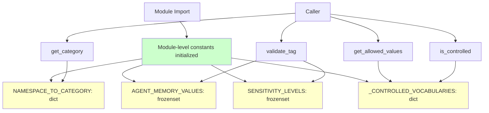

# Module-Level Registry Pattern

> Stateless registries using module-level constants and pure functions instead of singleton classes

**Pattern Type:** Domain
**Introduced:** F-100-002 Tag System (S-100-002-002)
**Status:** Active

---

## Problem

Registries in domain logic often need to provide lookup services for static data:

- Namespace-to-category mappings
- Controlled vocabularies
- Validation rules
- Type discrimination tables

Traditional approaches have drawbacks:

**Class-based singleton:**

```python
class TagRegistry:
    _instance = None

    def __new__(cls):
        if cls._instance is None:
            cls._instance = super().__new__(cls)
            cls._instance._init_data()
        return cls._instance

    def get_category(self, namespace: str) -> TagCategory | None:
        return self._mapping.get(namespace)
```

**Problems:**

- Unnecessary instance state when data is static
- Singleton anti-pattern (global mutable state)
- Harder to test (need to reset singleton between tests)
- More boilerplate (class definition, instance methods, `self` everywhere)
- Violates pure domain principle (stateful object for stateless data)

---

## Solution

**Use module-level constants and pure functions:**

1. **Data as module-level constants** (frozenset, dict, tuples)
2. **Logic as pure functions** (no `self`, no instance state)
3. **TYPE_CHECKING imports** for type hints only (avoid circular imports)

The module itself acts as a namespace, and Python's module singleton guarantee ensures the data is initialized once.

---

## Implementation

### Example: Tag Namespace Registry

**File:** `src/{project}/memory/domain/tag_registry.py`

```python
"""Tag namespace registry with categories and controlled vocabularies.

Defines the five namespace categories for the tag taxonomy and provides
semantic validation for controlled namespaces (agent-memory, sensitivity).

This module contains only pure domain logic with zero external dependencies
beyond the standard library.
"""

from __future__ import annotations

from dataclasses import dataclass
from enum import StrEnum
from typing import TYPE_CHECKING

if TYPE_CHECKING:
    from {project}.memory.domain.value_objects import Tag


class TagCategory(StrEnum):
    """Five namespace categories for the tag taxonomy."""

    ORGANIZATIONAL = "organizational"
    CLASSIFICATION = "classification"
    TEMPORAL = "temporal"
    SYSTEM = "system"
    AGENT_MEMORY = "agent-memory"


# ---------------------------------------------------------------------------
# Module-level constants (initialized once at import)
# ---------------------------------------------------------------------------

NAMESPACE_TO_CATEGORY: dict[str, TagCategory] = {
    # Organizational
    "department": TagCategory.ORGANIZATIONAL,
    "team": TagCategory.ORGANIZATIONAL,
    "project": TagCategory.ORGANIZATIONAL,
    "customer": TagCategory.ORGANIZATIONAL,
    "workitem": TagCategory.ORGANIZATIONAL,
    "agent": TagCategory.ORGANIZATIONAL,
    "org": TagCategory.ORGANIZATIONAL,
    # Classification
    "topic": TagCategory.CLASSIFICATION,
    "doctype": TagCategory.CLASSIFICATION,
    "domain": TagCategory.CLASSIFICATION,
    "classification": TagCategory.CLASSIFICATION,
    "sensitivity": TagCategory.CLASSIFICATION,
    # Temporal
    "fiscal": TagCategory.TEMPORAL,
    "lifecycle": TagCategory.TEMPORAL,
    "version": TagCategory.TEMPORAL,
    "created": TagCategory.TEMPORAL,
    "expires": TagCategory.TEMPORAL,
    # System
    "entity": TagCategory.SYSTEM,
    "source": TagCategory.SYSTEM,
    "extracted": TagCategory.SYSTEM,
    "sync": TagCategory.SYSTEM,
    # Agent Memory
    "agent-memory": TagCategory.AGENT_MEMORY,
}

AGENT_MEMORY_VALUES: frozenset[str] = frozenset(
    ["preference", "commitment", "pattern", "fact", "boundary"]
)
"""Strict allowlist for agent-memory namespace values."""

SENSITIVITY_LEVELS: frozenset[str] = frozenset(
    ["public", "internal", "confidential", "restricted"]
)
"""Strict allowlist for sensitivity subvalue levels."""

# Internal mapping of controlled vocabularies:
# key = (namespace,) for direct value control, or (namespace, value) for subvalue control
_CONTROLLED_VOCABULARIES: dict[tuple[str, ...], frozenset[str]] = {
    ("agent-memory",): AGENT_MEMORY_VALUES,
    ("classification", "sensitivity"): SENSITIVITY_LEVELS,
}


# ---------------------------------------------------------------------------
# Pure functions (stateless lookup and validation)
# ---------------------------------------------------------------------------


def get_category(namespace: str) -> TagCategory | None:
    """Look up the category for a namespace prefix.

    Args:
        namespace: Tag namespace string (e.g., "org", "agent-memory").

    Returns:
        TagCategory if namespace is registered, None if unknown.
    """
    return NAMESPACE_TO_CATEGORY.get(namespace)


def get_allowed_values(
    namespace: str, value: str | None = None
) -> frozenset[str] | None:
    """Get the controlled vocabulary for a namespace (or namespace:value pair).

    Args:
        namespace: Tag namespace (e.g., "agent-memory").
        value: Optional value segment for subvalue-level control
               (e.g., "sensitivity" for classification:sensitivity).

    Returns:
        Frozenset of allowed values if controlled, None if open.
    """
    if value is not None:
        key = (namespace, value)
        if key in _CONTROLLED_VOCABULARIES:
            return _CONTROLLED_VOCABULARIES[key]

    key_ns = (namespace,)
    return _CONTROLLED_VOCABULARIES.get(key_ns)


def is_controlled(namespace: str, value: str | None = None) -> bool:
    """Check if a namespace (or namespace:value pair) has a controlled vocabulary.

    Args:
        namespace: Tag namespace.
        value: Optional value segment for subvalue-level control.

    Returns:
        True if the namespace/value pair enforces an allowlist.
    """
    return get_allowed_values(namespace, value) is not None


@dataclass(frozen=True)
class ValidationResult:
    """Result of tag semantic validation."""
    is_valid: bool
    error_message: str | None = None
    tag: Tag | None = None


def validate_tag(tag: Tag) -> ValidationResult:
    """Perform semantic validation on a tag.

    Format validation is handled by Tag.__init__(). This function validates:
    1. agent-memory namespace: value must be in AGENT_MEMORY_VALUES
    2. classification:sensitivity: subvalue must be in SENSITIVITY_LEVELS
    3. All other namespaces: no semantic constraints (pass through)

    Args:
        tag: A format-valid Tag instance.

    Returns:
        ValidationResult with is_valid=True if tag passes, or
        is_valid=False with a descriptive error_message.
    """
    # Check agent-memory controlled vocabulary
    if tag.namespace == "agent-memory" and tag.value not in AGENT_MEMORY_VALUES:
        return ValidationResult(
            is_valid=False,
            error_message=(
                f"Value '{tag.value}' is not in the allowed list for "
                f"namespace 'agent-memory'. "
                f"Allowed: {sorted(AGENT_MEMORY_VALUES)}"
            ),
            tag=tag,
        )

    # Check classification:sensitivity controlled vocabulary
    if tag.namespace == "classification" and tag.value == "sensitivity":
        if tag.subvalue is None:
            return ValidationResult(
                is_valid=False,
                error_message=(
                    "Tag 'classification:sensitivity' requires a subvalue "
                    f"from: {sorted(SENSITIVITY_LEVELS)}"
                ),
                tag=tag,
            )
        if tag.subvalue not in SENSITIVITY_LEVELS:
            return ValidationResult(
                is_valid=False,
                error_message=(
                    f"Subvalue '{tag.subvalue}' is not in the allowed list for "
                    f"'classification:sensitivity'. "
                    f"Allowed: {sorted(SENSITIVITY_LEVELS)}"
                ),
                tag=tag,
            )

    return ValidationResult(is_valid=True, tag=tag)
```

---

## Usage Examples

### Example 1: Looking Up Categories

```python
from {project}.memory.domain import tag_registry

category = tag_registry.get_category("org")
assert category == tag_registry.TagCategory.ORGANIZATIONAL

category = tag_registry.get_category("unknown-namespace")
assert category is None  # Unknown namespaces return None
```

### Example 2: Checking Controlled Vocabularies

```python
from {project}.memory.domain import tag_registry

# Check if namespace is controlled
is_controlled = tag_registry.is_controlled("agent-memory")
assert is_controlled  # True

is_controlled = tag_registry.is_controlled("org")
assert not is_controlled  # False (open namespace)

# Get allowed values
allowed = tag_registry.get_allowed_values("agent-memory")
assert allowed == {"preference", "commitment", "pattern", "fact", "boundary"}
```

### Example 3: Validating Tags

```python
from {project}.memory.domain.value_objects import Tag
from {project}.memory.domain import tag_registry

tag = Tag("agent-memory:preference")
result = tag_registry.validate_tag(tag)
assert result.is_valid

tag = Tag("agent-memory:invalid-type")
result = tag_registry.validate_tag(tag)
assert not result.is_valid
assert "not in the allowed list" in result.error_message
```

---

## Pattern Structure



---

## When to Use

**Use Module-Level Registry When:**

| Scenario | Why |
|----------|-----|
| Static lookup data | Data never changes at runtime |
| Pure domain logic | No side effects, no I/O, no mutable state |
| Simple key-value mappings | Dict/frozenset lookups sufficient |
| Validation functions | Pure functions operating on domain objects |
| Zero external dependencies | Domain layer must stay pure |

**Do NOT Use When:**

| Scenario | Alternative |
|----------|-------------|
| Data loaded from database | Use repository pattern in application layer |
| Runtime reconfiguration | Use configuration service with dependency injection |
| Complex stateful logic | Use domain service with explicit state management |
| Caching or memoization | Use class with `@lru_cache` or explicit cache |

---

## Benefits

1. **Simplicity**: No class boilerplate, no instance state
2. **Pure Functions**: All functions are stateless and testable
3. **Module Singleton**: Python guarantees module is imported once
4. **Zero Overhead**: Direct function calls, no indirection through `self`
5. **Type Safety**: Full static type checking with mypy
6. **Testability**: Pure functions with no setup/teardown

---

## Trade-offs

### Advantages

- Simple: no classes, no instances, no constructors
- Fast: direct function calls, no `self` indirection
- Pure: all functions are stateless
- Pythonic: modules are natural namespaces
- Testable: no singleton reset needed

### Disadvantages

- Cannot be extended via inheritance (but that's a feature, not a bug)
- Cannot swap implementations at runtime (use dependency injection if needed)
- All data must be compile-time constants (no lazy loading)
- Harder to mock entire module (but functions can be mocked individually)

---

## Testing Strategy

### Unit Tests

```python
@pytest.mark.story("S-100-002-002")
class TestGetCategory:
    """Test namespace-to-category mapping."""

    def test_organizational_namespaces(self):
        """org, team, project -> ORGANIZATIONAL"""
        assert get_category("org") == TagCategory.ORGANIZATIONAL
        assert get_category("team") == TagCategory.ORGANIZATIONAL
        assert get_category("project") == TagCategory.ORGANIZATIONAL

    def test_unknown_namespace_returns_none(self):
        """'custom-ns' -> None"""
        assert get_category("custom-ns") is None


@pytest.mark.story("S-100-002-002")
class TestControlledVocabularies:
    """Test allowlist enforcement."""

    def test_agent_memory_has_five_values(self):
        """AGENT_MEMORY_VALUES has exactly 5 entries"""
        assert len(AGENT_MEMORY_VALUES) == 5
        assert AGENT_MEMORY_VALUES == {
            "preference", "commitment", "pattern", "fact", "boundary"
        }

    def test_get_allowed_values_agent_memory(self):
        """get_allowed_values('agent-memory') returns AGENT_MEMORY_VALUES"""
        allowed = get_allowed_values("agent-memory")
        assert allowed == AGENT_MEMORY_VALUES

    def test_is_controlled_open_namespace(self):
        """is_controlled('org') is False"""
        assert not is_controlled("org")
```

---

## Comparison with Class-Based Singleton

### Class-Based Singleton (DON'T)

```python
class TagRegistry:
    _instance = None

    def __new__(cls):
        if cls._instance is None:
            cls._instance = super().__new__(cls)
            cls._instance._mapping = {...}  # Initialize data
        return cls._instance

    def get_category(self, namespace: str) -> TagCategory | None:
        return self._mapping.get(namespace)

# Usage requires instantiation
registry = TagRegistry()
category = registry.get_category("org")
```

**Problems:**

- 10+ lines of boilerplate for singleton pattern
- Instance state for static data
- `self` parameter everywhere (unnecessary)
- Need to reset singleton in tests

### Module-Level Registry (DO)

```python
NAMESPACE_TO_CATEGORY: dict[str, TagCategory] = {...}

def get_category(namespace: str) -> TagCategory | None:
    return NAMESPACE_TO_CATEGORY.get(namespace)

# Usage is direct
category = get_category("org")
```

**Benefits:**

- 2 lines vs 10+
- No instance state
- No `self` parameter
- No test setup/teardown

---

## Related Patterns

- [ref-domain-two-tier-validation.md](ref-domain-two-tier-validation.md) — Uses validate_tag() function from registry
- [con-domain-model.md](con-domain-model.md) — Pure domain principles

---

## Related Decisions

- [PADR-112: Module-Level Registry Pattern](../../decisions/patterns/PADR-112-module-level-registry.md) — Formalization of this convention
- [PADR-108: Domain Service Protocols](../../decisions/patterns/PADR-108-domain-service-protocols.md) — Pure function protocols

---

## References

- **Feature:** F-100-002 Tag System
- **Story:** S-100-002-002 (namespace categories registry)
- **Key Files:**
  - `src/{project}/memory/domain/tag_registry.py`

---

**Last Updated:** 2026-02-06
**Applies To:** Memory context (domain layer)
