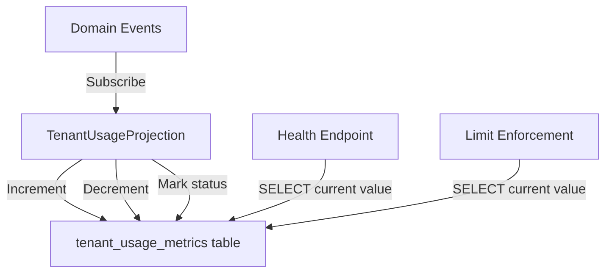

# Delta-Based Counter Projection Pattern

> Event-sourced read model maintaining running counters via increment/decrement operations

**Category:** Infrastructure
**Introduced:** F-101-004 (Tenant Monitoring)
**Related ADRs:** [PADR-115](../../adr/patterns/PADR-115-reinforcement-metrics-projection.md), [PADR-109](../../adr/patterns/PADR-109-sync-first-eventsourcing.md)

---

## Problem

Multi-tenant systems need real-time resource usage tracking (entry counts, storage bytes, API calls) for monitoring and limit enforcement. Counting rows in projection tables on every query is too expensive at scale. Deriving counts from the event stream at query time requires full event replay per tenant.

**Requirements:**

- Constant-time O(1) usage queries regardless of tenant size
- Automatic updates as domain events occur
- Support for both creation/deletion (increment/decrement) and soft-delete (status transitions)
- Idempotent handlers safe for event replay
- Isolation per tenant via RLS

---

## Solution

Maintain per-tenant counter columns in a projection table, updated via delta operations (increment/decrement) from domain event handlers. The projection subscribes to entity lifecycle events (`Created`, `Deleted`, `Archived`) and applies atomic SQL updates.



**Key characteristics:**

- **Delta-based updates:** `UPDATE counters SET count = count + 1` rather than absolute value writes
- **UPSERT initialization:** First event for a tenant creates the row with zero counters
- **Soft-delete support:** Status column tracks tenant lifecycle (active/decommissioned)
- **Replay safety:** Clear read model before full replay; delta updates are NOT replay-safe on their own

---

## Implementation

### Projection Table Schema

```sql
CREATE TABLE tenant_usage_metrics (
    tenant_id       VARCHAR(255)  PRIMARY KEY,
    entry_count     BIGINT        NOT NULL DEFAULT 0,
    storage_bytes   BIGINT        NOT NULL DEFAULT 0,
    api_call_count  BIGINT        NOT NULL DEFAULT 0,
    status          VARCHAR(20)   NOT NULL DEFAULT 'active',
    last_updated_at TIMESTAMPTZ   NOT NULL DEFAULT NOW()
);

-- Index for filtering active tenants
CREATE INDEX idx_tenant_usage_metrics_status
    ON tenant_usage_metrics (status);

-- RLS isolation per tenant
ALTER TABLE tenant_usage_metrics ENABLE ROW LEVEL SECURITY;
ALTER TABLE tenant_usage_metrics FORCE ROW LEVEL SECURITY;
CREATE POLICY tenant_isolation_policy ON tenant_usage_metrics
    FOR ALL
    USING (tenant_id = current_setting('app.current_tenant', true));
```

### Projection Handler

```python
class TenantUsageProjection(BaseProjection):
    """Materializes domain events into tenant usage counters.

    Subscribes to Tenant and MemoryBlock lifecycle events.
    Uses UPSERT pattern for idempotent initialization.
    Delta updates for increment/decrement.
    """

    topics: ClassVar[tuple[str, ...]] = ()  # All events, filter in handler

    def __init__(self, repository: TenantUsageRepository) -> None:
        super().__init__()
        self._repo = repository

    @singledispatchmethod
    def policy(
        self,
        domain_event: DomainEvent,
        processing_event: ProcessingEvent[UUID],
    ) -> None:
        """Route events by class name to handlers."""
        event_name = domain_event.__class__.__name__

        if event_name == "Provisioned":
            self._handle_tenant_provisioned(domain_event)
        elif event_name == "Decommissioned":
            self._handle_tenant_decommissioned(domain_event)
        elif event_name == "Created":
            self._handle_entry_created(domain_event)
        elif event_name == "Deleted":
            self._handle_entry_deleted(domain_event)
        elif event_name == "Archived":
            self._handle_entry_archived(domain_event)

    def _handle_entry_created(self, event: DomainEvent) -> None:
        """Increment entry count."""
        tenant_id = getattr(event, "tenant_id", None)
        if tenant_id is None:
            return
        self._repo.increment_entry_count(tenant_id, increment=1)

    def _handle_entry_deleted(self, event: DomainEvent) -> None:
        """Decrement entry count (floor at 0)."""
        tenant_id = getattr(event, "tenant_id", None)
        if tenant_id is None:
            return
        self._repo.decrement_entry_count(tenant_id, decrement=1)

    def clear_read_model(self) -> None:
        """TRUNCATE for projection rebuild."""
        self._repo.truncate()
```

### Repository Delta Methods

```python
class TenantUsageRepository:
    """Sync repository for delta counter operations."""

    def increment_entry_count(self, tenant_id: str, increment: int = 1) -> None:
        """UPSERT: increment counter, create row if missing."""
        with self._session_factory() as session:
            session.execute(
                text(
                    "INSERT INTO tenant_usage_metrics "
                    "(tenant_id, entry_count, storage_bytes, api_call_count, "
                    "status, last_updated_at) "
                    "VALUES (:tenant_id, :increment, 0, 0, 'active', NOW()) "
                    "ON CONFLICT (tenant_id) DO UPDATE SET "
                    "entry_count = tenant_usage_metrics.entry_count + :increment, "
                    "last_updated_at = NOW()"
                ),
                {"tenant_id": tenant_id, "increment": increment},
            )
            session.commit()

    def decrement_entry_count(self, tenant_id: str, decrement: int = 1) -> None:
        """Decrement counter with floor at 0."""
        with self._session_factory() as session:
            session.execute(
                text(
                    "UPDATE tenant_usage_metrics "
                    "SET entry_count = GREATEST(entry_count - :decrement, 0), "
                    "last_updated_at = NOW() "
                    "WHERE tenant_id = :tenant_id"
                ),
                {"tenant_id": tenant_id, "decrement": decrement},
            )
            session.commit()
```

---

## When to Use

Use delta-based counter projections when:

- **High-frequency counting queries** - Usage checks on every API request, health monitoring endpoints
- **Constant-time requirements** - Query latency must not scale with entity count
- **Incremental updates** - Counters change one at a time via discrete events (Created, Deleted)
- **Multi-tenant isolation** - Per-tenant counters with RLS enforcement
- **Soft-delete support** - Entities can be archived/decommissioned without deletion

**Example scenarios:**

- Tenant resource usage tracking (memory blocks, storage bytes, API calls)
- Per-user activity counters (documents created, queries run)
- Aggregate relationship counts (memberships per block, tags per entry)

---

## When NOT to Use

Avoid delta-based projections when:

- **Replay safety is critical** - Delta updates double-count on replay without full rebuild
- **Derived from multiple sources** - Count depends on complex joins or external data
- **Requires point-in-time accuracy** - Delta lag (10-60 seconds) is unacceptable
- **Absolute values available** - If events carry absolute counts, use those instead of deltas

**Alternative:** For replay-safe counters, use event-sourced snapshots (store count in event payload) or compute from event stream with deduplication tracking.

---

## Trade-offs

| Pro | Con |
|-----|-----|
| **O(1) query performance** - Single SELECT per tenant | **NOT replay-safe** - Delta operations double-count without clear_read_model() |
| **Automatic updates** - No manual counter maintenance | **Eventual consistency** - Projection lag (typically 10-60 seconds) |
| **Database-level enforcement** - RLS + floor constraints | **Requires UPSERT logic** - First event must initialize row |
| **Soft-delete support** - Status transitions without data loss | **Complex rebuild** - Must TRUNCATE + replay from event stream start |

---

## Replay Safety Considerations

**CRITICAL:** Delta-based projections are **NOT idempotent** for replay. Reprocessing the same event twice will increment the counter twice.

### Safe Rebuild Pattern

```python
def rebuild_projection(projection: TenantUsageProjection) -> None:
    """Safe rebuild for delta-based projection."""
    # 1. Clear read model (TRUNCATE counters table)
    projection.clear_read_model()

    # 2. Reset notification log position to beginning
    projection.reset_position()

    # 3. Replay all events from start
    projection.run()  # ProcessApplication replays from position 0
```

### Partial Replay Protection

The eventsourcing library's `ProcessApplication` tracks notification position and guarantees at-most-once delivery **per projection instance**. As long as the projection runs continuously, events are processed exactly once. Only on manual rebuild or position reset do delta operations become unsafe.

---

## Variations

### With Storage Size Tracking

If domain events carry `content_size` fields:

```python
def _handle_entry_created(self, event: DomainEvent) -> None:
    tenant_id = getattr(event, "tenant_id")
    content_size = getattr(event, "content_size", 0)
    self._repo.increment_entry_count(tenant_id, increment=1)
    self._repo.increment_storage_bytes(tenant_id, increment=content_size)
```

### With Multi-Column Counters

Single event may update multiple counters:

```python
def _handle_api_request(self, event: DomainEvent) -> None:
    tenant_id = getattr(event, "tenant_id")
    # Increment both API call count and request bytes
    self._repo.increment_api_call_count(tenant_id, increment=1)
    self._repo.increment_request_bytes(tenant_id, increment=event.request_size)
```

### With Time-Windowed Counters

Reset counters periodically (e.g., per-minute API rate limits):

```sql
-- Add window tracking
ALTER TABLE tenant_usage_metrics
    ADD COLUMN current_window TIMESTAMPTZ DEFAULT NOW();

-- Reset counter if new window
UPDATE tenant_usage_metrics
SET api_call_count = 1,
    current_window = NOW()
WHERE tenant_id = :tenant_id
  AND current_window < DATE_TRUNC('minute', NOW());
```

---

## Testing Strategy

### Unit Tests

```python
def test_increment_creates_row_if_missing(repo: TenantUsageRepository):
    """First increment UPSERTs new row."""
    repo.increment_entry_count("tenant-a", increment=1)

    metrics = repo.get("tenant-a")
    assert metrics.entry_count == 1

def test_decrement_floors_at_zero(repo: TenantUsageRepository):
    """Decrement below zero clamps to 0."""
    repo.initialize_tenant("tenant-a")  # count = 0
    repo.decrement_entry_count("tenant-a", decrement=5)

    metrics = repo.get("tenant-a")
    assert metrics.entry_count == 0  # Not -5
```

### Integration Tests

```python
@pytest.mark.integration
def test_projection_handles_lifecycle_events(
    projection: TenantUsageProjection,
    event_store: EventStore,
):
    """End-to-end projection updates from domain events."""
    # Emit domain events
    tenant_id = "tenant-a"
    event_store.publish(TenantProvisioned(tenant_id=tenant_id))
    event_store.publish(MemoryBlockCreated(tenant_id=tenant_id, block_id="b1"))
    event_store.publish(MemoryBlockCreated(tenant_id=tenant_id, block_id="b2"))
    event_store.publish(MemoryBlockDeleted(tenant_id=tenant_id, block_id="b1"))

    # Run projection
    projection.run()

    # Verify counters
    metrics = projection._repo.get(tenant_id)
    assert metrics.entry_count == 1  # 2 created - 1 deleted
    assert metrics.status == "active"
```

---

## Related

- **[PADR-115: Reinforcement Metrics Projection](../../adr/patterns/PADR-115-reinforcement-metrics-projection.md)** - Established projection-as-read-model pattern
- **[PADR-109: Sync-First Event Sourcing](../../adr/patterns/PADR-109-sync-first-eventsourcing.md)** - Projection repository sync pattern
- **[PADR-115: PostgreSQL RLS Tenant Isolation](../../adr/patterns/PADR-115-postgresql-rls-tenant-isolation.md)** - RLS enforcement on projection tables
- **[ref-infra-rls-migration-helpers.md](ref-infra-rls-migration-helpers.md)** - Alembic helpers for RLS setup
- **[BaseProjection](../../05-building-blocks/building-blocks/ref-cqrs-projection.md)** - Base class for all projections

---

**Implementation:** `src/{project}/shared/infrastructure/projections/tenant_usage.py`
**Migration:** `migrations/versions/20260207_0017_cca9336746fd_create_tenant_usage_metrics.py`
**Tests:** `tests/unit/shared/infrastructure/projections/test_tenant_usage.py`
