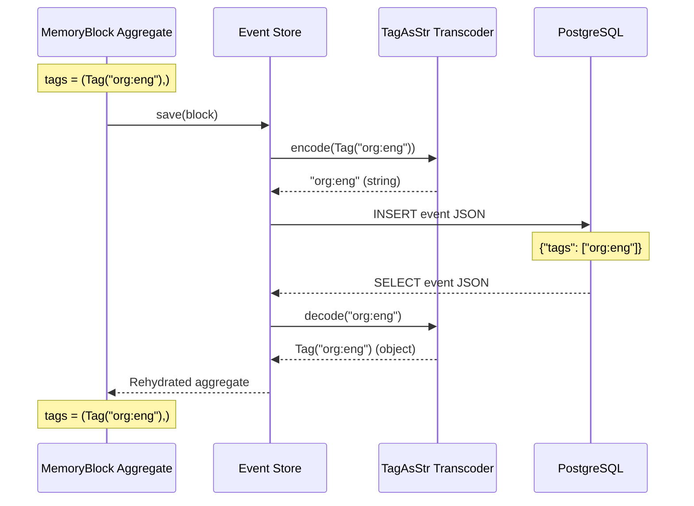

# EventSourcing Custom Transcoder Pattern

> Serializing domain value objects through the eventsourcing library's transcoding system

**Pattern Type:** Infrastructure
**Introduced:** F-100-002 Tag System (S-100-002-001)
**Status:** Active

---

## Problem

The eventsourcing library automatically serializes aggregate state to JSON for event store persistence. For standard Python types (str, int, dict, list), this works automatically. However, **custom domain value objects** (frozen dataclasses, custom classes) may not serialize correctly:

- **Frozen dataclasses with custom `__init__`**: The library's default transcoding may fail if `__init__` has custom logic (e.g., validation, normalization)
- **Value objects with factory methods**: `from_parts()` constructors don't align with the library's serialization expectations
- **Nested value objects**: Tuples or lists of value objects require recursive transcoding

**Symptoms of missing transcoder:**

- Events save successfully but fail to reload (deserialization error)
- Aggregate rehydration raises `TypeError` or `ValueError`
- Event store roundtrip tests fail with serialization exceptions

---

## Solution

**Register a custom `Transcoding` subclass** that defines how to serialize and deserialize the value object:

1. Subclass `eventsourcing.persistence.Transcoding`
2. Set `type` to the value object class
3. Set `name` to a unique identifier string
4. Implement `encode(obj) -> serializable_type` (value object → JSON-safe type)
5. Implement `decode(data) -> value_object` (JSON-safe type → reconstructed object)
6. Register the transcoder during application initialization

The eventsourcing library will then use your custom transcoder whenever it encounters the value object type during serialization.

---

## Implementation

### Example: Tag Value Object Transcoder

**Value Object (`value_objects.py`):**

```python
import re
from dataclasses import dataclass

_TAG_PATTERN = re.compile(
    r"^[a-z][a-z0-9-]*:[a-z][a-z0-9-]*(:[a-z][a-z0-9-]*)?$"
)

@dataclass(frozen=True)
class Tag:
    """Tag with namespace:value[:subvalue] format."""

    namespace: str
    value: str
    subvalue: str | None = None

    def __init__(self, tag_string: str) -> None:
        """Parse and validate tag format."""
        normalized = tag_string.strip().lower()

        if not _TAG_PATTERN.match(normalized):
            msg = f"Invalid tag format '{tag_string}'"
            raise ValueError(msg)

        parts = normalized.split(":", maxsplit=2)
        object.__setattr__(self, "namespace", parts[0])
        object.__setattr__(self, "value", parts[1])
        object.__setattr__(
            self, "subvalue", parts[2] if len(parts) == 3 else None
        )

    def __str__(self) -> str:
        """Return canonical lowercase string form."""
        if self.subvalue:
            return f"{self.namespace}:{self.value}:{self.subvalue}"
        return f"{self.namespace}:{self.value}"
```

**Custom Transcoder (`infrastructure/transcoders.py`):**

```python
"""Custom transcodings for the memory bounded context.

Registers serialization/deserialization for domain value objects
that are not natively handled by the eventsourcing library.

References:
    - eventsourcing persistence docs: custom Transcoding pattern
    - Tag value object: {Project}.memory.domain.value_objects.Tag
"""

from __future__ import annotations

from eventsourcing.persistence import Transcoding

from {project}.memory.domain.value_objects import Tag


class TagAsStr(Transcoding):
    """Transcode Tag value objects to/from their canonical string form.

    Encodes a Tag as its lowercase canonical string (e.g., "org:engineering").
    Decodes by reconstructing the Tag from the string, which re-validates format.

    Examples:
        >>> transcoder.register(TagAsStr())
        >>> tag = Tag("org:engineering")
        >>> encoded = TagAsStr().encode(tag)
        >>> encoded
        'org:engineering'
        >>> TagAsStr().decode(encoded) == tag
        True
    """

    type = Tag
    name = "tag"

    def encode(self, obj: Tag) -> str:
        """Encode a Tag to its canonical string form."""
        return str(obj)

    def decode(self, data: str) -> Tag:
        """Decode a Tag from its canonical string form."""
        return Tag(data)
```

**Registration (`application.py`):**

```python
from eventsourcing.application import Application
from eventsourcing.persistence import Transcoder

from {project}.memory.infrastructure.transcoders import TagAsStr


class MemoryApplication(Application):
    """Memory bounded context application."""

    def __init__(self, env: dict[str, str]) -> None:
        """Initialize application with custom transcoders."""
        super().__init__(env=env)

        # Register custom transcoders
        transcoder = Transcoder()
        transcoder.register(TagAsStr())

        # Store for event persistence
        self._transcoder = transcoder
```

---

## Usage Example

### Aggregate with Tag Value Objects

```python
from eventsourcing.domain import Aggregate, event

@dataclass(frozen=True)
class Tag:
    namespace: str
    value: str
    subvalue: str | None = None


class MemoryBlock(Aggregate):
    """Memory block with tags."""

    def __init__(self, tenant_id: str, **kwargs):
        super().__init__(**kwargs)
        self.tenant_id = tenant_id
        self.tags: tuple[Tag, ...] = ()

    @event("Updated")
    def request_update_tags(self, *, tags: tuple[Tag, ...]) -> None:
        """Update block tags."""
        self.tags = tags


# Usage
app = MemoryApplication(env={...})

# Create block with tags
block = MemoryBlock(tenant_id="tenant-1")
block.request_update_tags(tags=(
    Tag("org:engineering"),
    Tag("classification:sensitivity:confidential"),
))

# Save (tags are encoded as strings via TagAsStr)
app.save(block)

# Reload (tags are decoded from strings via TagAsStr)
reloaded = app.repository.get(block.id)
assert reloaded.tags == block.tags  # Roundtrip successful
```

---

## Transcoding Flow



---

## When to Use

**Use Custom Transcoder When:**

| Scenario | Why |
|----------|-----|
| Frozen dataclass with custom `__init__` | Default transcoding may fail due to custom initialization logic |
| Value object with validation | Need to re-run validation on deserialization |
| Value object with factory methods | `from_parts()` doesn't align with default serialization |
| Nested value objects in collections | `tuple[Tag, ...]` requires recursive transcoding |
| Event store roundtrip tests fail | Symptoms indicate transcoding issue |

**Do NOT Use When:**

| Scenario | Alternative |
|----------|-------------|
| Simple dataclass (no custom logic) | eventsourcing handles it automatically |
| Pydantic models | Use Pydantic's JSON schema, not eventsourcing |
| Mutable objects | Don't store mutable state in events |

---

## Benefits

1. **Automatic Serialization**: eventsourcing handles all encoding/decoding
2. **Type Safety**: Deserialized objects are fully typed value objects
3. **Validation on Deserialization**: Custom `__init__` re-validates on decode
4. **Roundtrip Guarantee**: Encode/decode cycle preserves object equality
5. **Separation of Concerns**: Domain layer stays pure, infrastructure handles persistence

---

## Trade-offs

### Advantages

- Clean separation: domain value object knows nothing about serialization
- Automatic: once registered, transcoding is invisible
- Type-safe: deserialized objects are full value objects, not dicts
- Testable: transcoding logic is isolated and testable

### Disadvantages

- Boilerplate: need transcoder class for each custom value object
- Registration: must remember to register during app initialization
- Debugging: transcoding errors can be opaque (silent failures)
- Coupling: infrastructure depends on domain (but domain stays pure)

---

## Testing Strategy

### Unit Tests for Transcoder

```python
@pytest.mark.story("S-100-002-001")
class TestTagAsStrTranscoder:
    """Test TagAsStr transcoding roundtrip."""

    def test_encode_two_part_tag(self):
        """Encode Tag to canonical string."""
        tag = Tag("org:engineering")
        transcoder = TagAsStr()
        encoded = transcoder.encode(tag)
        assert encoded == "org:engineering"

    def test_encode_three_part_tag(self):
        """Encode three-part Tag."""
        tag = Tag("classification:sensitivity:confidential")
        transcoder = TagAsStr()
        encoded = transcoder.encode(tag)
        assert encoded == "classification:sensitivity:confidential"

    def test_decode_roundtrip(self):
        """Decode reconstructs equal Tag."""
        tag = Tag("org:engineering")
        transcoder = TagAsStr()
        encoded = transcoder.encode(tag)
        decoded = transcoder.decode(encoded)
        assert decoded == tag

    def test_decode_validates_format(self):
        """Decode with invalid string raises ValueError."""
        transcoder = TagAsStr()
        with pytest.raises(ValueError, match="Invalid tag format"):
            transcoder.decode("invalid-format")
```

### Integration Tests for Event Store Roundtrip

```python
@pytest.mark.integration
@pytest.mark.story("S-100-002-001")
def test_tag_roundtrip_through_event_store(memory_app):
    """Tags survive save/reload cycle through event store."""
    # Create block with tags
    block = WorkspaceBlock(tenant_id="tenant-1")
    block.request_update_tags(tags=(
        Tag("org:engineering"),
        Tag("classification:sensitivity:confidential"),
    ))

    # Save to event store
    memory_app.save(block)
    block_id = block.id

    # Reload from event store
    reloaded = memory_app.repository.get(block_id)

    # Verify tags match exactly
    assert len(reloaded.tags) == 2
    assert reloaded.tags[0] == Tag("org:engineering")
    assert reloaded.tags[1] == Tag("classification:sensitivity:confidential")
```

---

## Common Pitfalls

### Pitfall 1: Forgetting to Register Transcoder

**Symptom:** Events save but fail to reload with deserialization error.

**Solution:** Register transcoder in `Application.__init__`:

```python
def __init__(self, env: dict[str, str]) -> None:
    super().__init__(env=env)
    transcoder = Transcoder()
    transcoder.register(TagAsStr())  # Don't forget this!
    self._transcoder = transcoder
```

### Pitfall 2: Encoding to Mutable Type

**Problem:** Encoding Tag as dict `{"namespace": "org", "value": "eng"}` breaks immutability.

**Solution:** Encode to immutable string, decode reconstructs full object:

```python
def encode(self, obj: Tag) -> str:
    return str(obj)  # Immutable string
```

### Pitfall 3: Skipping Validation on Decode

**Problem:** Directly setting attributes bypasses validation:

```python
def decode(self, data: str) -> Tag:
    parts = data.split(":")
    tag = Tag.__new__(Tag)  # Bypass __init__
    tag.namespace = parts[0]  # No validation!
    return tag
```

**Solution:** Use the value object's constructor to re-validate:

```python
def decode(self, data: str) -> Tag:
    return Tag(data)  # __init__ validates
```

---

## Related Patterns

- [ref-domain-tag-value-object.md](ref-domain-tag-value-object.md) — Tag value object that requires this transcoder
- [con-persistence-strategy.md](con-persistence-strategy.md) — Event store persistence architecture

---

## Related Decisions

- [PADR-109: Sync-First Event Sourcing](../../decisions/patterns/PADR-109-sync-first-eventsourcing.md) — Event sourcing patterns

---

## References

- **Feature:** F-100-002 Tag System
- **Story:** S-100-002-001 (Tag value object)
- **Key Files:**
  - `src/{project}/memory/domain/value_objects.py` (Tag)
  - `src/{project}/memory/infrastructure/transcoders.py` (TagAsStr)
  - `src/{project}/memory/application.py` (registration)
- **eventsourcing docs:** [Custom Transcoding](https://eventsourcing.readthedocs.io/en/stable/topics/persistence.html#custom-transcoding)

---

**Last Updated:** 2026-02-06
**Applies To:** Memory context (infrastructure layer)
