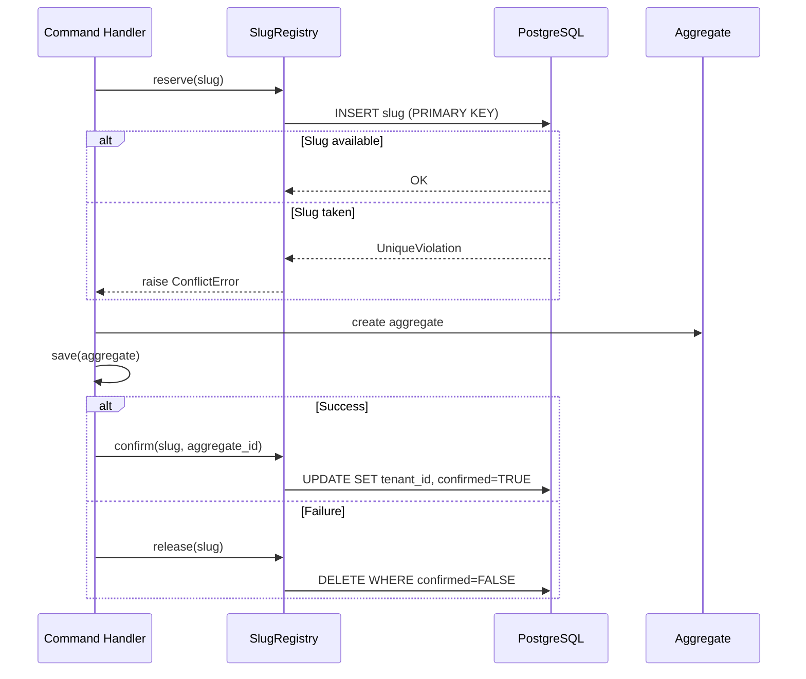

# Three-Phase Slug Reservation Pattern

> Atomic uniqueness enforcement via database constraints with compensating actions

**Pattern Type:** Infrastructure
**Introduced:** F-101-001 Tenant Lifecycle (S-101-001-002)
**Status:** Active

---

## Problem

When creating event-sourced aggregates that require a unique human-readable identifier (slug), uniqueness cannot be enforced by the aggregate itself because:

1. **Event store has no unique constraint on domain fields** — only on `originator_id` (UUID)
2. **Projections are eventually consistent** — checking a projection for slug existence has a race window
3. **Concurrent requests** can both pass a "slug available" check and create duplicate slugs
4. **Failure after reservation** must release the slug (compensating action)

The standard approach of "check-then-create" is vulnerable to TOCTOU race conditions.

---

## Solution

Use a dedicated reservation table with a database-level unique constraint. Split the operation into three phases:



**Key insight:** The PRIMARY KEY constraint on the reservation table provides atomic uniqueness at the database level, eliminating race conditions entirely.

---

## Implementation

### Reservation Table Schema

```sql
CREATE TABLE IF NOT EXISTS tenant_slug_registry (
    slug VARCHAR(63) PRIMARY KEY,
    tenant_id UUID,
    reserved_at TIMESTAMP WITH TIME ZONE NOT NULL DEFAULT NOW(),
    confirmed BOOLEAN NOT NULL DEFAULT FALSE
);

-- Index for orphan cleanup queries
CREATE INDEX IF NOT EXISTS idx_slug_registry_unconfirmed
    ON tenant_slug_registry (reserved_at)
    WHERE confirmed = FALSE;
```

### Registry Class

From `src/{project}/shared/infrastructure/slug_registry.py`:

```python
class SlugRegistry:
    """Three-phase slug reservation using event store database."""

    def __init__(self, app: Application[UUID]) -> None:
        self._app = app

    def reserve(self, slug: str) -> None:
        """Phase 1: Reserve slug via INSERT with PRIMARY KEY constraint."""
        try:
            with datastore.transaction(commit=True) as cursor:
                cursor.execute(
                    "INSERT INTO tenant_slug_registry (slug, confirmed) VALUES (%s, FALSE)",
                    (slug,),
                )
        except UniqueViolation as err:
            raise ConflictError(f"Slug '{slug}' is already taken", slug=slug) from err

    def confirm(self, slug: str, tenant_id: UUID) -> None:
        """Phase 2: Confirm reservation with aggregate UUID."""
        with datastore.transaction(commit=True) as cursor:
            cursor.execute(
                "UPDATE tenant_slug_registry SET tenant_id = %s, confirmed = TRUE WHERE slug = %s",
                (str(tenant_id), slug),
            )

    def release(self, slug: str) -> None:
        """Phase 3 (failure): Compensating action — release unconfirmed reservation."""
        with datastore.transaction(commit=True) as cursor:
            cursor.execute(
                "DELETE FROM tenant_slug_registry WHERE slug = %s AND confirmed = FALSE",
                (slug,),
            )

    def decommission(self, slug: str) -> None:
        """Permanently release slug (confirmed or not) on aggregate decommission."""
        with datastore.transaction(commit=True) as cursor:
            cursor.execute(
                "DELETE FROM tenant_slug_registry WHERE slug = %s",
                (slug,),
            )
```

### Handler Usage

```python
class ProvisionTenantHandler:
    def handle(self, cmd: ProvisionTenantCommand) -> UUID:
        # Phase 1: Reserve (atomic, raises ConflictError if taken)
        self._slug_registry.reserve(cmd.slug)

        try:
            # Create and save aggregate
            tenant = Tenant(tenant_id=cmd.slug, name=cmd.name, slug=cmd.slug)
            tenant.request_activate()
            self._app.save(tenant)

            # Phase 2: Confirm reservation with aggregate ID
            self._slug_registry.confirm(cmd.slug, tenant.id)
            return tenant.id

        except Exception:
            # Phase 3: Compensating action on any failure
            self._slug_registry.release(cmd.slug)
            raise
```

---

## When to Use

- Any aggregate requiring a **unique human-readable identifier** (slug, username, code)
- **Concurrent creation** is possible (multiple API requests, distributed systems)
- The unique field is **not the aggregate's originator_id** (UUID)
- The unique identifier must be **reservable before aggregate creation** succeeds

## When NOT to Use

- UUID-based uniqueness (already guaranteed by event store)
- Single-writer systems with no concurrency concern
- Identifiers validated against a static list (use value object validation instead)
- Temporary or mutable identifiers (reservation assumes immutability)

---

## Trade-offs

| Pro | Con |
|-----|-----|
| Atomic uniqueness (zero race window) | Extra database table and queries |
| Compensating action on failure (clean) | Two-phase commit between reservation and event store |
| Slug reuse after decommission | Orphan reservations possible if process crashes between reserve and confirm |
| Shares event store connection (no extra pool) | Tight coupling to PostgreSQL (not portable) |

---

## Orphan Cleanup

Unconfirmed reservations (process crash between reserve and confirm) can be cleaned up with:

```sql
-- Clean reservations older than 1 hour that were never confirmed
DELETE FROM tenant_slug_registry
WHERE confirmed = FALSE AND reserved_at < NOW() - INTERVAL '1 hour';
```

The `idx_slug_registry_unconfirmed` partial index makes this query efficient.

---

## Related

- [PADR-001: Event Sourcing](../../09-decisions/PADR-001-event-sourcing.md) — Why aggregates use UUIDs, not slugs
- [ref-shared-interactions.md](../05-building-blocks/bounded-contexts/ref-shared-interactions.md) — Tenant provisioning sequence diagram
- [ref-domain-aggregate-lifecycle.md](ref-domain-aggregate-lifecycle.md) — Aggregate state machine pattern
