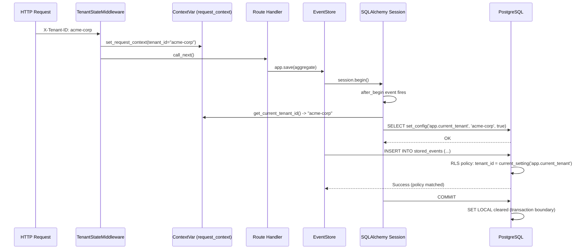

# Infrastructure Pattern: SQLAlchemy Tenant Context Handler

> Session event handler that propagates request-scoped tenant context to PostgreSQL session variables for RLS enforcement.

**Pattern ID:** `ref-infra-tenant-context-handler`
**Category:** Infrastructure / Persistence
**Introduced:** F-101-002 (Database Isolation)
**Status:** Active

---

## Context

{Project} uses PostgreSQL Row-Level Security (RLS) policies to enforce tenant data isolation at the database layer. RLS policies filter rows based on a session variable (`app.current_tenant`). This variable must be set on every database transaction to match the current request's tenant context.

**Challenge:** How do we propagate tenant context from the HTTP request layer (FastAPI middleware) to the database layer (PostgreSQL session variables) in a way that:

1. Works transparently with the eventsourcing library (which knows nothing about tenants)
2. Is safe for connection pooling (no context leakage between requests)
3. Supports both sync and async database operations
4. Requires zero boilerplate in application code

---

## Pattern

Use a **SQLAlchemy `after_begin` session event listener** to automatically execute `SET LOCAL app.current_tenant = :tenant` on every transaction begin.

### Implementation

**File:** `src/{project}/shared/infrastructure/persistence/tenant_context.py`

```python
"""SQLAlchemy session event handler for tenant context propagation.

Bridges the request-scoped ContextVar (set by middleware) to a PostgreSQL
session variable (consumed by RLS policies). Uses SET LOCAL for
transaction-scoped safety in connection-pooled environments.

Registration: Called once during application lifespan startup.
"""

from __future__ import annotations

from sqlalchemy import event, text
from sqlalchemy.orm import Session

from {project}.shared.infrastructure.context import (
    NoRequestContextError,
    get_current_tenant_id,
)
from {project}.shared.observability import get_logger

logger = get_logger(__name__)


def _set_tenant_context_on_begin(
    session: Session,
    transaction: object,
    connection: object,
) -> None:
    """Set app.current_tenant as PostgreSQL session variable.

    Fires after Session.begin() (including savepoints). Reads tenant_id
    from the ContextVar populated by request middleware and executes
    SET LOCAL on the raw connection.

    SET LOCAL is transaction-scoped: automatically cleared on COMMIT
    or ROLLBACK. Safe for connection pooling.

    Args:
        session: The SQLAlchemy Session.
        transaction: The SessionTransaction (unused).
        connection: The Connection object to execute SET LOCAL on.
    """
    try:
        tenant_id = get_current_tenant_id()
    except NoRequestContextError:
        # No request context: migrations, health checks, admin tools,
        # background tasks. RLS default-deny returns zero rows.
        logger.debug("tenant_context_skipped", reason="no_request_context")
        return

    if not tenant_id:
        logger.warning("tenant_context_empty", msg="tenant_id is empty string")
        return

    # Use set_config() with is_local=true for transaction-scoped context.
    # set_config() accepts parameterized values (unlike SET LOCAL which
    # rejects prepared statement parameters). The third argument 'true'
    # makes it equivalent to SET LOCAL -- cleared on commit/rollback.
    connection.execute(  # type: ignore[attr-defined]
        text("SELECT set_config('app.current_tenant', :tenant, true)"),
        {"tenant": str(tenant_id)},
    )
    logger.debug("tenant_context_set", tenant_id=tenant_id)


def register_tenant_context_handler() -> None:
    """Register the after_begin event handler on the Session class.

    Must be called once during application startup (lifespan).
    Applies to ALL sessions created from any engine -- both async
    and sync sessions fire after_begin through the same Session class.

    Idempotent: SQLAlchemy deduplicates identical listener registrations.
    """
    event.listen(Session, "after_begin", _set_tenant_context_on_begin)
    logger.info("tenant_context_handler_registered")
```

### Registration in Application Startup

**File:** `src/{project}/main.py`

```python
from {project}.shared.infrastructure.persistence.tenant_context import (
    register_tenant_context_handler,
)

@asynccontextmanager
async def lifespan(app: FastAPI) -> AsyncIterator[None]:
    # ... event store initialization ...

    # Register tenant context handler for RLS
    register_tenant_context_handler()

    # ... initialize applications ...
```

**Placement:** After event store initialization, before application instances. This ensures the handler is registered before any aggregates are saved.

---

## How It Works

### Request Flow



### Key Characteristics

1. **Automatic:** No manual `SET LOCAL` calls in application code
2. **Transparent:** Eventsourcing library unaware of tenant context
3. **Transaction-scoped:** `set_config(..., true)` cleared on COMMIT/ROLLBACK
4. **Connection-pool safe:** No context leakage between requests
5. **Dual-mode:** Works for both sync and async sessions

---

## Design Decisions

### DD-1: `set_config()` Instead of `SET LOCAL`

**Decision:** Use `SELECT set_config('app.current_tenant', :tenant, true)` instead of `SET LOCAL app.current_tenant = :tenant`.

**Rationale:**

- `SET LOCAL` rejects parameterized values (only literal strings allowed)
- Using f-strings would open SQL injection risk
- `set_config()` is a PostgreSQL function that accepts parameters safely
- The third argument `true` makes it transaction-scoped (equivalent to SET LOCAL)

### DD-2: `Session`-level Listener (Not Engine-level)

**Decision:** Register listener on the `Session` class, not on a specific engine.

**Rationale:**

- {Project} uses dual engines (async for queries, sync for projections)
- `Session` class is shared across both async and sync sessions
- Engine-level listeners only fire for sessions created from that specific engine
- Session-level listener fires for ALL sessions regardless of engine

### DD-3: Silent Skip on `NoRequestContextError`

**Decision:** Catch `NoRequestContextError` and return silently (no exception raised).

**Rationale:**

- Migrations, health checks, and admin tools run without request context
- RLS default-deny behavior (zero rows returned) is safe fallback
- Raising an exception would break legitimate non-request operations
- Logged at DEBUG level for observability

### DD-4: Warning on Empty `tenant_id`

**Decision:** Log warning if `tenant_id` is an empty string, but don't set session variable.

**Rationale:**

- Empty string indicates a bug in middleware (tenant_id should be slug or None)
- Setting empty string in session variable would match NULL in RLS policies (unintended behavior)
- Warning provides observability for debugging

---

## Connection Pooling Safety

### The Problem: Context Leakage

SQLAlchemy uses connection pooling (`pool_size=20, max_overflow=10`). Without proper scoping, a connection reused from the pool could retain the previous request's tenant context:

```
Request 1 (Tenant A):
  - Connection #5 retrieved from pool
  - SET app.current_tenant = 'tenant-a'
  - Query executes (sees Tenant A data)
  - Connection #5 returned to pool

Request 2 (Tenant B):
  - Connection #5 retrieved from pool
  - STILL HAS app.current_tenant = 'tenant-a' (LEAK!)
  - Query executes (sees Tenant A data instead of Tenant B)
```

### The Solution: Transaction-Scoped Variables

Using `set_config(..., true)` (or `SET LOCAL`) ensures the variable is **transaction-scoped**:

```
Request 1 (Tenant A):
  - BEGIN
  - SET LOCAL app.current_tenant = 'tenant-a'
  - Query executes
  - COMMIT (app.current_tenant cleared automatically)

Request 2 (Tenant B):
  - BEGIN
  - SET LOCAL app.current_tenant = 'tenant-b'
  - Query executes (correct context, no leakage)
```

### Validation Test

```python
async def test_connection_reuse_no_context_leakage(
    db_engine_with_migrations: AsyncEngine,
) -> None:
    """Reused connection does not leak previous tenant context."""
    async with db_engine_with_migrations.connect() as conn:
        # Request 1: Tenant A
        async with conn.begin():
            await set_tenant_context(conn, "tenant-alpha")
            result = await conn.execute(
                text("SELECT current_setting('app.current_tenant', true)")
            )
            assert result.scalar() == "tenant-alpha"

        # Request 2: should have no context
        async with conn.begin():
            result = await conn.execute(
                text("SELECT current_setting('app.current_tenant', true)")
            )
            value = result.scalar()
            assert value is None or value == "", (
                "Previous tenant context must not leak to next transaction"
            )
```

---

## Async vs Sync Compatibility

### PADR-109: Sync-First Event Sourcing

{Project} uses a **sync-first** async strategy (PADR-109):

- **Command endpoints:** Use `def` (sync functions), FastAPI runs in threadpool
- **Query endpoints:** Use `async def` (genuine async)
- **Projections:** Use sync repositories (`session.execute()`)

### Event Handler Compatibility

The `after_begin` event handler works for both sync and async sessions:

| Path | Engine Type | Session Type | Handler Behavior |
|------|-------------|--------------|-----------------|
| Command endpoint (`def`) | Async (threadpool) | AsyncSession | `after_begin` fires on underlying sync connection |
| Query endpoint (`async def`) | Async | AsyncSession | `after_begin` fires normally |
| Projection sync write | Sync | Session | `after_begin` fires on sync connection |

**Important:** The `connection.execute()` call in the handler is **always sync** (not `await connection.execute()`), because SQLAlchemy 2.0 provides a sync connection object to event callbacks regardless of session type.

---

## Testing

### Unit Tests

```python
class TestSetTenantContextOnBegin:
    """Test _set_tenant_context_on_begin event handler."""

    def test_sets_local_when_context_exists(self, mocker):
        """SET LOCAL executed with tenant_id from ContextVar."""
        mock_conn = mocker.Mock()
        mocker.patch(
            "...tenant_context.get_current_tenant_id",
            return_value="acme-corp",
        )
        _set_tenant_context_on_begin(
            session=mocker.Mock(),
            transaction=mocker.Mock(),
            connection=mock_conn,
        )
        mock_conn.execute.assert_called_once()
        call_text = str(mock_conn.execute.call_args[0][0])
        assert "set_config('app.current_tenant'" in call_text

    def test_skips_when_no_request_context(self, mocker):
        """No SET LOCAL when NoRequestContextError raised."""
        mock_conn = mocker.Mock()
        mocker.patch(
            "...tenant_context.get_current_tenant_id",
            side_effect=NoRequestContextError(),
        )
        _set_tenant_context_on_begin(
            session=mocker.Mock(),
            transaction=mocker.Mock(),
            connection=mock_conn,
        )
        mock_conn.execute.assert_not_called()
```

### Integration Tests

Integration tests in `tests/integration/shared/test_cross_tenant_isolation.py` validate the full request-to-database flow with real RLS policies.

---

## Observability

### Structured Logging

The handler emits structured logs at two levels:

**DEBUG:** Successful context set

```json
{
  "level": "debug",
  "event": "tenant_context_set",
  "tenant_id": "acme-corp",
  "timestamp": "2026-02-06T12:34:56Z"
}
```

**DEBUG:** Skipped (no request context)

```json
{
  "level": "debug",
  "event": "tenant_context_skipped",
  "reason": "no_request_context",
  "timestamp": "2026-02-06T12:34:56Z"
}
```

**WARNING:** Empty tenant_id

```json
{
  "level": "warning",
  "event": "tenant_context_empty",
  "msg": "tenant_id is empty string",
  "timestamp": "2026-02-06T12:34:56Z"
}
```

### Tracing

The handler operates within the request's trace span (inherited from middleware). Database queries with tenant context appear in distributed traces with correct tenant_id labels.

---

## Troubleshooting

### Issue: Queries Return Zero Rows

**Symptoms:** Application queries return no results despite data existing in the database.

**Diagnosis:**

1. Check logs for `tenant_context_skipped` (middleware not setting context)
2. Verify `X-Tenant-ID` header in request
3. Check PostgreSQL: `SELECT current_setting('app.current_tenant', true);` should return tenant slug

**Resolution:** Ensure `TenantStateMiddleware` is registered and `X-Tenant-ID` header is present.

### Issue: Cross-Tenant Data Visible

**Symptoms:** Tenant A sees Tenant B's data.

**Diagnosis:**

1. Check if FORCE RLS is applied: `SELECT relforcerowsecurity FROM pg_class WHERE relname = 'stored_events';`
2. Verify user is not superuser: `SELECT usesuper FROM pg_user WHERE usename = current_user;`
3. Check RLS policy exists: `SELECT * FROM pg_policies WHERE tablename = 'stored_events';`

**Resolution:** Apply FORCE RLS migration, or connect as non-superuser role.

---

## Related Patterns

- **RLS Migration Helpers** (`ref-infra-rls-migration-helpers.md`): Creates RLS policies consumed by this handler
- **Request Context** (`con-request-context.md`): ContextVar pattern for propagating tenant_id
- **Cross-Tenant Isolation Testing** (`ref-infra-cross-tenant-isolation-tests.md`): Validates this handler's behavior
- **PADR-109: Sync-First Event Sourcing**: Async strategy that this handler supports

---

## References

- **Feature:** F-101-002 (Database Isolation)
- **Story:** S-101-002-002 (Tenant Context Middleware)
- **Implementation:** `src/{project}/shared/infrastructure/persistence/tenant_context.py`
- **PostgreSQL Docs:** [set_config()](https://www.postgresql.org/docs/current/functions-admin.html#FUNCTIONS-ADMIN-SET)
- **SQLAlchemy Docs:** [Session Events](https://docs.sqlalchemy.org/en/20/orm/events.html#session-events)

---

**Last Updated:** 2026-02-06
**Introduced By:** S-101-002-002
**Status:** Active — registered at application startup
