# Shared Context — Interactions

> How entities, events, and facades interact within and across the shared bounded context.

**Last updated:** 2026-02-08 (after features F-102-003, F-102-004)

---

## Entity Interaction Diagram

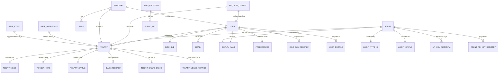

**Ownership rules:**

- `Tenant`, `User`, and `Agent` are aggregate roots in the shared context (F-102-003, F-102-004)
- `TenantSlug` and `TenantName` are value objects owned by Tenant
- `OidcSub`, `Email`, `DisplayName` are value objects owned by User (F-102-003)
- `SlugRegistry` ensures slug uniqueness at the database level
- `OidcSubRegistry` ensures OIDC sub uniqueness at the database level (F-102-003)
- `TenantStateCache` is an in-memory projection of tenant status for middleware enforcement
- `TenantUsageMetrics` is a read model projection tracking resource consumption (entry_count, storage_bytes, api_call_count)
- `UserProfile` is a read model projection of User aggregate for fast profile reads (F-102-003)
- `AgentAPIKeyRegistry` is a read model projection of Agent API keys for fast auth lookups (F-102-004)
- `APIKeyMetadata` is a value object owned by Agent containing key_id, key_hash, created_at, status (F-102-004)
- `RequestContext` is a cross-cutting ContextVar carrying tenant_id, user_id, and correlation_id per request
- `Principal` is a domain value object representing an authenticated identity (user or agent) with tenant_id, user_id, roles (F-102-001, F-102-004)
- `JWKSProvider` is an infrastructure singleton caching JWT signing keys from the OIDC provider's JWKS endpoint (F-102-001)
- `BaseAggregate` and `BaseEvent` are abstract base classes consumed by all bounded contexts

---

## Aggregate State Machine

### Tenant Lifecycle

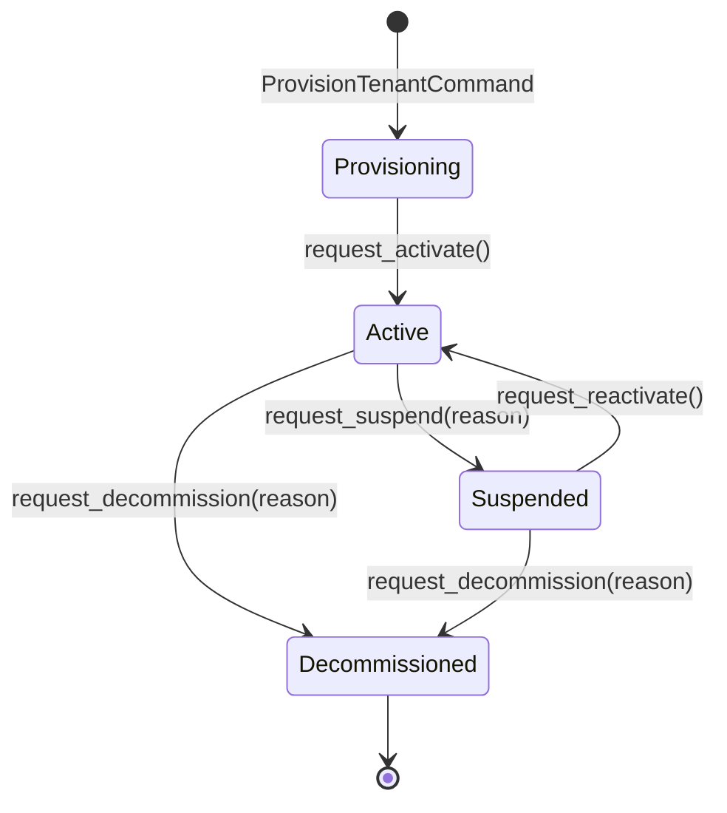

**Invariants:**

- Provisioning auto-transitions to Active during the provision command handler (atomic)
- Suspend/Reactivate commands are **idempotent** (re-suspending a suspended tenant is a no-op)
- Decommissioned is a **terminal state** — no transitions out
- Decommission triggers cascade deletion of tenant-scoped projection data
- Events are never deleted (immutability principle, PADR-101)

### Agent Lifecycle (F-102-004)

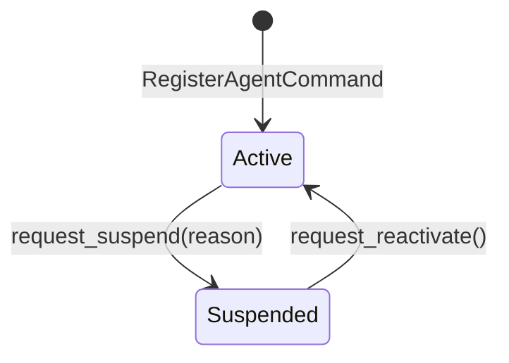

**Invariants:**

- Agent is created in ACTIVE state (no provisioning state)
- Suspend/Reactivate commands are **idempotent** (re-suspending a suspended agent is a no-op)
- No terminal state (agents can be suspended/reactivated indefinitely)
- Suspending an agent does NOT auto-revoke API keys (keys must be revoked separately)

---

## Internal Event Flow

### Tenant Provisioning

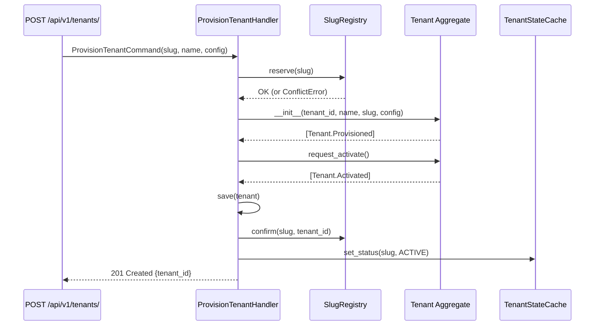

### Tenant Decommissioning (Cascade)

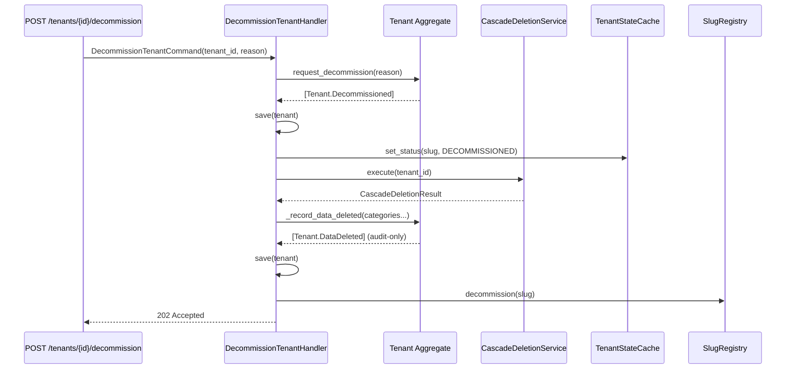

### User Provisioning (JIT Pattern, F-102-003)

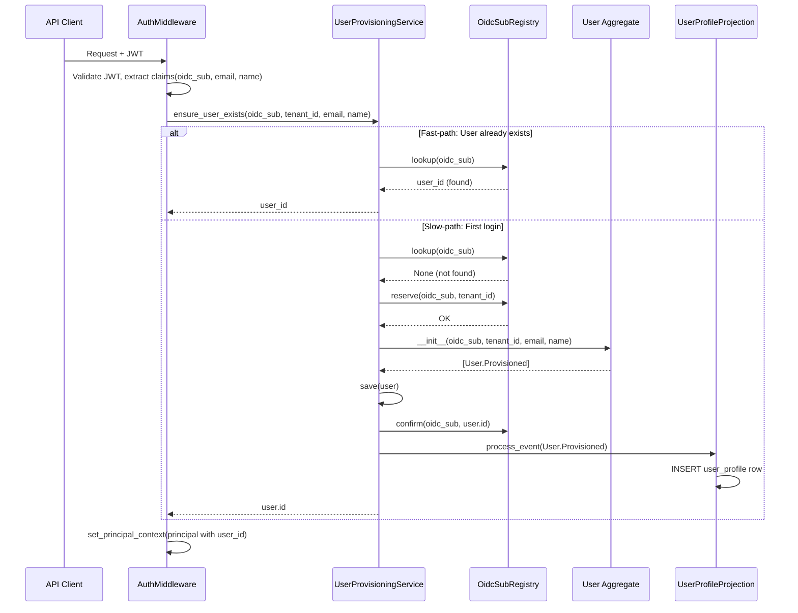

**Trigger:** First authenticated request with a new `oidc_sub` (JIT provisioning)
**Outcome:** User aggregate created, registry entry confirmed, user profile projection populated

**Pattern:** JIT provisioning with fast/slow path (see [ref-infra-jit-provisioning.md](../../security/references/ref-infra-jit-provisioning.md))

### Agent Registration and API Key Issuance (F-102-004)

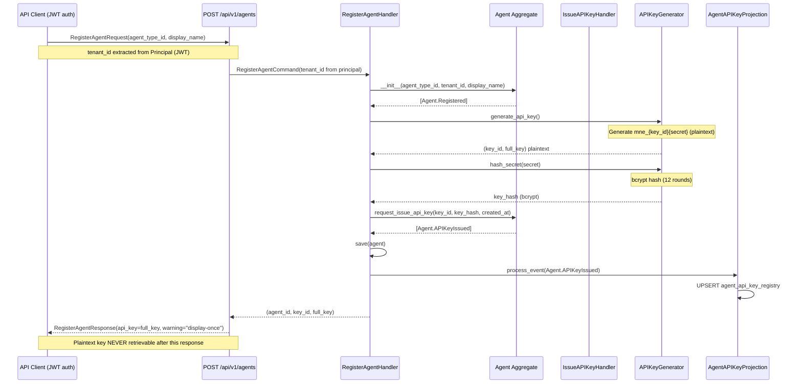

**Trigger:** Authenticated user (JWT) registers a new agent
**Outcome:** Agent aggregate created, API key issued and projected, plaintext key returned once

**Pattern:** Display-once credential issuance (see [ref-infra-display-once-credential.md](../../security/references/ref-infra-display-once-credential.md))

---

## Cross-Context Integration

### Usage Metrics Projection (Cross-Context Event Consumption)

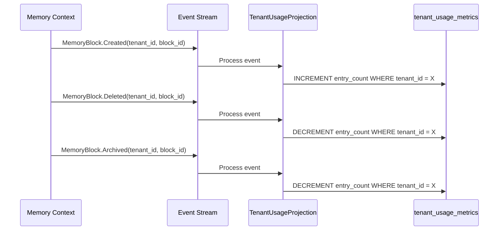

**Trigger:** Memory block lifecycle events from Memory context
**Outcome:** Real-time per-tenant resource usage counters maintained in shared context

**Pattern:** Delta-based counter projection (see [ref-infra-delta-counter-projection.md](../../08-crosscutting/ref-infra-delta-counter-projection.md))

**Events consumed from Memory context:**

- `MemoryBlock.Created` → Increment `entry_count` by 1
- `MemoryBlock.Deleted` → Decrement `entry_count` by 1 (floor at 0)
- `MemoryBlock.Archived` → Decrement `entry_count` by 1 (archived blocks don't count toward active limit)

**Projection characteristics:**

- **Delta-based updates:** `UPDATE SET count = count + 1` (not replay-safe)
- **UPSERT initialization:** First event for tenant creates row with zero counters
- **Soft-delete support:** `status` column tracks tenant lifecycle (active/decommissioned)
- **RLS isolation:** Projection table has tenant_id-based RLS policy

### Tenant Health Monitoring Flow

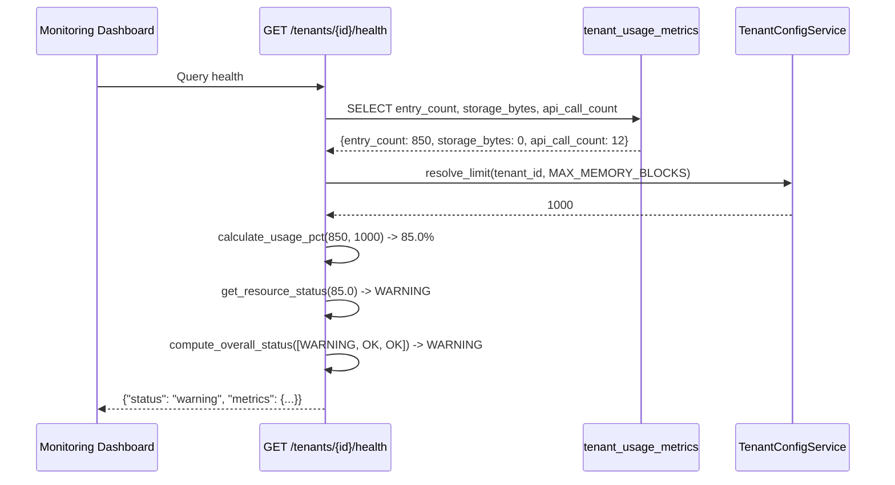

**Trigger:** Operator queries tenant health endpoint
**Outcome:** Composite health status with per-resource usage percentages and status indicators

**Pattern:** Composite health scoring (see [ref-api-composite-health-scoring.md](../../08-crosscutting/ref-api-composite-health-scoring.md))

**Data flow:**

1. Query usage projection for current counts (async SELECT)
2. Resolve configured limits via TenantConfigService (cached)
3. Calculate usage percentages for each resource
4. Classify each resource (ok/warning/at_limit) based on thresholds
5. Aggregate to composite status via worst-case escalation

**Thresholds (system-wide constants):**

- `ok`: usage_pct < 80% or no limit configured
- `warning`: 80% <= usage_pct < 100%
- `at_limit`: usage_pct >= 100%

**Composite escalation:**

- Any resource `at_limit` → tenant status `critical`
- Any resource `warning` → tenant status `warning`
- All resources `ok` → tenant status `healthy`

### JWT Authentication and Principal Extraction (F-102-001)

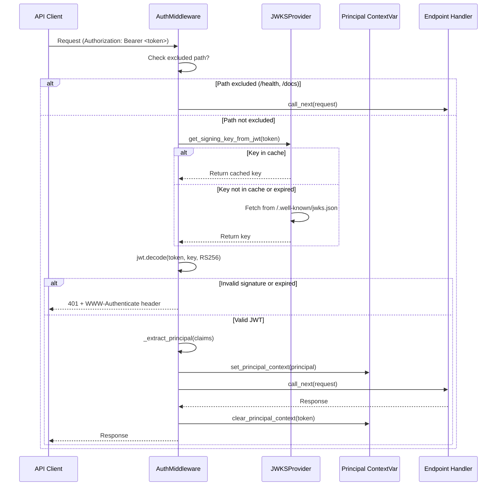

**Trigger:** Every HTTP request with `Authorization: Bearer <token>` header (except excluded paths)
**Outcome:** Principal extracted from JWT, stored in ContextVar, available to endpoint handlers via Depends(get_current_principal)

**Pattern:** JWT authentication middleware with JWKS caching (see [ref-infra-jwt-auth-middleware.md](../../security/references/ref-infra-jwt-auth-middleware.md))

### Multi-Auth Authentication Flow (API Key vs JWT, F-102-004)

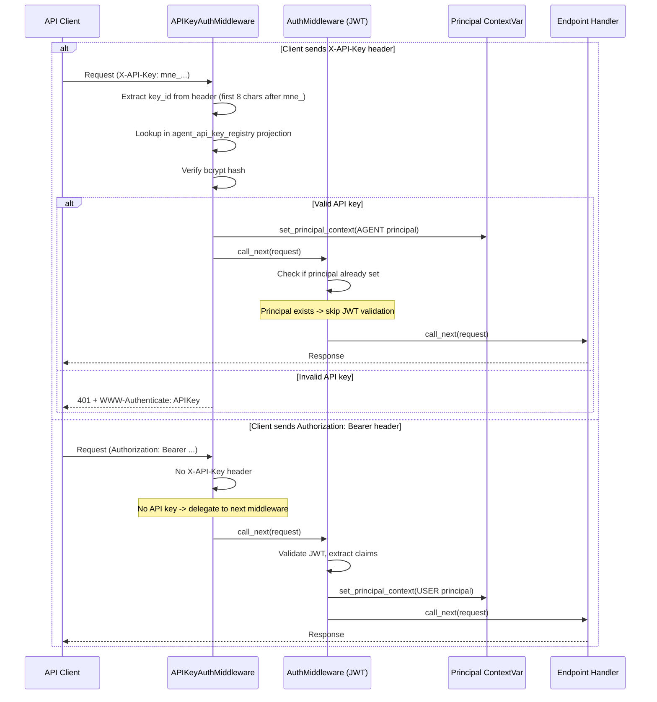

**Trigger:** Every HTTP request with either `X-API-Key` or `Authorization: Bearer` header
**Outcome:** Principal extracted (AGENT or USER type), available to endpoint handlers

**Pattern:** Multi-auth middleware with first-match-wins (see [ref-infra-multi-auth-middleware.md](../../security/references/ref-infra-multi-auth-middleware.md))

### Request Context Propagation

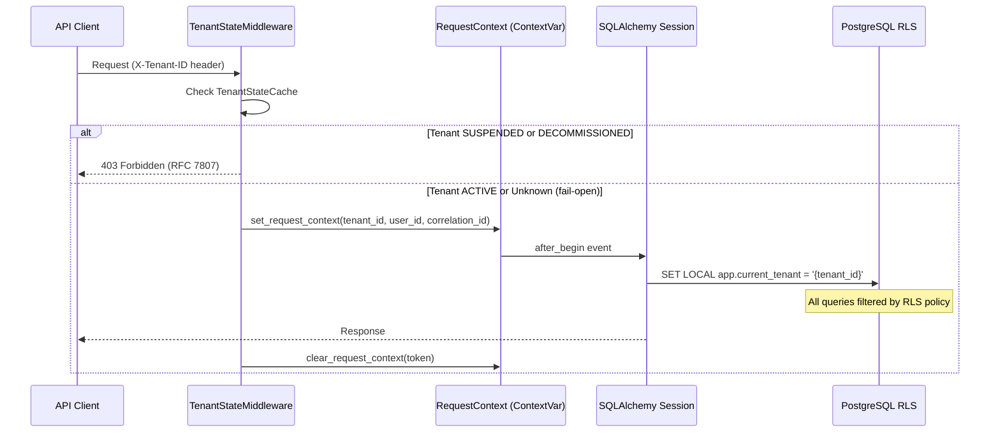

**Trigger:** Every HTTP request with `X-Tenant-ID` header
**Outcome:** PostgreSQL session variable set for RLS enforcement; suspended tenants blocked

### Base Class Inheritance (All Contexts)

All bounded contexts depend on shared for:

| Symbol | Purpose | Consumed By |
|--------|---------|-------------|
| `BaseAggregate` | Aggregate root with `tenant_id` | memory, ingestion, query, security, graph, curation |
| `BaseEvent` | Domain event with tenant_id, correlation_id, user_id | All contexts |
| `BaseProjection` | CQRS read model with topic filtering and idempotent handlers | All contexts |
| `RequestContext` | ContextVar for tenant_id, user_id, correlation_id | All contexts (via middleware) |
| Exception hierarchy | `DomainError`, `NotFoundError`, `ConflictError`, etc. | All contexts |

---

## Facade Contracts

### Provided (shared exposes)

The shared context does not expose a formal facade class. Instead, it provides:

1. **Base classes** imported directly by other contexts:
   - `BaseAggregate` — aggregate root with tenant_id enforcement
   - `BaseEvent` — domain event with tracing fields
   - `BaseProjection` — CQRS read model base

2. **Request context utilities** consumed via function calls:
   - `get_current_tenant_id()` — returns current request's tenant_id
   - `get_current_user_id()` — returns current request's user_id
   - `get_current_correlation_id()` — returns current correlation_id
   - `set_request_context(tenant_id, user_id, correlation_id)` — sets ContextVar (middleware only)

2b. **Principal context utilities** consumed via function calls (F-102-001):

- `get_current_principal()` — returns authenticated Principal from ContextVar
- `set_principal_context(principal)` — sets Principal ContextVar (AuthMiddleware only)
- `clear_principal_context(token)` — resets Principal ContextVar (AuthMiddleware only)

2c. **FastAPI authentication dependencies** (F-102-001):

- `get_current_principal()` — FastAPI Depends() function returning Principal
- `CurrentPrincipal` — Type alias for `Annotated[Principal, Depends(get_current_principal)]`
- `require_role(role: str)` — FastAPI Depends() factory enforcing role membership

1. **Middleware** registered at application startup:
   - `TenantStateMiddleware` — enforces tenant suspension/decommission globally
   - `AuthMiddleware` — validates JWT, extracts Principal (F-102-001)

2. **Infrastructure singletons** (lifespan-managed, stored in app.state):
   - `JWKSProvider` — caches JWT signing keys from OIDC provider JWKS endpoint (F-102-001)

### Consumed (shared depends on)

None. The shared context has **zero outbound dependencies** on other bounded contexts.

---

## Event Catalog

### Events Published

| Event | Trigger | Payload (key fields) | Consumers |
|-------|---------|---------------------|-----------|
| `Tenant.Provisioned` | Tenant creation | `tenant_id`, `name`, `slug`, `config` | (projections, future) |
| `Tenant.Activated` | Auto-activate or reactivate | `tenant_id` | TenantStateCache |
| `Tenant.Suspended` | Admin suspend action | `tenant_id`, `reason` | TenantStateCache |
| `Tenant.Reactivated` | Admin reactivate action | `tenant_id` | TenantStateCache |
| `Tenant.Decommissioned` | Admin decommission action | `tenant_id`, `reason` | TenantStateCache, CascadeDeletionService |
| `Tenant.DataDeleted` | Cascade deletion complete | `tenant_id`, `category`, `entity_count` | (audit-only, no consumers) |
| `User.Provisioned` | JIT provisioning on first login (F-102-003) | `user_id`, `oidc_sub`, `email`, `tenant_id`, `display_name`, `preferences` | UserProfileProjection |
| `User.ProfileUpdated` | User updates display_name (F-102-003) | `user_id`, `display_name` | UserProfileProjection |
| `User.PreferencesUpdated` | User updates preferences (F-102-003) | `user_id`, `preferences` | UserProfileProjection |
| `Agent.Registered` | Agent registration (F-102-004) | `agent_id`, `agent_type_id`, `tenant_id`, `display_name` | (no projections) |
| `Agent.Suspended` | Admin suspend action (F-102-004) | `agent_id`, `reason` | (no projections) |
| `Agent.Reactivated` | Admin reactivate action (F-102-004) | `agent_id` | (no projections) |
| `Agent.APIKeyIssued` | API key issuance (F-102-004) | `agent_id`, `key_id`, `key_hash`, `created_at` | AgentAPIKeyProjection |
| `Agent.APIKeyRotated` | API key rotation (F-102-004) | `agent_id`, `new_key_id`, `new_key_hash`, `revoked_key_id` | AgentAPIKeyProjection |

### Events Consumed

| Event | Source | Handler | Side Effect |
|-------|--------|---------|-------------|
| `MemoryBlock.Created` | Memory context | `TenantUsageProjection` | Increment `entry_count` for tenant |
| `MemoryBlock.Deleted` | Memory context | `TenantUsageProjection` | Decrement `entry_count` for tenant |
| `MemoryBlock.Archived` | Memory context | `TenantUsageProjection` | Decrement `entry_count` (archived blocks don't count toward limit) |

**Note:** The shared context only consumes events from the Memory context for resource usage tracking. All other bounded contexts produce events that shared does not consume.

---

## See Also

- [Bounded Contexts Index](_index.md) — All contexts overview
- [Level 1 Overview](../con-level1-overview.md) — System-wide context map
