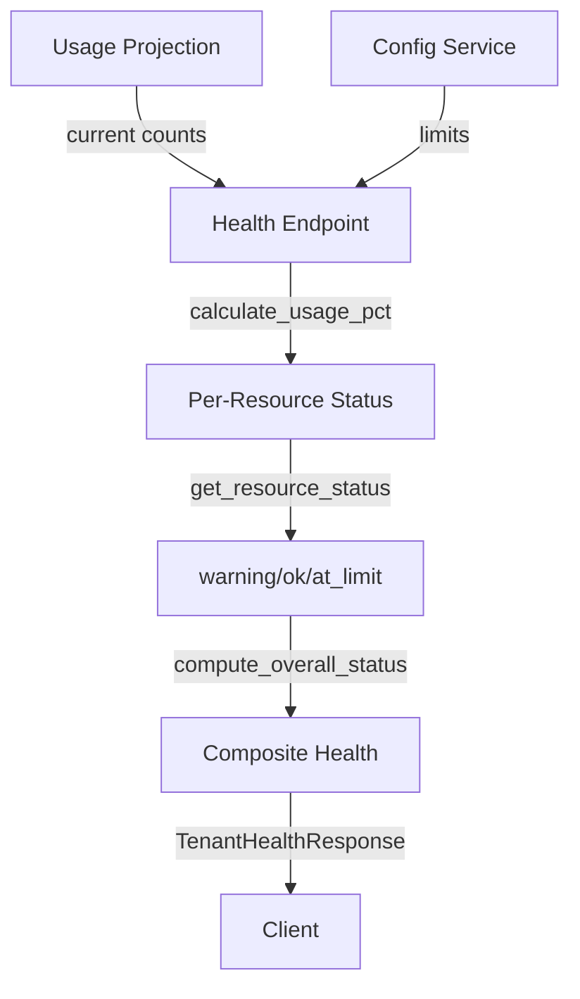

# Composite Health Scoring Pattern

> Threshold-based status aggregation for multi-metric health endpoints

**Category:** API
**Introduced:** F-101-004 (Tenant Monitoring)
**Related ADRs:** [PADR-109](../../adr/patterns/PADR-109-sync-first-eventsourcing.md), [PADR-101](../../adr/patterns/PADR-101-vertical-slices.md)

---

## Problem

Multi-tenant systems must expose health status for operators to monitor resource consumption and identify tenants approaching limits. A naive health endpoint returns raw counters (memory blocks: 850, API calls: 45), leaving status interpretation to clients.

**Challenges:**

- **Multiple resource types** - Memory blocks, storage bytes, API calls each have different limits and semantics
- **Threshold variability** - Warning at 80%, critical at 95%, at-limit at 100%
- **Composite status** - Overall tenant health must aggregate across all resource types
- **Unlimited resources** - Some limits may be disabled (INT_MAX sentinel)
- **Client burden** - Clients should not reimplement threshold logic

**Requirements:**

- Per-resource status indicators (`ok`, `warning`, `at_limit`)
- Composite health status (`healthy`, `warning`, `critical`, `unknown`)
- Configurable thresholds (currently system-wide constants, future per-tenant)
- Clear escalation rules (worst-case aggregation)

---

## Solution

Compute per-resource status from usage percentages using threshold constants, then aggregate to a composite health status via worst-case escalation. The health endpoint returns structured data with current usage, configured limits, computed percentages, and status indicators at both the resource and tenant level.



**Key characteristics:**

- **Threshold-based classification:** Usage percentage mapped to status via constants
- **Worst-case aggregation:** Any resource at_limit → critical; any warning → warning
- **Null-safe handling:** Unlimited resources (limit=null) always return `ok` status
- **Structured response:** Machine-readable status enums, not free-text descriptions

---

## Implementation

### Response Schema

```python
class HealthStatus(StrEnum):
    """Composite health status for a tenant."""
    HEALTHY = "healthy"   # All resources below warning threshold
    WARNING = "warning"   # At least one resource at 80-99%
    CRITICAL = "critical" # At least one resource at 100%+
    UNKNOWN = "unknown"   # No usage data available

class ResourceStatus(StrEnum):
    """Per-resource status indicator."""
    OK = "ok"           # Below 80% or no limit
    WARNING = "warning" # 80-99% of limit
    AT_LIMIT = "at_limit" # 100%+ of limit

class MetricHealth(BaseModel):
    """Health data for a single resource metric."""
    current: int                           # From usage projection
    limit: int | None                      # From config service (null = unlimited)
    usage_pct: float | None                # Computed percentage
    status: ResourceStatus = ResourceStatus.OK

class TenantHealthResponse(BaseModel):
    """Root health response."""
    tenant_id: str
    status: HealthStatus
    queried_at: datetime
    metrics: dict[str, MetricHealth]  # Keyed by resource name
```

### Threshold Constants

```python
# System-wide thresholds (future: per-tenant via ConfigKey)
_WARNING_THRESHOLD_PCT = 80.0
_CRITICAL_THRESHOLD_PCT = 95.0  # Unused in current impl (100% = at_limit)
_AT_LIMIT_THRESHOLD_PCT = 100.0
_INT_MAX = 2**31 - 1  # Sentinel for unlimited
```

### Helper Functions

```python
def calculate_usage_pct(current: int, limit: int | None) -> float | None:
    """Calculate usage percentage. Returns None if no limit configured.

    Edge cases:
    - limit is None or >= INT_MAX → None (unlimited)
    - limit is 0, current is 0 → 0.0 (disabled, no usage)
    - limit is 0, current > 0 → 100.0 (should not happen; limit blocks creation)
    """
    if limit is None or limit >= _INT_MAX:
        return None
    if limit == 0:
        return 100.0 if current > 0 else 0.0
    return round((current / limit) * 100, 1)

def get_resource_status(usage_pct: float | None) -> ResourceStatus:
    """Determine per-resource status from usage percentage.

    Thresholds:
    - None (no limit) → ok
    - 0-79.9% → ok
    - 80-99.9% → warning
    - 100%+ → at_limit
    """
    if usage_pct is None:
        return ResourceStatus.OK
    if usage_pct >= _AT_LIMIT_THRESHOLD_PCT:
        return ResourceStatus.AT_LIMIT
    if usage_pct >= _WARNING_THRESHOLD_PCT:
        return ResourceStatus.WARNING
    return ResourceStatus.OK

def compute_overall_status(metric_statuses: list[ResourceStatus]) -> HealthStatus:
    """Compute composite health status from per-resource statuses.

    Worst-case escalation:
    - Any AT_LIMIT → CRITICAL
    - Any WARNING → WARNING
    - All OK → HEALTHY
    """
    if any(s == ResourceStatus.AT_LIMIT for s in metric_statuses):
        return HealthStatus.CRITICAL
    if any(s == ResourceStatus.WARNING for s in metric_statuses):
        return HealthStatus.WARNING
    return HealthStatus.HEALTHY
```

### Endpoint Handler

```python
@router.get("/{tenant_id}/health", response_model=TenantHealthResponse)
async def get_tenant_health(
    tenant_id: str,
    request: Request,
    session: DbSession,
) -> TenantHealthResponse:
    """Query composite health status for a tenant with limit comparisons."""

    # 1. Query usage metrics projection (async, single SELECT)
    usage = await _get_usage_metrics(session, tenant_id)
    if usage is None:
        return TenantHealthResponse(
            tenant_id=tenant_id,
            status=HealthStatus.UNKNOWN,
            queried_at=datetime.now(UTC),
            metrics={},
        )

    # 2. Get config service for limit resolution
    config_service: TenantConfigService = request.app.state.config_service

    # 3. Build metric health entries with limit comparisons
    metrics: dict[str, MetricHealth] = {}
    resource_statuses: list[ResourceStatus] = []

    for metric_name, column_name in TRACKED_RESOURCES.items():
        current = usage[column_name]
        config_key = RESOURCE_CONFIG_KEYS.get(metric_name)

        # Resolve limit (sync call to cache-backed config service)
        if config_key is not None:
            limit_value = config_service.resolve_limit(tenant_id, config_key)
            limit = limit_value if limit_value < _INT_MAX else None
        else:
            limit = None

        # Calculate percentage and status
        pct = calculate_usage_pct(current, limit)
        status = get_resource_status(pct)
        resource_statuses.append(status)

        metrics[metric_name] = MetricHealth(
            current=current,
            limit=limit,
            usage_pct=pct,
            status=status,
        )

    # 4. Compute composite health status
    overall = compute_overall_status(resource_statuses)

    return TenantHealthResponse(
        tenant_id=tenant_id,
        status=overall,
        queried_at=datetime.now(UTC),
        metrics=metrics,
    )
```

---

## When to Use

Use composite health scoring when:

- **Multiple resource types** - Health depends on several independent metrics
- **Threshold-based alerting** - Operators need clear warning/critical indicators
- **Machine-readable status** - Clients consume status programmatically (dashboards, alerting)
- **Aggregated view** - Single composite status simplifies monitoring ("is this tenant healthy?")

**Example scenarios:**

- Multi-tenant resource health (memory, storage, API quotas)
- Service health checks (database connections, queue depth, cache hit rate)
- SLA compliance monitoring (latency percentiles, error rates, uptime)

---

## When NOT to Use

Avoid composite health scoring when:

- **Single metric** - Only one resource to monitor (use simple threshold check)
- **Continuous values** - Status is not threshold-based (use raw metrics)
- **Complex dependencies** - Health depends on non-linear relationships between metrics
- **Real-time requirements** - Projection lag is unacceptable (use direct queries)

**Alternative:** For continuous monitoring, expose raw metrics to a time-series database and compute health in the monitoring system (Prometheus, Datadog).

---

## Trade-offs

| Pro | Con |
|-----|-----|
| **Clear status indicators** - warning/critical thresholds explicit | **Hardcoded thresholds** - Currently system-wide constants (80%, 100%) |
| **Worst-case aggregation** - Any critical resource escalates overall status | **Loss of granularity** - Composite status hides which specific resource is problematic |
| **Machine-readable** - Enum values for programmatic consumption | **Threshold choice** - 80%/100% may not fit all resource types |
| **Null-safe** - Unlimited resources (limit=null) handled cleanly | **Eventual consistency** - Projection lag means status may be stale |

---

## Threshold Configuration Strategies

### Current: System-Wide Constants

```python
_WARNING_THRESHOLD_PCT = 80.0
_AT_LIMIT_THRESHOLD_PCT = 100.0
```

**Pros:** Simple, no per-tenant config storage
**Cons:** All tenants use same thresholds

### Future: Per-Tenant Thresholds

```python
class ConfigKey(StrEnum):
    WARNING_THRESHOLD_PCT = "warning_threshold_pct"
    AT_LIMIT_THRESHOLD_PCT = "at_limit_threshold_pct"

# In endpoint handler:
warning_threshold = config_service.resolve_value(
    tenant_id,
    ConfigKey.WARNING_THRESHOLD_PCT,
    default=80.0
)
```

**Pros:** Tenants can customize alerting sensitivity
**Cons:** More complex config storage, threshold proliferation

### Future: Per-Resource Thresholds

```python
RESOURCE_THRESHOLDS: dict[str, tuple[float, float]] = {
    "memory_blocks": (80.0, 100.0),      # Warning at 80%, critical at 100%
    "storage_bytes": (90.0, 100.0),      # Warning at 90%, critical at 100%
    "api_requests_per_minute": (80.0, 95.0),  # Warning at 80%, critical at 95%
}
```

**Pros:** Thresholds match resource semantics (storage less sensitive than API rate)
**Cons:** More configuration surface area

---

## Escalation Rule Variations

### Worst-Case (Current Implementation)

```python
if any(s == ResourceStatus.AT_LIMIT for s in metric_statuses):
    return HealthStatus.CRITICAL
if any(s == ResourceStatus.WARNING for s in metric_statuses):
    return HealthStatus.WARNING
return HealthStatus.HEALTHY
```

**Semantics:** Any resource in bad state escalates overall health
**Use case:** Conservative alerting (operator intervention at first warning)

### Majority Vote

```python
critical_count = sum(1 for s in metric_statuses if s == ResourceStatus.AT_LIMIT)
warning_count = sum(1 for s in metric_statuses if s == ResourceStatus.WARNING)

if critical_count > len(metric_statuses) / 2:
    return HealthStatus.CRITICAL
if warning_count > len(metric_statuses) / 2:
    return HealthStatus.WARNING
return HealthStatus.HEALTHY
```

**Semantics:** Health reflects majority of resources
**Use case:** Noisy metrics where isolated spikes should not escalate

### Weighted Aggregation

```python
RESOURCE_WEIGHTS = {
    "memory_blocks": 3,        # Most critical
    "storage_bytes": 2,
    "api_requests_per_minute": 1,
}

score = sum(
    RESOURCE_WEIGHTS[name] * (1.0 if status == ResourceStatus.AT_LIMIT else
                              0.5 if status == ResourceStatus.WARNING else 0.0)
    for name, status in zip(metric_names, metric_statuses)
)

if score >= 3.0:
    return HealthStatus.CRITICAL
elif score >= 1.0:
    return HealthStatus.WARNING
else:
    return HealthStatus.HEALTHY
```

**Semantics:** Critical resources weigh more in composite score
**Use case:** Differentiated importance (memory blocks more critical than API calls)

---

## Response Examples

### Healthy Tenant

```json
{
  "tenant_id": "acme",
  "status": "healthy",
  "queried_at": "2026-02-07T12:34:56.789Z",
  "metrics": {
    "memory_blocks": {
      "current": 250,
      "limit": 1000,
      "usage_pct": 25.0,
      "status": "ok"
    },
    "storage_bytes": {
      "current": 0,
      "limit": null,
      "usage_pct": null,
      "status": "ok"
    },
    "api_requests_per_minute": {
      "current": 12,
      "limit": 100,
      "usage_pct": 12.0,
      "status": "ok"
    }
  }
}
```

### Warning Tenant (One Resource at 85%)

```json
{
  "tenant_id": "acme",
  "status": "warning",
  "queried_at": "2026-02-07T12:34:56.789Z",
  "metrics": {
    "memory_blocks": {
      "current": 850,
      "limit": 1000,
      "usage_pct": 85.0,
      "status": "warning"
    },
    "storage_bytes": {
      "current": 0,
      "limit": null,
      "usage_pct": null,
      "status": "ok"
    },
    "api_requests_per_minute": {
      "current": 45,
      "limit": 100,
      "usage_pct": 45.0,
      "status": "ok"
    }
  }
}
```

### Critical Tenant (At Limit)

```json
{
  "tenant_id": "acme",
  "status": "critical",
  "queried_at": "2026-02-07T12:34:56.789Z",
  "metrics": {
    "memory_blocks": {
      "current": 1000,
      "limit": 1000,
      "usage_pct": 100.0,
      "status": "at_limit"
    },
    "storage_bytes": {
      "current": 0,
      "limit": null,
      "usage_pct": null,
      "status": "ok"
    },
    "api_requests_per_minute": {
      "current": 78,
      "limit": 100,
      "usage_pct": 78.0,
      "status": "ok"
    }
  }
}
```

---

## Testing Strategy

### Unit Tests

```python
def test_calculate_usage_pct_with_limit():
    assert calculate_usage_pct(50, 100) == 50.0
    assert calculate_usage_pct(75, 100) == 75.0

def test_calculate_usage_pct_unlimited():
    assert calculate_usage_pct(1000, None) is None
    assert calculate_usage_pct(1000, _INT_MAX) is None

def test_calculate_usage_pct_zero_limit():
    assert calculate_usage_pct(0, 0) == 0.0
    assert calculate_usage_pct(1, 0) == 100.0

def test_get_resource_status_thresholds():
    assert get_resource_status(None) == ResourceStatus.OK
    assert get_resource_status(50.0) == ResourceStatus.OK
    assert get_resource_status(80.0) == ResourceStatus.WARNING
    assert get_resource_status(99.9) == ResourceStatus.WARNING
    assert get_resource_status(100.0) == ResourceStatus.AT_LIMIT
    assert get_resource_status(105.0) == ResourceStatus.AT_LIMIT

def test_compute_overall_status_escalation():
    assert compute_overall_status([ResourceStatus.OK, ResourceStatus.OK]) == HealthStatus.HEALTHY
    assert compute_overall_status([ResourceStatus.OK, ResourceStatus.WARNING]) == HealthStatus.WARNING
    assert compute_overall_status([ResourceStatus.WARNING, ResourceStatus.AT_LIMIT]) == HealthStatus.CRITICAL
```

### Integration Tests

```python
@pytest.mark.integration
async def test_health_endpoint_returns_warning_at_threshold(
    test_client: AsyncClient,
    tenant_id: str,
):
    """Health endpoint returns warning when usage >= 80%."""
    # Setup: Create tenant with limit=1000, usage=850
    # ... (provision tenant, set config, create 850 blocks)

    response = await test_client.get(f"/api/v1/tenants/{tenant_id}/health")

    assert response.status_code == 200
    data = response.json()
    assert data["status"] == "warning"
    assert data["metrics"]["memory_blocks"]["status"] == "warning"
    assert data["metrics"]["memory_blocks"]["usage_pct"] == 85.0
```

---

## Related

- **[PADR-101: Vertical Slices](../../adr/patterns/PADR-101-vertical-slices.md)** - Health endpoint as vertical slice
- **[PADR-109: Sync-First Event Sourcing](../../adr/patterns/PADR-109-sync-first-eventsourcing.md)** - Async query endpoint pattern
- **[ref-infra-delta-counter-projection.md](ref-infra-delta-counter-projection.md)** - Usage metrics projection (data source)
- **[TenantConfigService](../../05-building-blocks/bounded-contexts/con-shared-context.md)** - Limit resolution

---

**Implementation:** `src/{project}/shared/slices/get_tenant_health/endpoint.py`
**Tests:** `tests/unit/shared/slices/test_tenant_health_limits.py`
**API:** `GET /api/v1/tenants/{tenant_id}/health`
