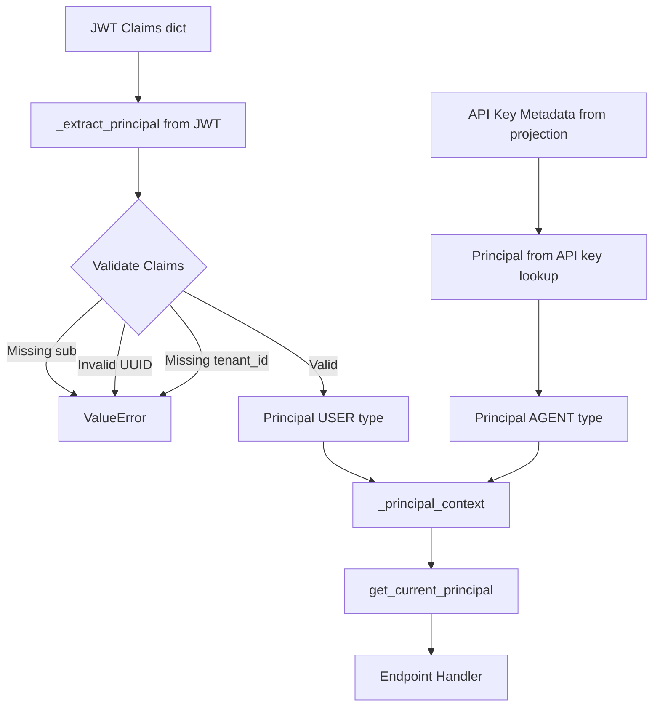

# Principal Value Object Pattern

> Frozen dataclass representing an authenticated identity with tenant context and roles

**Feature:** F-102-001, F-102-004 | **Story:** S-102-001-003, S-102-004-003
**Category:** Domain Pattern
**Last updated:** 2026-02-08

---

## Problem

JWT claims (for human users) and API key lookups (for agents) produce untyped dictionaries with no validation or type safety. Endpoint handlers need a typed representation of the authenticated identity that includes:

- Subject identifier (`sub` claim for JWT, `agent_id` for API keys) as both string and parsed UUID
- Tenant context (`tenant_id` custom claim or projection field)
- Role membership (`roles` array claim for JWT, `("agent",)` for API keys)
- Optional email and principal type (USER for JWT, AGENT for API keys)

The solution must be immutable (thread-safe), domain-pure (no external dependencies), and integrated with FastAPI dependency injection.

## Solution

A frozen dataclass in the domain layer that maps JWT claims (for users) or API key metadata (for agents) to a type-safe, immutable value object. The principal is extracted by either `AuthMiddleware` (JWT validation) or `APIKeyAuthMiddleware` (API key validation) and propagated via ContextVar for request-scoped access.

### Architecture



## Implementation

### Domain Value Object

```python
# src/{project}/shared/domain/principal.py
from dataclasses import dataclass
from enum import StrEnum
from uuid import UUID

class PrincipalType(StrEnum):
    """Type of authenticated principal."""
    USER = "user"
    AGENT = "agent"

@dataclass(frozen=True, slots=True)
class Principal:
    """Authenticated entity performing a request.

    Constructed from validated JWT claims. Immutable for thread safety
    and to prevent modification after extraction.

    Attributes:
        subject: JWT 'sub' claim -- unique principal identifier from identity provider.
        tenant_id: Tenant slug from JWT 'tenant_id' custom claim.
        user_id: UUID parsed from 'sub' claim.
        roles: Role strings from JWT 'roles' claim. Empty tuple if absent.
        email: Email from JWT 'email' claim. None if absent.
        principal_type: USER or AGENT. Defaults to USER.
    """
    subject: str
    tenant_id: str
    user_id: UUID
    roles: tuple[str, ...] = ()
    email: str | None = None
    principal_type: PrincipalType = PrincipalType.USER
```

### Extraction Logic

```python
# src/{project}/shared/infrastructure/middleware/auth.py
def _extract_principal(claims: dict[str, Any]) -> Principal:
    """Map JWT claims to Principal value object.

    Raises:
        ValueError: If required claims are missing or malformed.
    """
    sub = claims.get("sub")
    if not sub:
        raise ValueError("JWT missing required claim: sub")

    try:
        user_id = UUID(str(sub))
    except (ValueError, AttributeError):
        raise ValueError(f"JWT 'sub' claim is not a valid UUID: {sub}")

    tenant_id = claims.get("tenant_id", "")
    if not tenant_id:
        raise ValueError("JWT missing required claim: tenant_id")

    roles = claims.get("roles", [])
    if isinstance(roles, str):
        roles = [roles]  # Coerce single role string to list

    email = claims.get("email")
    principal_type_str = claims.get("principal_type", "user")

    return Principal(
        subject=str(sub),
        tenant_id=str(tenant_id),
        user_id=user_id,
        roles=tuple(roles),
        email=str(email) if email is not None else None,
        principal_type=(
            PrincipalType(principal_type_str)
            if principal_type_str in ("user", "agent")
            else PrincipalType.USER
        ),
    )
```

### ContextVar Propagation

```python
# src/{project}/shared/infrastructure/context.py
_principal_context: ContextVar[Principal | None] = ContextVar("principal_context", default=None)

def set_principal_context(principal: Principal) -> Token[Principal | None]:
    """Set the authenticated principal for the current request."""
    return _principal_context.set(principal)

def clear_principal_context(token: Token[Principal | None]) -> None:
    """Reset the principal context using the provided token."""
    _principal_context.reset(token)

def get_current_principal() -> Principal:
    """Get the authenticated principal from request context.

    Raises:
        NoRequestContextError: If called outside authenticated request.
    """
    principal = _principal_context.get()
    if principal is None:
        raise NoRequestContextError()
    return principal
```

### FastAPI Dependency Injection

```python
# src/{project}/shared/infrastructure/auth/dependencies.py
from fastapi import Depends
from typing import Annotated

def get_current_principal() -> Principal:
    """FastAPI dependency that returns the authenticated principal."""
    return _get_principal_from_context()

# Type alias for cleaner endpoint signatures
CurrentPrincipal = Annotated[Principal, Depends(get_current_principal)]

def require_role(role: str) -> Callable[..., None]:
    """Factory returning a dependency that enforces role membership."""
    def _check_role(principal: CurrentPrincipal) -> None:
        if role not in principal.roles:
            raise AuthorizationError(
                f"Required role '{role}' not found in principal roles",
                context={"required_role": role, "principal_id": principal.subject},
            )
    return _check_role
```

## Usage Patterns

### Basic Principal Access

```python
from {project}.shared.infrastructure.auth.dependencies import CurrentPrincipal

@router.post("/blocks")
def create_block(
    principal: CurrentPrincipal,
    cmd: CreateBlockCommand,
) -> BlockResponse:
    logger.info(
        "creating_block",
        extra={
            "user_id": principal.user_id,
            "tenant_id": principal.tenant_id,
            "principal_type": principal.principal_type,  # USER or AGENT
        },
    )
    # Use principal.user_id, principal.tenant_id in domain logic
    # Works identically for USER (JWT) and AGENT (API key) principals
    ...
```

### Role-Based Access Control

```python
from {project}.shared.infrastructure.auth.dependencies import require_role, CurrentPrincipal
from typing import Annotated

@router.delete("/admin/purge")
def admin_purge(
    _: Annotated[None, Depends(require_role("admin"))],  # Enforces role
    principal: CurrentPrincipal,
) -> PurgeResponse:
    # Only principals with "admin" role can reach this handler
    logger.info("admin_purge", extra={"admin_id": principal.subject})
    ...
```

### Multiple Role Requirements

```python
@router.put("/sensitive")
def sensitive_operation(
    _admin: Annotated[None, Depends(require_role("admin"))],
    _auditor: Annotated[None, Depends(require_role("auditor"))],
    principal: CurrentPrincipal,
) -> OperationResponse:
    # Requires BOTH "admin" and "auditor" roles
    ...
```

### Conditional Logic Based on Roles

```python
@router.get("/data")
def get_data(principal: CurrentPrincipal) -> DataResponse:
    if "admin" in principal.roles:
        # Return all data
        return fetch_all_data(principal.tenant_id)
    else:
        # Return filtered data for regular users
        return fetch_user_data(principal.tenant_id, principal.user_id)
```

### Conditional Logic Based on Principal Type

```python
from {project}.shared.domain.principal import PrincipalType

@router.post("/sensitive-operation")
def sensitive_operation(principal: CurrentPrincipal) -> Response:
    if principal.principal_type == PrincipalType.AGENT:
        # Agents have restricted access (e.g., read-only)
        raise AuthorizationError("Agents cannot perform this operation")

    # Only human users can proceed
    logger.info("user_action", extra={"user_id": principal.user_id})
    ...
```

### Agent Principal Creation (from API Key Auth)

```python
# In APIKeyAuthMiddleware
from {project}.shared.domain.principal import Principal, PrincipalType

# After API key validation via projection lookup
principal = Principal(
    subject=str(key_record.agent_id),
    tenant_id=key_record.tenant_id,
    user_id=key_record.agent_id,  # agent_id maps to user_id field
    roles=("agent",),  # All agents have "agent" role
    email=None,  # Agents have no email
    principal_type=PrincipalType.AGENT,
)
principal_token = set_principal_context(principal)
```

## When to Use

Use this pattern when:

- Extracting typed identity information from JWT claims
- Need immutable representation of authenticated identity
- Want type-safe access to tenant context, user ID, and roles
- Using FastAPI dependency injection for endpoint authorization

## When NOT to Use

Do NOT use this pattern when:

- Authentication is optional (public endpoints) — use `Optional[CurrentPrincipal]` or skip dependency
- Claims structure is dynamic (no fixed schema) — use dict directly
- Need to modify principal after extraction — principal is frozen by design

## Design Decisions

### DD-1: Frozen Dataclass (not Pydantic Model)

**Decision:** Use `@dataclass(frozen=True, slots=True)` instead of Pydantic `BaseModel`

**Rationale:** Principal lives in the domain layer which MUST have zero external dependencies (`import-linter` enforced). Pydantic is an infrastructure concern. Frozen dataclass provides immutability and type hints without dependencies.

**Trade-off:** No automatic validation (field validators) or JSON serialization. Validation happens in `_extract_principal()` function during extraction.

### DD-2: Tuple for Roles (not List)

**Decision:** `roles: tuple[str, ...]` instead of `list[str]`

**Rationale:** Tuples are immutable, consistent with `frozen=True`. Prevents accidental mutation like `principal.roles.append("admin")`.

**Trade-off:** Slightly less ergonomic for role checks (but `"admin" in principal.roles` works identically).

### DD-3: user_id as UUID (not String)

**Decision:** Parse `sub` claim to `UUID` during extraction

**Rationale:** Early validation at the middleware layer catches malformed UUIDs. Domain logic receives a validated UUID type, not a string that might not be a valid UUID.

**Trade-off:** The identity provider's `sub` must be a valid UUID. Non-UUID subjects (e.g., email-based `sub`) would fail extraction.

### DD-4: Separate ContextVar (not Part of RequestContext)

**Decision:** Use `_principal_context: ContextVar[Principal | None]` instead of adding `principal` field to `RequestContext` dataclass

**Rationale:** `RequestContext` is frozen and managed by `RequestContextMiddleware`. Adding a `principal` field would break the signature of `set_request_context()`. A separate ContextVar allows independent lifecycle management by `AuthMiddleware`.

**Trade-off:** Two ContextVars instead of one unified context. Benefit: Auth middleware runs independently of RequestContextMiddleware.

## Trade-offs

| Pro | Con |
|-----|-----|
| Frozen dataclass is immutable (thread-safe) | Cannot modify principal after extraction |
| Domain-pure (no external dependencies) | No automatic validation (must validate in extraction function) |
| Type-safe access to claims | Requires custom extraction logic |
| FastAPI dependency injection | Requires FastAPI framework (not portable to other frameworks) |
| Tuple roles prevent mutation | Slightly less ergonomic than list |
| UUID parsing catches malformed subjects early | Assumes subject is always a UUID (identity-provider-specific) |

## Validation Rules

| Field | Validation | Error |
|-------|-----------|-------|
| `subject` | Non-empty string | `ValueError("JWT missing required claim: sub")` |
| `user_id` | Valid UUID format | `ValueError("JWT 'sub' claim is not a valid UUID: {sub}")` |
| `tenant_id` | Non-empty string | `ValueError("JWT missing required claim: tenant_id")` |
| `roles` | List or string (coerced to tuple) | (no error, defaults to empty tuple) |
| `email` | Optional string | (no validation, can be None) |
| `principal_type` | "user" or "agent" (fallback to USER) | (no error, defaults to USER) |

## Related

- [JWT Authentication Middleware Pattern](ref-infra-jwt-auth-middleware.md) — Extracts Principal from JWT claims (USER type)
- [Multi-Auth Middleware Pattern](ref-infra-multi-auth-middleware.md) — API key and JWT auth with first-match-wins (AGENT or USER type)
- [Request Context Pattern](con-request-context.md) — ContextVar propagation pattern
- [PADR-116: JWT Authentication with JWKS Discovery](../../../decisions/patterns/PADR-116-jwt-auth-jwks.md) — Principal as part of auth strategy
- [PADR-120: Multi-Auth Middleware Sequencing](../../../decisions/patterns/PADR-120-multi-auth-middleware-sequencing.md) — First-match-wins pattern for AGENT vs USER principals
- [Error Handling](con-error-handling.md) — AuthorizationError for role-based access

## See Also

- `src/{project}/shared/domain/principal.py` — Full implementation
- `src/{project}/shared/infrastructure/middleware/auth.py` — Extraction logic
- `src/{project}/shared/infrastructure/context.py` — ContextVar propagation
- `src/{project}/shared/infrastructure/auth/dependencies.py` — FastAPI dependencies
