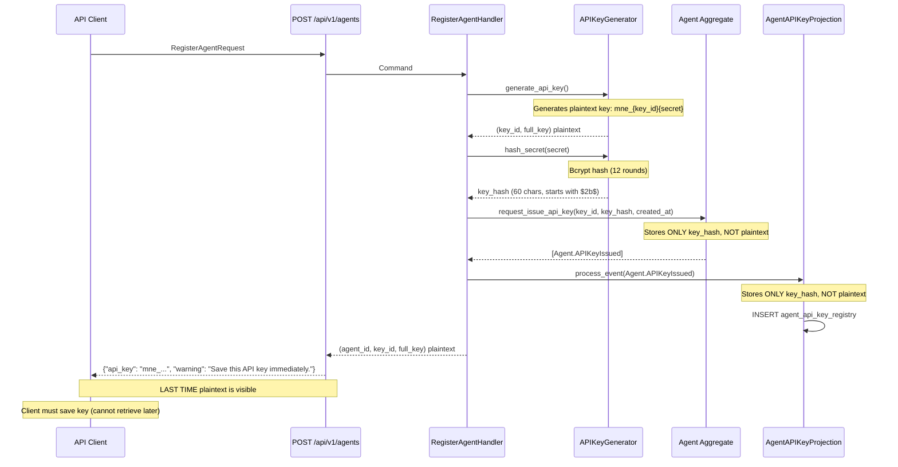
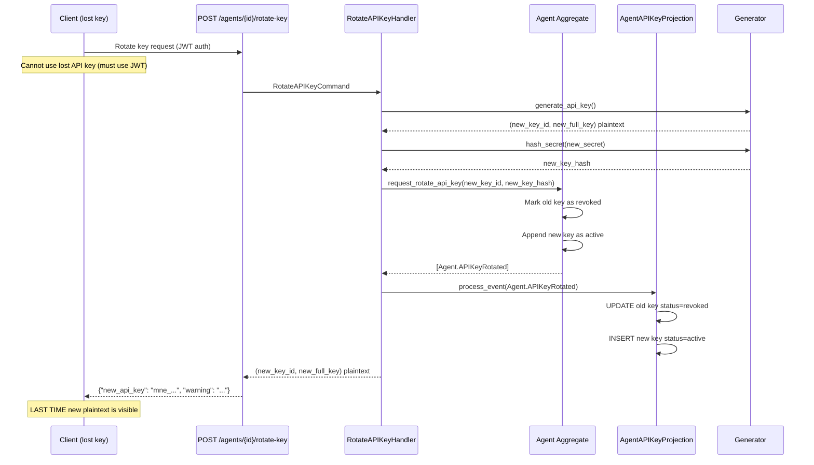

# Display-Once Credential Issuance Pattern

> Security pattern for issuing credentials (API keys, passwords, recovery codes) that are displayed only once and never retrievable

**Pattern Type:** Security + API Design
**Introduced:** F-102-004 Agent Identity (S-102-004-002, S-102-004-005)
**Status:** Active

---

## Problem

When issuing credentials (API keys, temporary passwords, MFA recovery codes), applications face a security dilemma:

1. **User needs the plaintext credential** to configure their client
2. **Storing plaintext is a security risk** (database breach exposes all credentials)
3. **Users may not save the credential** when first shown (UX friction vs security)

Common anti-patterns:
- **Store plaintext in database** with "show API key" endpoint → security breach on database dump
- **Encrypt credentials** with application key → key management complexity, still vulnerable to application-level attacks
- **Send via email** → credential exposed in email logs, transit, user's inbox
- **Allow re-display** with admin override → social engineering vector

---

## Solution

Issue credentials with **display-once** semantics enforced at all layers:



**Security guarantees:**
1. Plaintext credential NEVER logged (generator returns it, handler passes it, endpoint returns it — no logging)
2. Only one-way hash (bcrypt) stored in aggregate events and projection tables
3. No "show API key" endpoint exists (hash is irreversible)
4. If user loses credential, only option is rotation (issue new key, revoke old)

---

## Implementation

### Step 1: Key Generation (Infrastructure Layer)

From `src/{project}/shared/infrastructure/api_key_generator.py`:

```python
def generate_api_key() -> tuple[str, str]:
    """Generate API key with mne_ prefix.

    Returns:
        (key_id, full_key) where full_key = mne_{key_id}{secret}

    Security: This is the ONLY function that returns plaintext key.
    """
    key_id = secrets.token_urlsafe(6)[:8]  # 8 chars for identification
    secret = secrets.token_urlsafe(32)      # 256-bit entropy
    full_key = f"mne_{key_id}{secret}"
    return key_id, full_key

def hash_secret(secret: str) -> str:
    """Hash API key secret with bcrypt (12 rounds).

    Security: One-way hash. Cannot reverse to recover plaintext.
    """
    return bcrypt.hashpw(
        secret.encode("utf-8"),
        bcrypt.gensalt(rounds=12),
    ).decode("utf-8")
```

**Key insight:** Generator returns plaintext ONCE. All downstream code receives plaintext as a return value, not from storage.

---

### Step 2: Hash Storage (Domain + Projection Layers)

From `src/{project}/shared/domain/agent.py`:

```python
class Agent(BaseAggregate):
    def request_issue_api_key(
        self,
        key_id: str,
        key_hash: str,  # NEVER plaintext
        created_at: str,
    ) -> None:
        """Issue new API key for agent.

        Args:
            key_id: 8-char identifier (stored unhashed for lookup).
            key_hash: bcrypt hash of secret portion (NEVER plaintext).
            created_at: ISO 8601 timestamp string.
        """
        self._apply_api_key_issued(key_id=key_id, key_hash=key_hash, created_at=created_at)

    @event("APIKeyIssued")
    def _apply_api_key_issued(self, key_id: str, key_hash: str, created_at: str) -> None:
        """Apply API key issuance to aggregate state.

        Security: key_hash is stored in event payload, NOT plaintext.
        """
        self.active_keys.append(
            {
                "key_id": key_id,
                "key_hash": key_hash,  # HASH ONLY
                "created_at": created_at,
                "status": "active",
            }
        )
```

From `src/{project}/shared/infrastructure/projections/agent_api_key.py`:

```python
class AgentAPIKeyProjection(BaseProjection):
    def _handle_issued(self, event: DomainEvent) -> None:
        """UPSERT API key on issuance.

        Security: Only key_hash is stored, NOT plaintext.
        """
        self._repo.upsert(
            key_id=event.key_id,
            agent_id=event.originator_id,
            tenant_id=event.tenant_id,
            key_hash=event.key_hash,  # HASH ONLY
            status="active",
        )
```

**Guarantee:** Aggregate events and projection tables store ONLY `key_hash` (bcrypt). Plaintext is never persisted.

---

### Step 3: Display-Once Response (API Layer)

From `src/{project}/shared/slices/register_agent/endpoint.py`:

```python
class RegisterAgentResponse(BaseModel):
    """Response model for successful agent registration.

    SECURITY: The api_key field contains the plaintext API key and is
    displayed ONLY in this response. It cannot be retrieved later.
    """

    agent_id: UUID
    api_key: str = Field(
        ...,
        description="Full API key with mne_ prefix (display-once, never retrievable)",
        examples=["mne_aB3d_Z9kXyZ123456789abcdefghijklmnopqrstuvw"],
    )
    api_key_prefix: str = Field(
        ...,
        description="Key identifier prefix (first 12 chars)",
        examples=["mne_aB3d_Z9k"],
    )
    warning: str = Field(
        ...,
        description="Display-once security warning",
    )

@router.post("/", status_code=201, response_model=RegisterAgentResponse)
def register_agent(
    request: RegisterAgentRequest,
    principal: CurrentPrincipal,
    app: AgentApp,
) -> RegisterAgentResponse:
    # ... (create agent, issue key) ...
    agent_id, key_id, api_key = handler.handle(cmd)  # Plaintext returned here

    return RegisterAgentResponse(
        agent_id=agent_id,
        api_key=api_key,  # PLAINTEXT (last time visible)
        api_key_prefix=f"mne_{key_id}",
        warning="Save this API key immediately. You will not be able to view it again.",
    )
```

**Client behavior:**

```bash
# Client makes one-time request to issue API key
curl -X POST https://api.{Project}.ai/api/v1/agents \
  -H "Authorization: Bearer $JWT" \
  -d '{"agent_type_id": "claude-3-5-sonnet", "display_name": "prod-bot-01"}'

# Response (ONLY TIME plaintext is visible)
{
  "agent_id": "550e8400-e29b-41d4-a716-446655440000",
  "api_key": "mne_aB3d_Z9kXyZ123456789abcdefghijklmnopqrstuvw",
  "api_key_prefix": "mne_aB3d_Z9k",
  "warning": "Save this API key immediately. You will not be able to view it again."
}

# Client MUST save api_key to secure storage (password manager, k8s secret, vault)
# If lost, client must rotate (POST /agents/{id}/rotate-key) to get new key
```

**Anti-pattern (NOT implemented):**

```python
# DO NOT implement this endpoint
@router.get("/agents/{agent_id}/api-key")
def get_api_key(agent_id: UUID) -> dict:
    """DANGEROUS: Allows re-display of plaintext key.

    Security risk: Social engineering, insider threat, log exposure.
    """
    return {"api_key": "..."}  # NEVER DO THIS
```

---

### Step 4: Key Rotation (Security Recovery Path)

If user loses the API key, the only option is **rotation**:

From `src/{project}/shared/slices/rotate_api_key/endpoint.py`:

```python
@router.post(
    "/agents/{agent_id}/rotate-key",
    status_code=200,
    response_model=RotateAPIKeyResponse,
)
def rotate_api_key(
    agent_id: UUID,
    principal: CurrentPrincipal,
    app: AgentApp,
) -> RotateAPIKeyResponse:
    """Rotate API key atomically: revoke old key, issue new key.

    SECURITY: Old key is IMMEDIATELY INVALID after rotation (no grace period).
    New key is displayed ONCE in this response.
    """
    # ... (validate ownership, rotate key) ...
    new_key_id, new_api_key = handler.handle(cmd)  # Plaintext returned

    return RotateAPIKeyResponse(
        agent_id=agent_id,
        new_api_key=new_api_key,  # PLAINTEXT (last time visible)
        new_api_key_prefix=f"mne_{new_key_id}",
        revoked_at=datetime.now(UTC),
        warning="Save this new API key immediately. The old key is now invalid.",
    )
```

**Rotation flow:**



**Security property:** Rotation is **atomic** (old key revoked and new key issued in single event). No grace period to reduce attack surface.

---

## When to Use

- **Credential issuance** for any sensitive token (API keys, temporary passwords, MFA recovery codes)
- **Security priority** over UX convenience (users may lose keys, but cannot retrieve them)
- **One-way hashing acceptable** (bcrypt, Argon2) — no need to recover plaintext
- **Rotation acceptable** as recovery mechanism (issue new credential, revoke old)

## When NOT to Use

- **Encryption keys** where plaintext must be recoverable (use KMS/vault with access controls instead)
- **Session tokens** with short TTL (store in-memory or use JWT instead)
- **User passwords** that need "forgot password" flow (email reset link, not display-once)

---

## Security Properties

1. **Plaintext never stored:** Only bcrypt hash persisted (aggregate events + projection)
2. **Plaintext never logged:** Generator returns plaintext as return value, handler passes it, endpoint returns it — no intermediate logging
3. **One-way hash:** bcrypt with 12 rounds (irreversible, resistant to brute-force)
4. **Display-once guarantee:** No "show API key" endpoint (architectural constraint)
5. **Rotation as recovery:** Lost key requires rotation (new key issued, old key revoked atomically)
6. **Audit trail:** All key issuance and rotation events recorded in aggregate event stream

---

## Trade-offs

| Pro | Con |
|-----|-----|
| Maximum security (no plaintext storage) | User loses key → must rotate (UX friction) |
| Breach-resistant (hash-only in database) | Cannot help user recover lost key (support burden) |
| Audit trail (event sourcing) | Rotation required for recovery (extra API call) |
| No encryption key management | bcrypt verification is slow (~150ms, intentional) |

---

## Variations

### Variant 1: Grace Period on Rotation

**Current implementation:** Old key is IMMEDIATELY invalid after rotation (atomic, no grace period).

**Alternative:** Allow grace period (e.g., 5 minutes) for clients to update configuration:

```python
# In Agent aggregate
@event("APIKeyRotated")
def _apply_api_key_rotated(self, new_key_id, new_key_hash, revoked_key_id, grace_period_sec) -> None:
    # Mark old key as "pending_revocation" (still valid)
    self.active_keys = [
        {**k, "status": "pending_revocation", "revoked_at": now + grace_period_sec}
        if k["key_id"] == revoked_key_id
        else k
        for k in self.active_keys
    ]
    # Add new key
    self.active_keys.append({"key_id": new_key_id, "key_hash": new_key_hash, "status": "active"})

# Background job (TaskIQ) runs every minute
@task
def finalize_revocations():
    # Query projection for keys with revoked_at < now()
    # Update status from "pending_revocation" to "revoked"
```

**Trade-off:** More complex implementation (background job, status state machine) for better UX (zero-downtime rotation).

---

### Variant 2: Recovery Codes (Multi-Use)

For MFA recovery codes, allow **multiple display-once credentials** issued at once:

```python
class IssueRecoveryCodesResponse(BaseModel):
    recovery_codes: list[str] = Field(
        ...,
        description="10 recovery codes (display-once, never retrievable)",
    )
    warning: str = "Save these recovery codes in a secure location. You will not be able to view them again."

@router.post("/users/{user_id}/recovery-codes")
def issue_recovery_codes(user_id: UUID) -> IssueRecoveryCodesResponse:
    codes = [generate_recovery_code() for _ in range(10)]
    hashes = [hash_secret(code) for code in codes]
    # Store only hashes
    user.request_issue_recovery_codes(hashes)
    # Return plaintext codes ONCE
    return IssueRecoveryCodesResponse(recovery_codes=codes)
```

**Pattern:** Same display-once semantics, but batch issuance (10 codes at once instead of 1 API key).

---

## Related Patterns

- [ref-infra-multi-auth-middleware.md](ref-infra-multi-auth-middleware.md) — API key authentication using bcrypt verification
- [ref-infra-projection-based-auth.md](ref-infra-projection-based-auth.md) — Projection lookup for key_hash verification
- [PADR-120 Multi-Auth Middleware Sequencing](../../../decisions/patterns/PADR-120-multi-auth-middleware-sequencing.md) — API key authentication flow

---

## Testing Strategy

**Unit tests:**
1. Test generator produces unique keys on each call
2. Test hash_secret produces different hashes for same input (salt randomness)
3. Test verify_secret accepts correct plaintext, rejects incorrect
4. Test endpoint returns `api_key` in response model

**Integration tests:**
1. Test plaintext key NOT stored in aggregate events (inspect event payload)
2. Test plaintext key NOT stored in projection table (query database)
3. Test rotation invalidates old key immediately (auth with old key returns 401)
4. Test no "show API key" endpoint exists (404 on GET /agents/{id}/api-key)

From `tests/integration/shared/test_api_key_rotation.py`:

```python
def test_old_key_immediately_invalid_after_rotation(client, agent_id, old_api_key):
    """After rotation, old API key returns 401 (no grace period)."""
    # Rotate key
    response = client.post(f"/api/v1/agents/{agent_id}/rotate-key")
    assert response.status_code == 200
    new_api_key = response.json()["new_api_key"]

    # Old key immediately invalid
    response = client.get(
        "/api/v1/agents",
        headers={"X-API-Key": old_api_key},
    )
    assert response.status_code == 401

    # New key valid
    response = client.get(
        "/api/v1/agents",
        headers={"X-API-Key": new_api_key},
    )
    assert response.status_code == 200
```

---

**End of Pattern Reference**
