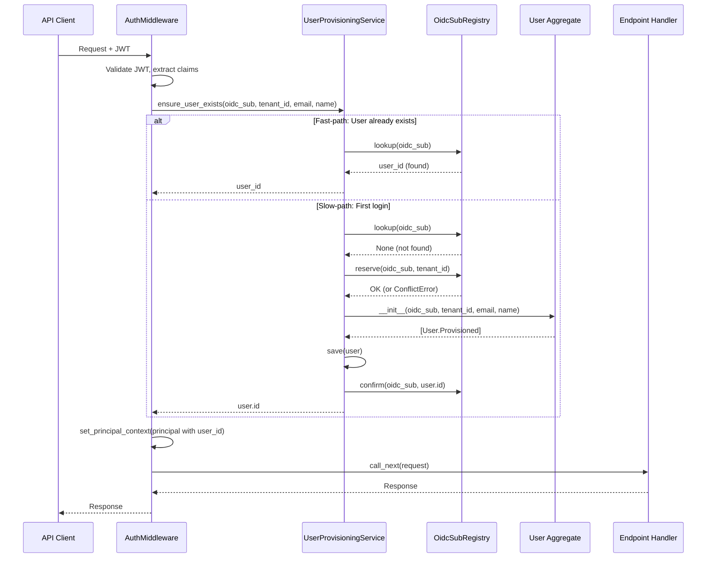

# JIT (Just-In-Time) User Provisioning Pattern

> Idempotent middleware-integrated aggregate provisioning with fast/slow path optimization

**Pattern Type:** Infrastructure
**Introduced:** F-102-003 User Provisioning (S-102-003-002)
**Status:** Active

---

## Problem

When using OIDC authentication with external identity providers (Auth0, Okta, Keycloak, etc.), users are authenticated externally but do not exist in the application's domain model until explicitly created. This creates a bootstrapping problem:

1. **First login requires user creation** — the User aggregate must be provisioned before handlers can use `principal.user_id`
2. **Concurrent first logins** can race to create the same user (duplicate prevention required)
3. **Provisioning failure** must not block authentication (non-fatal, retry on next request)
4. **Fast-path optimization** needed to avoid provisioning overhead on every request after first login
5. **Synchronous execution required** — handlers must see a valid user_id in the request context

Traditional approaches:
- **Manual provisioning** — admin creates users before first login (UX friction)
- **Async provisioning** — fire-and-forget user creation (eventual consistency issues, handler sees missing user_id)
- **Pre-flight check in handlers** — each handler checks if user exists (duplicated logic, poor separation of concerns)

---

## Solution

Integrate user provisioning directly into the authentication middleware using a **fast-path/slow-path** strategy:



**Key insights:**
1. **Fast-path dominates** — 99.9% of requests hit the registry lookup and return immediately (~0.1ms)
2. **Slow-path is atomic** — three-phase reservation pattern prevents duplicate users (see [ref-infra-slug-reservation.md](../../multi-tenancy/references/ref-infra-slug-reservation.md))
3. **Non-fatal failure** — if provisioning fails, log the error but continue authentication (user can retry)
4. **Synchronous execution** — provisioning completes before handler executes (no eventual consistency gap)

---

## Implementation

### Service Class

From `src/{project}/shared/infrastructure/user_provisioning.py`:

```python
class UserProvisioningService:
    """Orchestrates idempotent User aggregate provisioning from OIDC claims."""

    def __init__(self, app: Application[UUID], registry: OidcSubRegistry) -> None:
        self._app = app
        self._registry = registry

    def ensure_user_exists(
        self,
        oidc_sub: str,
        tenant_id: str,
        email: str | None = None,
        name: str | None = None,
    ) -> UUID:
        """Provision user if not exists. Idempotent, handles race conditions.

        Flow:
        1. Fast-path: lookup() -> return existing user_id if found
        2. Slow-path:
           - reserve(oidc_sub, tenant_id)
           - Create User aggregate
           - app.save(user)
           - confirm(oidc_sub, user.id)
        3. On ConflictError: retry lookup (race condition)
        4. On any error during creation: release(oidc_sub) (compensating action)
        """
        # 1. Fast-path: Check if user already exists
        existing_user_id = self._registry.lookup(oidc_sub)
        if existing_user_id is not None:
            return existing_user_id

        # 2. Slow-path: Provision new user
        try:
            self._registry.reserve(oidc_sub, tenant_id)
        except ConflictError:
            # Race condition: Another thread provisioned between lookup and reserve
            retry_user_id = self._registry.lookup(oidc_sub)
            if retry_user_id is not None:
                return retry_user_id
            raise  # Still None means the other thread hasn't confirmed yet

        # 2b. Create User aggregate and save (with compensating action on failure)
        try:
            user = User(oidc_sub=oidc_sub, tenant_id=tenant_id, email=email, name=name)
            self._app.save(user)
            self._registry.confirm(oidc_sub, user.id)
            return user.id
        except Exception:
            # Compensating action: Release reservation on any creation/save failure
            self._registry.release(oidc_sub)
            raise
```

### Middleware Integration

From `src/{project}/shared/infrastructure/middleware/auth.py`:

```python
async def dispatch(self, request: Request, call_next: RequestResponseEndpoint) -> Response:
    # ... JWT validation and principal extraction ...

    # Ensure User aggregate exists for this principal.
    # Synchronous: must complete before request handler executes (DD-7).
    user_provisioning = getattr(request.app.state, "user_provisioning", None)
    if user_provisioning is not None:
        try:
            user_provisioning.ensure_user_exists(
                oidc_sub=principal.subject,
                tenant_id=principal.tenant_id,
                email=claims.get("email"),
                name=claims.get("name"),
            )
        except Exception:
            # Non-fatal: log and continue (DD-4)
            # User can retry on next request
            logger.exception("user_provisioning_failed", extra={"oidc_sub": principal.subject})

    # ... set principal context and continue ...
```

### Application Startup

From `src/{project}/main.py`:

```python
@asynccontextmanager
async def lifespan(app: FastAPI) -> AsyncIterator[None]:
    # ... other initialization ...

    # Initialize User provisioning
    from {project}.shared.application.user_app import UserApplication
    from {project}.shared.infrastructure.oidc_sub_registry import OidcSubRegistry
    from {project}.shared.infrastructure.user_provisioning import UserProvisioningService

    app.state.user_app = UserApplication()
    OidcSubRegistry.ensure_table_exists(app.state.user_app)

    user_oidc_sub_registry = OidcSubRegistry(app.state.user_app)
    app.state.user_provisioning = UserProvisioningService(
        app=app.state.user_app,
        registry=user_oidc_sub_registry,
    )

    yield
```

---

## When to Use

- **OIDC-based authentication** with external identity providers
- **User aggregate required** in domain model for attribution and audit
- **First-login user creation** acceptable (vs pre-provisioning)
- **Synchronous provisioning tolerable** (latency impact ~5-10ms on first login only)
- **Idempotency required** (concurrent first logins possible)

## When NOT to Use

- Pre-provisioned users (admin creates accounts before login)
- Async-first systems where eventual consistency is acceptable
- Stateless authentication (no domain User aggregate)
- High-latency provisioning (slow external API calls required)
- User data must be fetched from external system on every request (use projection instead)

---

## Trade-offs

| Pro | Con |
|-----|-----|
| Zero manual user creation (better UX) | Slow-path adds 5-10ms to first login |
| Synchronous guarantee (handler sees user_id) | Middleware coupling to domain/application layers |
| Idempotent (safe concurrent first logins) | Non-fatal failure means user sees no error on provision failure |
| Fast-path is ~0.1ms (negligible overhead) | Registry table adds storage/query overhead |
| Race condition handling built-in | Complex error handling (compensating actions) |

---

## Performance Characteristics

From feature testing:

- **Fast-path (99.9% of requests):** Single indexed SELECT on PRIMARY KEY (~0.1ms)
- **Slow-path (first login only):** Reserve + Create + Save + Confirm (~5-10ms)
- **Race condition retry:** Adds one extra lookup SELECT (~0.1ms)
- **Memory overhead:** Registry table row per user (~100 bytes)

**Optimization:** The registry lookup uses the event store database connection (no extra connection pool required).

---

## Related

- [ref-infra-slug-reservation.md](../../multi-tenancy/references/ref-infra-slug-reservation.md) — Three-phase reservation pattern (base pattern)
- [ref-infra-jwt-auth-middleware.md](ref-infra-jwt-auth-middleware.md) — JWT validation in AuthMiddleware
- [PADR-110: Application Lifecycle](../../../decisions/patterns/PADR-110-application-lifecycle.md) — Lifespan-managed singletons
- [PADR-118: JIT User Provisioning](../../../decisions/patterns/PADR-118-jit-user-provisioning.md) — Decision to use middleware-integrated provisioning
- [ref-shared-interactions.md](../../multi-tenancy/references/ref-shared-interactions.md) — User aggregate lifecycle
