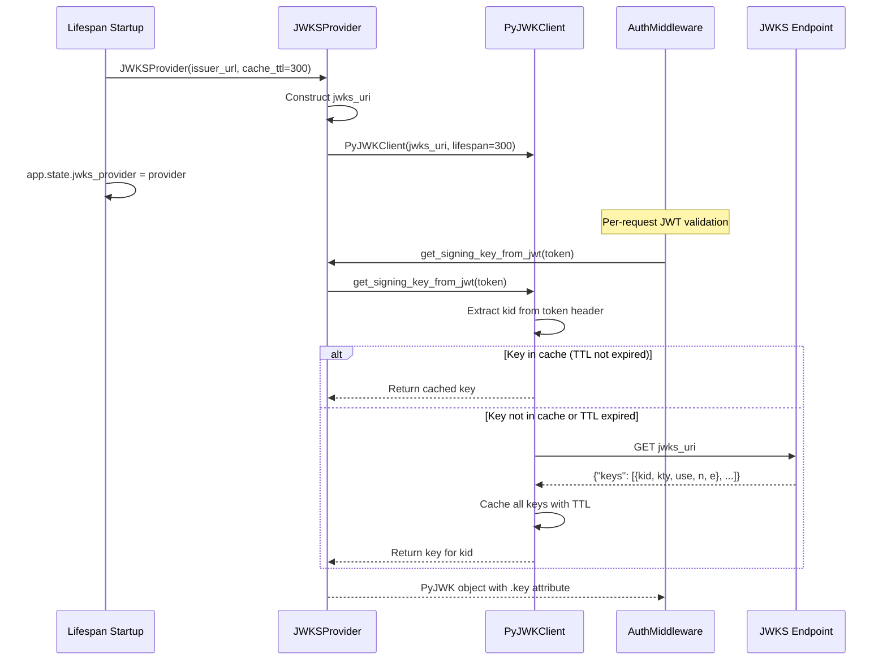

# JWKS Provider Pattern

> Lifespan singleton for caching JWT signing keys from an OIDC provider's JWKS endpoint

**Feature:** F-102-001 | **Story:** S-102-001-001
**Category:** Infrastructure Pattern
**Last updated:** 2026-02-06

---

## Problem

JWT signature verification requires fetching public keys from an OIDC provider's JWKS (JSON Web Key Set) endpoint. Fetching keys on every request is too slow (adds 50-100ms latency) and risks rate limiting from the identity provider. The solution must:

- Cache keys in memory with configurable TTL (default: 300 seconds)
- Handle key rotation transparently (when token `kid` doesn't match cached keys)
- Fail closed on network errors (return 401 rather than bypassing auth)
- Be thread-safe and async-safe for concurrent requests
- Construct JWKS URI from OIDC issuer URL following standard patterns

## Solution

A lifespan singleton that wraps PyJWT's `PyJWKClient` to provide JWKS discovery and caching. The provider is initialized once during app startup and stored in `app.state` for injection into the AuthMiddleware.

### Lifecycle



## Implementation

### Core Provider

```python
# src/{project}/shared/infrastructure/auth/jwks.py
from jwt import PyJWKClient

class JWKSProvider:
    """JWKS key provider with caching and rotation support.

    Wraps PyJWKClient to provide:
    - JWKS URI construction from OIDC issuer
    - In-memory key caching with configurable TTL
    - Automatic key refresh on kid mismatch (handles key rotation)

    Lifecycle: Created once during app lifespan startup, stored in app.state.
    """

    def __init__(self, issuer_url: str, cache_ttl: int = 300) -> None:
        if not issuer_url:
            raise ValueError("OIDC issuer URL is required for JWKS discovery")

        self._issuer_url = issuer_url.rstrip("/")
        self._cache_ttl = cache_ttl

        # Construct JWKS URI following standard OIDC pattern.
        # Full OIDC discovery (fetching .well-known/openid-configuration) is deferred
        # because standard OIDC providers follow the standard pattern.
        self._jwks_uri = f"{self._issuer_url}/.well-known/jwks.json"

        # Initialize PyJWKClient with caching enabled.
        # PyJWKClient handles kid mismatch -> refresh -> retry internally.
        self._client = PyJWKClient(
            self._jwks_uri,
            cache_jwk_set=True,
            lifespan=cache_ttl,
        )

        logger.info(
            "jwks_provider_initialized",
            extra={
                "issuer": self._issuer_url,
                "jwks_uri": self._jwks_uri,
                "cache_ttl": cache_ttl,
            },
        )

    def get_signing_key_from_jwt(self, token: str) -> PyJWK:
        """Retrieve the signing key for a JWT token.

        Extracts kid from the token header, looks up the key in cache,
        and refreshes from JWKS endpoint on cache miss.

        Raises:
            PyJWKClientError: If key cannot be found after refresh.
            PyJWKClientConnectionError: If JWKS endpoint is unreachable.
        """
        return self._client.get_signing_key_from_jwt(token)

    @property
    def jwks_uri(self) -> str:
        return self._jwks_uri

    @property
    def issuer_url(self) -> str:
        return self._issuer_url
```

### Lifespan Integration

```python
# src/{project}/main.py (in lifespan() function)
from {project}.shared.infrastructure.config.auth import get_auth_settings
from {project}.shared.infrastructure.auth.jwks import JWKSProvider

auth_settings = get_auth_settings()

if not auth_settings.dev_bypass or os.environ.get("{Project}_ENV") == "production":
    if auth_settings.issuer:
        jwks_provider = JWKSProvider(
            issuer_url=auth_settings.issuer,
            cache_ttl=auth_settings.jwks_cache_ttl,
        )
        app.state.jwks_provider = jwks_provider
        logger.info("jwks_provider_initialized")
    else:
        app.state.jwks_provider = None
        logger.warning("jwks_provider_skipped_no_issuer")
else:
    app.state.jwks_provider = None
    logger.warning("jwks_provider_skipped_dev_bypass")
```

### Middleware Usage

```python
# src/{project}/main.py (middleware registration)
app.add_middleware(
    AuthMiddleware,
    jwks_provider=getattr(app.state, "jwks_provider", None),  # Injected from lifespan
    issuer=auth_settings.issuer,
    audience=auth_settings.audience,
    dev_bypass=auth_settings.dev_bypass,
)
```

## When to Use

Use this pattern when:

- Validating RS256 (or ES256, PS256) JWTs from an OIDC provider
- Need to minimize latency by caching public keys
- OIDC provider publishes JWKS at a well-known endpoint
- Need automatic handling of key rotation (new keys added, old keys retired)

## When NOT to Use

Do NOT use this pattern when:

- Using symmetric HS256 JWTs (single shared secret, no key rotation)
- Using opaque tokens (session tokens, API keys) — no JWKS endpoint exists
- OIDC provider uses a non-standard JWKS location (can still use with explicit `jwks_uri` override)
- Using offline token validation (pre-shared public keys) — just use a static key

## Trade-offs

| Pro | Con |
|-----|-----|
| Caching reduces latency (no per-request fetch) | Key rotation has up to 300s delay (cache TTL) |
| PyJWKClient handles kid mismatch → refresh | PyJWKClient uses synchronous HTTP (brief blocking) |
| Automatic retry on key mismatch | Retry adds ~100ms latency on first use of new key |
| Thread-safe and async-safe | Cache is in-memory (not shared across app instances) |
| Standard OIDC pattern (/.well-known/jwks.json) | Non-standard providers need URI override |

## Configuration

Environment variables:

| Variable | Type | Default | Description |
|----------|------|---------|-------------|
| `{Project}_AUTH_ISSUER` | str | (required) | OIDC provider issuer URL (e.g., `https://auth.example.com`) |
| `{Project}_AUTH_JWKS_CACHE_TTL` | int | 300 | JWKS cache TTL in seconds |

Pydantic settings:

```python
# src/{project}/shared/infrastructure/config/auth.py
class AuthSettings(BaseSettings):
    issuer: str = Field(default="", description="OIDC provider issuer URL")
    jwks_cache_ttl: int = Field(default=300, ge=30, le=86400, description="JWKS cache TTL")
```

## Key Rotation Handling

When a new JWT arrives with a `kid` (key ID) not in the cache:

1. PyJWKClient detects cache miss
2. Fetches fresh JWKS from `/.well-known/jwks.json`
3. Caches all keys in the response
4. Returns the key matching the requested `kid`
5. If `kid` still not found, raises `PyJWKClientError` → 401 response

This handles key rotation gracefully:

- Identity provider adds new key to JWKS
- Old key remains in JWKS for grace period (e.g., 1 hour)
- New tokens use new `kid`, trigger cache refresh
- Old tokens still validate against cached old key (until TTL expires)

## Error Handling

| Error | Cause | Behavior |
|-------|-------|----------|
| `PyJWKClientConnectionError` | JWKS endpoint unreachable | Return 503 Service Unavailable (fail closed) |
| `PyJWKClientError` | kid not found after refresh | Return 401 Unauthorized (invalid token) |
| Empty JWKS response | Misconfigured identity provider | Raises `PyJWKClientError` → 401 |
| TTL expired during outage | JWKS endpoint down during TTL window | PyJWKClient retains cached keys until refresh succeeds |

## Related

- [JWT Authentication Middleware Pattern](ref-infra-jwt-auth-middleware.md) — Uses JWKSProvider for signature verification
- [Dev Bypass Safety Pattern](ref-infra-dev-bypass-safety.md) — Disables JWKSProvider in dev mode
- [PADR-110: Application Lifecycle](../../adr/patterns/PADR-110-application-lifecycle.md) — Lifespan singleton pattern
- [PADR-116: JWT Authentication with JWKS Discovery](../../adr/patterns/PADR-116-jwt-auth-jwks.md) — Technology choice for PyJWT + PyJWKClient

## See Also

- `src/{project}/shared/infrastructure/auth/jwks.py` — Full implementation
- `src/{project}/main.py` — Lifespan integration
- PyJWT documentation: <https://pyjwt.readthedocs.io/en/stable/usage.html#retrieve-rsa-signing-keys-from-a-jwks-endpoint>
