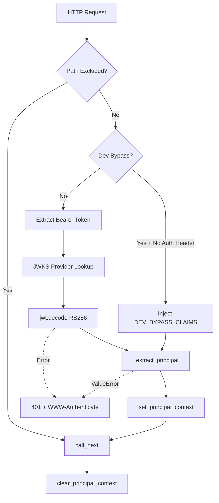

# JWT Authentication Middleware Pattern

> BaseHTTPMiddleware pattern for RS256 JWT validation with JWKS discovery, principal extraction, and dev bypass

**Feature:** F-102-001 | **Story:** S-102-001-002, S-102-001-003
**Category:** Infrastructure Pattern
**Last updated:** 2026-02-06

---

## Problem

FastAPI applications need to validate RS256-signed JWTs from an external OIDC provider on every request, extract claims into a typed `Principal` value object, and make that principal available to endpoint handlers via dependency injection. The solution must:

- Validate JWT signatures using cached public keys from a JWKS endpoint
- Support automatic key rotation detection and refresh
- Provide a development bypass for local development without an identity provider
- Propagate the principal via ContextVar for async-safe request scoping
- Return RFC 7807 Problem Details with RFC 6750 WWW-Authenticate headers on auth errors
- Exclude specific paths (/health, /docs) from authentication

## Solution

A two-layer pattern combining:

1. **AuthMiddleware** (`BaseHTTPMiddleware`) - Validates JWT, extracts claims, stores in request.state
2. **Principal extraction** - Maps claims dict to frozen `Principal` dataclass, sets ContextVar

### Architecture



### Middleware Stack Position

```
Request -> RequestIdMiddleware -> TraceContextMiddleware -> AuthMiddleware
        -> RequestContextMiddleware -> TenantStateMiddleware -> CORS -> Route
```

**Critical ordering:**

- **After RequestId/Trace**: Correlation ID and trace context available for logging
- **Before RequestContext**: Principal extracted before request context is set (future: RequestContext could read principal.user_id)
- **Before TenantState**: Tenant from JWT claim validated before tenant suspension check

## Implementation

### Core Middleware (BaseHTTPMiddleware)

```python
# src/{project}/shared/infrastructure/middleware/auth.py
class AuthMiddleware(BaseHTTPMiddleware):
    def __init__(
        self,
        app: Any,
        jwks_provider: JWKSProvider | None,
        issuer: str,
        audience: str,
        dev_bypass: bool,
    ) -> None:
        super().__init__(app)
        self._jwks_provider = jwks_provider
        self._issuer = issuer
        self._audience = audience
        self._dev_bypass = resolve_dev_bypass(dev_bypass)

    async def dispatch(self, request: Request, call_next: Callable) -> Response:
        # 1. Skip excluded paths
        if any(request.url.path.startswith(p) for p in _EXCLUDED_PREFIXES):
            return await call_next(request)

        # 2. Dev bypass (synthetic claims)
        auth_header = request.headers.get("Authorization", "")
        if self._dev_bypass and not auth_header:
            claims = dict(DEV_BYPASS_CLAIMS)
            principal = _extract_principal(claims)
            principal_token = set_principal_context(principal)
            try:
                return await call_next(request)
            finally:
                clear_principal_context(principal_token)

        # 3. Extract Bearer token
        if not auth_header or not auth_header.startswith("Bearer "):
            return self._auth_error(request, 401, "missing_token", "...")

        # 4. Validate JWT signature
        token = auth_header[7:]
        signing_key = self._jwks_provider.get_signing_key_from_jwt(token)
        claims = pyjwt.decode(
            token,
            signing_key.key,
            algorithms=["RS256"],
            issuer=self._issuer,
            audience=self._audience,
            options={"require": ["exp", "iss", "aud", "sub"]},
        )

        # 5. Extract principal and set context
        principal = _extract_principal(claims)
        principal_token = set_principal_context(principal)
        try:
            return await call_next(request)
        finally:
            clear_principal_context(principal_token)
```

### Principal Extraction (Domain Mapping)

```python
# src/{project}/shared/infrastructure/middleware/auth.py
def _extract_principal(claims: dict[str, Any]) -> Principal:
    """Map JWT claims to Principal value object."""
    sub = claims.get("sub")
    if not sub:
        raise ValueError("JWT missing required claim: sub")

    try:
        user_id = UUID(str(sub))
    except ValueError:
        raise ValueError(f"JWT 'sub' claim is not a valid UUID: {sub}")

    tenant_id = claims.get("tenant_id", "")
    if not tenant_id:
        raise ValueError("JWT missing required claim: tenant_id")

    roles = claims.get("roles", [])
    if isinstance(roles, str):
        roles = [roles]  # Coerce single role string to list

    return Principal(
        subject=str(sub),
        tenant_id=str(tenant_id),
        user_id=user_id,
        roles=tuple(roles),
        email=claims.get("email"),
        principal_type=PrincipalType(claims.get("principal_type", "user")),
    )
```

### Principal ContextVar (Request Scoping)

```python
# src/{project}/shared/infrastructure/context.py
_principal_context: ContextVar[Principal | None] = ContextVar("principal_context", default=None)

def set_principal_context(principal: Principal) -> Token[Principal | None]:
    """Set the authenticated principal for the current request."""
    return _principal_context.set(principal)

def clear_principal_context(token: Token[Principal | None]) -> None:
    """Reset the principal context using the provided token."""
    _principal_context.reset(token)

def get_current_principal() -> Principal:
    """Get the authenticated principal from request context."""
    principal = _principal_context.get()
    if principal is None:
        raise NoRequestContextError()
    return principal
```

### FastAPI Dependency Injection

```python
# src/{project}/shared/infrastructure/auth/dependencies.py
def get_current_principal() -> Principal:
    """FastAPI dependency that returns the authenticated principal."""
    return _get_principal_from_context()

CurrentPrincipal = Annotated[Principal, Depends(get_current_principal)]

def require_role(role: str) -> Callable[..., None]:
    """Factory returning a dependency that enforces role membership."""
    def _check_role(principal: CurrentPrincipal) -> None:
        if role not in principal.roles:
            raise AuthorizationError(f"Required role '{role}' not found")
    return _check_role
```

### Usage in Endpoints

```python
from {project}.shared.infrastructure.auth.dependencies import CurrentPrincipal, require_role

@router.post("/blocks")
def create_block(
    principal: CurrentPrincipal,  # Injected by FastAPI
    cmd: CreateBlockCommand,
) -> BlockResponse:
    # principal.tenant_id, principal.user_id, principal.roles available
    logger.info("creating_block", extra={"user_id": principal.user_id})
    ...

@router.delete("/admin/purge")
def admin_purge(
    _: Annotated[None, Depends(require_role("admin"))],  # Enforce role
    principal: CurrentPrincipal,
) -> PurgeResponse:
    # Only principals with "admin" role can reach this handler
    ...
```

## When to Use

Use this pattern when:

- Validating JWTs signed by an external OIDC provider (Auth0, Okta, Keycloak, etc.)
- Need to cache public keys with automatic key rotation handling
- Need typed principal extraction with custom claims (tenant_id, roles)
- Want dependency injection for principal in endpoint handlers
- Need dev bypass for local development without identity provider

## When NOT to Use

Do NOT use this pattern when:

- Using opaque tokens (session tokens, API keys) — use a different auth middleware
- Need stateful sessions — this pattern is for stateless JWT authentication
- OIDC provider does not support RS256 (only symmetric HS256) — adjust algorithm
- Frontend handles auth entirely (SPA with token in local storage) — middleware still validates, but no dev bypass

## Trade-offs

| Pro | Con |
|-----|-----|
| JWKS caching reduces latency (no per-request key fetch) | Key rotation has up to 300s delay (cache TTL) |
| Dev bypass enables local development | Dev bypass is a security risk if leaked to production |
| Principal ContextVar is async-safe | ContextVar cleanup requires `try/finally` discipline |
| BaseHTTPMiddleware matches existing middleware | BaseHTTPMiddleware has known `request.body()` limitation (not relevant for auth) |
| PyJWKClient handles key rotation automatically | PyJWKClient uses synchronous HTTP (brief blocking on refresh) |
| Frozen Principal dataclass is immutable | Cannot modify principal after extraction (by design) |

## Design Decisions

### DD-1: BaseHTTPMiddleware vs Pure ASGI

**Decision:** Use `BaseHTTPMiddleware`

**Rationale:** All 4 existing middlewares (`RequestIdMiddleware`, `TraceContextMiddleware`, `RequestContextMiddleware`, `TenantStateMiddleware`) use `BaseHTTPMiddleware`. Consistency reduces cognitive load. The known limitation (body can only be read once) does not apply to auth middleware which only reads headers.

**Trade-off:** Pure ASGI would be faster (~0.1ms), but auth middleware time is dominated by JWT signature verification (~1-3ms).

### DD-2: Separate Principal ContextVar

**Decision:** Add `_principal_context: ContextVar[Principal | None]` rather than extending `RequestContext` dataclass

**Rationale:** `RequestContext` is frozen and has an established lifecycle. Adding a `principal` field would break the `set_request_context()` signature. A separate ContextVar allows independent lifecycle management by `AuthMiddleware`.

**Trade-off:** Two separate ContextVars vs one unified context. Benefit: Auth middleware runs before RequestContextMiddleware, so principal extraction can occur independently.

### DD-3: PyJWKClient (not custom JWKS fetcher)

**Decision:** Wrap PyJWT's `PyJWKClient` instead of implementing custom JWKS fetching with httpx

**Rationale:** PyJWKClient handles caching, TTL, kid-based refresh, and thread safety internally. Custom implementation would duplicate ~100 lines of logic.

**Trade-off:** PyJWKClient uses synchronous HTTP (`urllib`) which blocks briefly during JWKS refresh. Acceptable because refreshes happen every ~300 seconds, not per-request.

### DD-4: JWKS URI Construction (not full OIDC discovery)

**Decision:** Construct JWKS URI as `{issuer}/.well-known/jwks.json` instead of fetching `.well-known/openid-configuration` first

**Rationale:** Standard OIDC providers follow the standard OIDC convention. Full discovery adds a startup network call with no benefit when the issuer is standards-compliant.

**Trade-off:** Non-standard OIDC providers require an override. Can add `{Project}_AUTH_JWKS_URI` env var if needed.

## Related

- [JWKS Provider Pattern](ref-infra-jwks-provider.md) — JWKS caching and key rotation
- [Dev Bypass Safety Pattern](ref-infra-dev-bypass-safety.md) — Production lockout for auth bypass
- [Principal Value Object](ref-domain-principal.md) — Frozen dataclass for authenticated identity
- [Request Context Pattern](con-request-context.md) — ContextVar propagation pattern
- [PADR-109: Sync-First Event Sourcing](../../adr/patterns/PADR-109-sync-first-eventsourcing.md) — Middleware async strategy
- [PADR-110: Application Lifecycle](../../adr/patterns/PADR-110-application-lifecycle.md) — Lifespan singleton pattern
- [PADR-116: JWT Authentication with JWKS Discovery](../../adr/patterns/PADR-116-jwt-auth-jwks.md) — Architectural decision covering this implementation

## See Also

- `src/{project}/shared/infrastructure/middleware/auth.py` — Full implementation
- `src/{project}/shared/infrastructure/context.py` — Principal ContextVar
- `src/{project}/shared/infrastructure/auth/dependencies.py` — FastAPI dependencies
- `src/{project}/shared/domain/principal.py` — Principal value object
