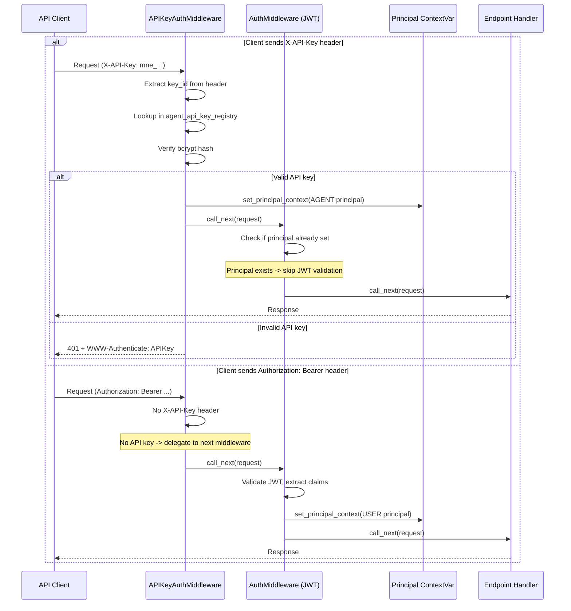

# Multi-Auth Middleware Pattern (First-Match-Wins)

> Sequential middleware composition for multiple authentication mechanisms with clean separation of concerns

**Pattern Type:** Infrastructure
**Introduced:** F-102-004 Agent Identity (S-102-004-003)
**Status:** Active
**Related ADR:** [PADR-120 Multi-Auth Middleware Sequencing](../../../decisions/patterns/PADR-120-multi-auth-middleware-sequencing.md)

---

## Problem

Modern APIs often need to support multiple authentication mechanisms for different client types:
- **Human users** authenticate via JWT tokens (OIDC/OAuth2 flows)
- **Machine clients** (agents, services, cron jobs) authenticate via API keys
- **Internal services** may use mTLS certificates
- **Legacy clients** may require Basic Auth or HMAC signatures

Traditional approaches:
- **Unified auth middleware with switch statement** — Violates Single Responsibility Principle, hard to test, complex branching
- **Header priority flags (X-Prefer-Auth)** — Unnecessary complexity, client already controls via header presence
- **All-mechanisms validation** — If multiple headers present, which wins? Requires complex fallback logic

---

## Solution

Implement each authentication mechanism as a **separate middleware** with **first-match-wins** semantics via shared `Principal` ContextVar:



**Key principles:**
1. **Sequential processing:** Middleware execute in LIFO registration order (last added = first executed)
2. **First-match-wins:** First middleware to set `Principal` context wins, later middlewares skip
3. **Fail-fast:** Invalid credentials return 401 immediately, no fallback to weaker auth
4. **Separation of concerns:** Each middleware handles one auth mechanism, easy to test and maintain

---

## Implementation

### Middleware 1: API Key Authentication (Runs FIRST)

From `src/{project}/shared/infrastructure/middleware/api_key_auth.py`:

```python
class APIKeyAuthMiddleware(BaseHTTPMiddleware):
    """API key validation middleware for agent authentication."""

    async def dispatch(
        self,
        request: Request,
        call_next: Callable[[Request], Awaitable[Response]],
    ) -> Response:
        # 1. Skip excluded paths
        path = request.url.path
        if any(path.startswith(prefix) for prefix in _EXCLUDED_PREFIXES):
            return await call_next(request)

        # 2. Check if principal already set by earlier middleware (defensive)
        if get_optional_principal() is not None:
            return await call_next(request)

        # 3. Extract X-API-Key header
        api_key_header = request.headers.get("X-API-Key", "")
        if not api_key_header:
            # No API key -> delegate to next middleware (JWT)
            return await call_next(request)

        # 4. Validate API key format and lookup
        # ... (validation logic) ...

        # 5. Set principal context and continue
        principal = Principal(
            subject=str(key_record.agent_id),
            tenant_id=key_record.tenant_id,
            user_id=key_record.agent_id,
            roles=("agent",),
            email=None,
            principal_type=PrincipalType.AGENT,
        )
        principal_token = set_principal_context(principal)
        try:
            return await call_next(request)
        finally:
            clear_principal_context(principal_token)
```

**Key behaviors:**
- No X-API-Key header → delegate to next middleware (JWT)
- Invalid API key → return 401 (fail-fast, no delegation)
- Valid API key → set principal context, continue to next middleware

---

### Middleware 2: JWT Authentication (Runs SECOND)

From `src/{project}/shared/infrastructure/middleware/auth.py`:

```python
class AuthMiddleware(BaseHTTPMiddleware):
    """JWT validation middleware with RS256 signature verification."""

    async def dispatch(
        self,
        request: Request,
        call_next: Callable[[Request], Awaitable[Response]],
    ) -> Response:
        # 0. Check if principal already set by APIKeyMiddleware (first-match-wins)
        if get_optional_principal() is not None:
            return await call_next(request)

        # 1. Skip excluded paths
        path = request.url.path
        if any(path.startswith(prefix) for prefix in _EXCLUDED_PREFIXES):
            return await call_next(request)

        # 2. Extract Authorization: Bearer header
        auth_header = request.headers.get("Authorization", "")
        if not auth_header:
            return self._auth_error(
                request, 401, "missing_token", "Authorization header is required"
            )

        # 3. Validate JWT
        # ... (validation logic) ...

        # 4. Set principal context and continue
        principal = _extract_principal(claims)
        principal_token = set_principal_context(principal)
        try:
            return await call_next(request)
        finally:
            clear_principal_context(principal_token)
```

**Key change from single-auth:**
- **Line 0 added:** Check if principal already set by APIKeyMiddleware → skip JWT validation

---

### Application Startup (Middleware Registration Order)

From `src/{project}/main.py`:

```python
@asynccontextmanager
async def lifespan(app: FastAPI) -> AsyncIterator[None]:
    # ... (initialization) ...
    yield

# Middleware registration (LIFO order: last added = first executed)
app.add_middleware(TenantStateMiddleware)  # Runs 3rd
app.add_middleware(AuthMiddleware, ...)     # Runs 2nd
app.add_middleware(APIKeyAuthMiddleware)    # Runs 1st (added last)
app.add_middleware(RequestIdMiddleware)     # Runs 0th (outermost)
```

**Critical ordering:**
1. `APIKeyAuthMiddleware` MUST be added AFTER `AuthMiddleware` (LIFO = reverse execution order)
2. Both auth middlewares MUST run BEFORE `TenantStateMiddleware` (tenant context depends on principal)
3. `RequestIdMiddleware` runs outermost (request tracking for all requests)

---

## When to Use

- **Multiple client types** with different auth mechanisms (humans vs machines vs services)
- **Clean separation of concerns** preferred over unified switch statement
- **Extensibility required** — adding new auth mechanisms should not modify existing code
- **Fail-fast semantics** — invalid credentials should return 401 immediately, no fallback

## When NOT to Use

- Single authentication mechanism only (no need for multi-auth pattern)
- Client can send multiple credentials simultaneously (need fallback/priority logic)
- Auth mechanisms share validation logic (extract into shared utility instead)

---

## Trade-offs

| Pro | Con |
|-----|-----|
| Clean separation (one middleware per auth type) | Middleware ordering is critical (misconfiguration risk) |
| Easy to test (mock one auth mechanism at a time) | Shared ContextVar contract (all middlewares must use Principal) |
| Extensible (add new auth without modifying existing) | First-match-wins may surprise users (no "try all mechanisms") |
| Fail-fast for invalid credentials | Must check `get_optional_principal()` in every middleware |

---

## Variations

### Variant 1: Auth Mechanism Priority

If both `X-API-Key` and `Authorization: Bearer` are present, which wins?

**Current implementation:** API key wins (APIKeyAuthMiddleware runs first)

**Alternative:** Check both headers, return 400 Bad Request if both present (force client to choose)

```python
# In APIKeyAuthMiddleware
api_key_header = request.headers.get("X-API-Key", "")
auth_header = request.headers.get("Authorization", "")
if api_key_header and auth_header:
    return self._auth_error(
        request, 400, "multiple_auth_headers",
        "Cannot use both X-API-Key and Authorization headers"
    )
```

**Trade-off:** Stricter client contract (less flexible) but clearer semantics.

---

### Variant 2: Optional Authentication

Some endpoints may be **public** (no auth required) but **enhanced** if auth is present (e.g., rate limits).

**Implementation:** Skip `missing_token` error if endpoint is marked public:

```python
# In AuthMiddleware
if not auth_header:
    # Check if endpoint is public
    if is_public_endpoint(request.url.path):
        return await call_next(request)  # No principal set (anonymous)
    return self._auth_error(...)  # Auth required
```

**Endpoint marker:**

```python
@router.get("/public-data", tags=["public"])
def get_public_data(principal: Principal | None = Depends(get_optional_principal)):
    if principal:
        # Authenticated user: higher rate limit
        pass
    else:
        # Anonymous: lower rate limit
        pass
```

---

## Related Patterns

- [ref-infra-jwt-auth-middleware.md](ref-infra-jwt-auth-middleware.md) — JWT validation (single-auth predecessor)
- [ref-infra-projection-based-auth.md](ref-infra-projection-based-auth.md) — Projection lookup for auth (used by APIKeyAuthMiddleware)
- [ref-domain-principal.md](ref-domain-principal.md) — Principal value object (shared contract between middlewares)
- [PADR-116 JWT Auth JWKS](../../../decisions/patterns/PADR-116-jwt-auth-jwks.md) — JWT validation pattern
- [PADR-120 Multi-Auth Middleware Sequencing](../../../decisions/patterns/PADR-120-multi-auth-middleware-sequencing.md) — Formal decision

---

## Performance Characteristics

**Fast-path (API key auth):**
- Header extraction: ~0.01ms
- Projection lookup (indexed): ~0.1ms
- bcrypt verification: ~150ms (intentional slowdown for brute-force protection)
- **Total:** ~150ms (dominated by bcrypt)

**Fast-path (JWT auth):**
- Header extraction: ~0.01ms
- JWKS cache lookup: ~0.01ms (cached) or ~50ms (JWKS fetch on cache miss)
- JWT decode + verify: ~1-3ms
- **Total:** ~1-3ms (cached) or ~50ms (JWKS fetch)

**Optimization:** API key middleware can skip bcrypt for revoked/unknown keys (check status before hash verification).

---

## Testing Strategy

**Unit tests:**
1. Test each middleware in isolation with mocked ContextVar
2. Test excluded paths bypass auth
3. Test invalid credentials return 401
4. Test valid credentials set principal context

**Integration tests:**
1. Test both headers present (which wins?)
2. Test API key middleware runs before JWT middleware (first-match-wins)
3. Test middleware ordering (swap registration order, verify failure)

From `tests/integration/shared/test_api_key_auth_integration.py`:

```python
def test_api_key_wins_over_jwt(client, valid_api_key, valid_jwt):
    """When both X-API-Key and Authorization headers present, API key wins."""
    response = client.get(
        "/api/v1/agents",
        headers={
            "X-API-Key": valid_api_key,
            "Authorization": f"Bearer {valid_jwt}",
        },
    )
    assert response.status_code == 200
    principal = get_current_principal()
    assert principal.principal_type == PrincipalType.AGENT  # API key won
```

---

**End of Pattern Reference**
