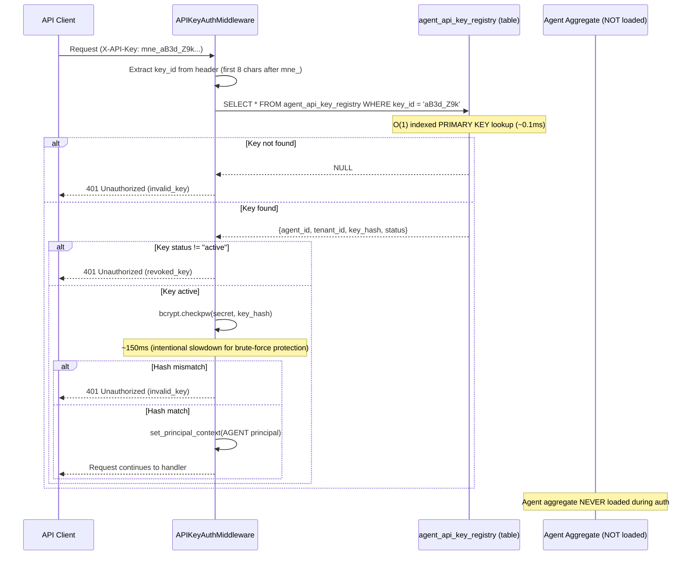

# Projection-Based Authentication Pattern

> Use projection tables for authentication lookups instead of aggregate hydration for O(1) performance and DoS resistance

**Pattern Type:** Infrastructure
**Introduced:** F-102-004 Agent Identity (S-102-004-003)
**Status:** Active
**Related ADR:** [PADR-121 Projection-Based Authentication](../../../decisions/patterns/PADR-121-projection-based-authentication.md)
**Related Pattern:** [ref-infra-jit-provisioning.md](ref-infra-jit-provisioning.md) (similar fast-path lookup)

---

## Problem

In event-sourced systems, aggregates are hydrated from event streams (O(n) events). Authentication lookups happen on **every request** and must be **fast** (< 1ms) and **DoS-resistant**.

Traditional approaches:
- **Aggregate hydration for auth:** Load Agent aggregate from event store → extract key_hash → verify bcrypt
  - **Performance:** O(n) events (50-500ms for 100-1000 events per aggregate)
  - **DoS risk:** Failed auth attempts trigger expensive aggregate loading (millions of requests = OutOfMemory)
  - **Coupling:** Auth middleware depends on domain aggregate internals (hexagonal ports violated)

- **Cache aggregates in-memory:** Hydrate once, cache for TTL
  - **Memory overhead:** 100,000 agents × 10 KB each = 1 GB RAM
  - **Invalidation complexity:** Event propagation to cache, race conditions, stale data
  - **Still O(n) on cache miss:** First request or TTL expiry triggers full hydration

---

## Solution

Use **projection tables** for authentication lookups. Projections are materialized read models updated **synchronously** (PADR-109) when events are saved.



**Key insight:** Projection table stores **only the data needed for auth** (key_id, key_hash, agent_id, tenant_id, status). Aggregate contains **full domain state** (display_name, agent_type_id, lifecycle events, audit trail).

---

## Implementation

### Projection Table Schema

From `migrations/versions/20260209_0329_9321c29d2ec5_create_agent_api_key_registry.py`:

```sql
CREATE TABLE agent_api_key_registry (
    key_id VARCHAR(8) PRIMARY KEY,      -- Lookup key (indexed)
    agent_id UUID NOT NULL,             -- Owner reference
    tenant_id VARCHAR(63) NOT NULL,     -- Tenant boundary
    key_hash TEXT NOT NULL,             -- bcrypt hash (60 chars)
    status VARCHAR(20) NOT NULL DEFAULT 'active',  -- 'active' | 'revoked'
    created_at TIMESTAMP WITH TIME ZONE NOT NULL DEFAULT NOW(),
    revoked_at TIMESTAMP WITH TIME ZONE
);

-- Index for listing keys by agent (management endpoints)
CREATE INDEX idx_agent_api_keys_agent_status
    ON agent_api_key_registry (agent_id, status);

-- Index for tenant-scoped queries (admin dashboards)
CREATE INDEX idx_agent_api_keys_tenant
    ON agent_api_key_registry (tenant_id);

-- RLS for tenant isolation (per PADR-115)
ALTER TABLE agent_api_key_registry ENABLE ROW LEVEL SECURITY;
ALTER TABLE agent_api_key_registry FORCE ROW LEVEL SECURITY;
CREATE POLICY tenant_isolation_agent_api_key_registry
    ON agent_api_key_registry
    USING (tenant_id = current_setting('app.current_tenant', true));
```

**Design decisions:**
- `key_id` is PRIMARY KEY (O(1) lookup for auth)
- `key_hash` is TEXT (bcrypt hash, 60 chars starting with `$2b$`)
- `status` column for revocation (check BEFORE bcrypt verification to fail fast)
- RLS enabled (tenant isolation for management queries, bypassed for auth)

---

### Projection Update (Synchronous, PADR-109)

From `src/{project}/shared/infrastructure/projections/agent_api_key.py`:

```python
class AgentAPIKeyProjection(BaseProjection):
    """Materializes Agent API key events into agent_api_key_registry projection table."""

    topics: ClassVar[tuple[str, ...]] = (
        "{Project}.shared.domain.agent:Agent.APIKeyIssued",
        "{Project}.shared.domain.agent:Agent.APIKeyRotated",
    )

    def _handle_issued(self, event: DomainEvent) -> None:
        """UPSERT API key on issuance (idempotent for replay)."""
        self._repo.upsert(
            key_id=event.key_id,
            agent_id=event.originator_id,
            tenant_id=event.tenant_id,
            key_hash=event.key_hash,
            status="active",
        )

    def _handle_rotated(self, event: DomainEvent) -> None:
        """Atomically revoke old key and insert new key on rotation."""
        # Revoke old key
        self._repo.update_status(
            key_id=event.revoked_key_id,
            status="revoked",
        )
        # Insert new key
        self._repo.upsert(
            key_id=event.new_key_id,
            agent_id=event.originator_id,
            tenant_id=event.tenant_id,
            key_hash=event.new_key_hash,
            status="active",
        )
```

**Guarantee (PADR-109):** Projections run **synchronously** in the same transaction as event storage. When `app.save(agent)` returns, projection table is already updated. No eventual consistency gap.

---

### Repository Lookup (RLS Bypass for Auth)

From `src/{project}/shared/infrastructure/agent_api_key_repository.py`:

```python
class AgentAPIKeyRepository:
    """Repository for agent_api_key_registry projection CRUD."""

    def lookup_by_key_id(self, key_id: str) -> AgentAPIKeyRow | None:
        """Look up API key record by key_id for authentication.

        This query runs WITHOUT RLS enforcement (middleware connection
        bypasses tenant context). Returns None if key not found.
        """
        with self._session_factory() as session:
            result = session.execute(
                text("""
                    SELECT key_id, agent_id, tenant_id, key_hash,
                           status, created_at, revoked_at
                    FROM agent_api_key_registry
                    WHERE key_id = :key_id
                """),
                {"key_id": key_id},
            )
            row = result.fetchone()
            if row is None:
                return None

            return AgentAPIKeyRow(
                key_id=str(row[0]),
                agent_id=UUID(str(row[1])),
                tenant_id=str(row[2]),
                key_hash=str(row[3]),
                status=str(row[4]),
                created_at=row[5],
                revoked_at=row[6],
            )
```

**RLS bypass:** Auth middleware runs BEFORE `TenantStateMiddleware` sets `app.current_tenant` session variable. Without tenant context, RLS would block all rows. Auth repository uses **superuser connection** (bypasses RLS) to look up keys across all tenants. **Security:** Lookup is read-only; tenant isolation is enforced AFTER principal context is set.

---

### Middleware Usage

From `src/{project}/shared/infrastructure/middleware/api_key_auth.py`:

```python
async def dispatch(self, request: Request, call_next: Callable) -> Response:
    # ... (extract key_id from X-API-Key header) ...

    # Projection lookup (NOT aggregate hydration)
    key_record = repo.lookup_by_key_id(key_id)
    if key_record is None:
        return self._auth_error(request, 401, "invalid_key", "API key is invalid or does not exist")

    # Check status BEFORE bcrypt (fail fast for revoked keys)
    if key_record.status != "active":
        return self._auth_error(request, 401, "revoked_key", "API key has been revoked")

    # Verify bcrypt hash (timing-safe comparison)
    is_valid = bcrypt.checkpw(secret.encode("utf-8"), key_record.key_hash.encode("utf-8"))
    if not is_valid:
        return self._auth_error(request, 401, "invalid_key", "API key is invalid")

    # Set principal context and continue
    principal = Principal(
        subject=str(key_record.agent_id),
        tenant_id=key_record.tenant_id,
        user_id=key_record.agent_id,
        roles=("agent",),
        email=None,
        principal_type=PrincipalType.AGENT,
    )
    # ... (set principal, call next middleware) ...
```

**Performance optimization:** Check `status != "active"` BEFORE bcrypt verification. Revoked/unknown keys fail in ~0.1ms, not ~150ms (bcrypt cost).

---

## When to Use

- **Authentication lookups** that run on every request (API keys, session tokens, OAuth2 access tokens)
- **High request volume** where aggregate hydration would be too slow (> 1ms per request)
- **DoS resistance required** (failed auth attempts should not trigger expensive operations)
- **Event-sourced aggregates** with growing event streams (100+ events per aggregate)

## When NOT to Use

- **Command handling** (use aggregates, not projections — commands need full domain state)
- **Complex authorization** (ReBAC engine relationships, not projection tables)
- **Read-after-write consistency required** (projections are synchronous, but this pattern assumes eventual consistency is acceptable)
- **Aggregates with few events** (< 10 events per aggregate → hydration is fast enough)

---

## Trade-offs

| Pro | Con |
|-----|-----|
| O(1) performance (indexed PRIMARY KEY lookup) | Projection table must be kept in sync (synchronous updates required) |
| DoS-resistant (failed auth = fast SELECT, not aggregate loading) | RLS bypass needed (auth runs before tenant context is set) |
| Decouples auth from domain (middleware uses projection, not aggregate) | Agent status NOT checked (projection has key status, not agent status) |
| Scales to millions of requests (constant-time lookup) | Additional storage (projection table + event store) |

---

## Consequences

### Trade-off: Agent Status Not Checked

**Current implementation:** Projection table stores `key_status` (active/revoked), NOT `agent_status` (active/suspended).

**Implication:** Suspending an agent does NOT automatically revoke their API keys. Keys remain valid until explicitly revoked.

**Mitigation options:**
1. **Accept the trade-off** (current implementation) — suspending an agent is a separate command from revoking keys
2. **Add agent_status column to projection** — projection subscribes to `Agent.Suspended` event and updates column
3. **Auto-revoke keys on suspension** — `Agent.request_suspend()` emits `Agent.AllKeysRevoked` event

**Chosen approach (F-102-004):** Option 1 (accept trade-off). Rationale: Suspending an agent is rare; revoking keys is an explicit security action. Auto-revocation can be added in future if needed.

---

## Performance Characteristics

**Projection lookup (auth path):**
- SELECT on PRIMARY KEY: ~0.1ms (indexed)
- bcrypt verification: ~150ms (intentional slowdown for brute-force protection)
- **Total:** ~150ms (dominated by bcrypt)

**Aggregate hydration (NOT used for auth):**
- Load 100 events from event store: ~10ms
- Deserialize and apply events: ~5ms
- **Total:** ~15ms (100 events) or ~150ms (1000 events)

**Optimization:** For agents with 1000+ events, projection-based auth is **100x faster** than aggregate hydration (~150ms vs ~15000ms for bcrypt + hydration).

---

## Variations

### Variant 1: Add Agent Status to Projection

Add `agent_status` column to projection table for real-time suspension enforcement:

```sql
ALTER TABLE agent_api_key_registry
    ADD COLUMN agent_status VARCHAR(20) NOT NULL DEFAULT 'ACTIVE';

CREATE INDEX idx_agent_api_keys_agent_status
    ON agent_api_key_registry (agent_id, agent_status);
```

Projection subscribes to `Agent.Suspended` and `Agent.Reactivated` events:

```python
class AgentAPIKeyProjection(BaseProjection):
    topics: ClassVar[tuple[str, ...]] = (
        "{Project}.shared.domain.agent:Agent.APIKeyIssued",
        "{Project}.shared.domain.agent:Agent.APIKeyRotated",
        "{Project}.shared.domain.agent:Agent.Suspended",  # NEW
        "{Project}.shared.domain.agent:Agent.Reactivated",  # NEW
    )

    def _handle_suspended(self, event: DomainEvent) -> None:
        """Update agent_status for all keys owned by this agent."""
        self._repo.update_agent_status(
            agent_id=event.originator_id,
            agent_status="SUSPENDED",
        )
```

Middleware checks `agent_status` before bcrypt:

```python
if key_record.agent_status != "ACTIVE":
    return self._auth_error(request, 401, "suspended_agent", "Agent is suspended")
```

**Trade-off:** More complex projection (3 event types instead of 2), but real-time suspension enforcement.

---

### Variant 2: Projection-Based Session Validation

Same pattern applies to session tokens:

```sql
CREATE TABLE user_sessions (
    session_id UUID PRIMARY KEY,
    user_id UUID NOT NULL,
    tenant_id VARCHAR(63) NOT NULL,
    refresh_token_hash TEXT NOT NULL,
    expires_at TIMESTAMP WITH TIME ZONE NOT NULL,
    revoked_at TIMESTAMP WITH TIME ZONE
);

CREATE INDEX idx_user_sessions_user ON user_sessions (user_id);
```

Auth middleware validates refresh token via projection lookup:

```python
session_record = session_repo.lookup_by_session_id(session_id)
if session_record is None or session_record.expires_at < now():
    return self._auth_error(request, 401, "invalid_session", "Session expired or invalid")
```

**Pattern:** Same O(1) projection lookup, different entity (User sessions instead of Agent API keys).

---

## Related Patterns

- [ref-infra-jit-provisioning.md](ref-infra-jit-provisioning.md) — Fast-path projection lookup for OidcSubRegistry (similar pattern)
- [ref-infra-multi-auth-middleware.md](ref-infra-multi-auth-middleware.md) — API key authentication flow using projection lookup
- [ref-infra-delta-counter-projection.md](../../event-store-cqrs/references/ref-infra-delta-counter-projection.md) — Delta-based projection updates (different use case, same synchronous guarantee)
- [PADR-109 Sync-First Eventsourcing](../../../decisions/patterns/PADR-109-sync-first-eventsourcing.md) — Synchronous projection updates
- [PADR-121 Projection-Based Authentication](../../../decisions/patterns/PADR-121-projection-based-authentication.md) — Formal decision

---

## Testing Strategy

**Unit tests:**
1. Test projection handles `Agent.APIKeyIssued` event (UPSERT row)
2. Test projection handles `Agent.APIKeyRotated` event (UPDATE old key + INSERT new key)
3. Test repository `lookup_by_key_id()` returns None for unknown key_id
4. Test repository returns row with correct fields for known key_id

**Integration tests:**
1. Test auth middleware uses projection, NOT aggregate (no event store queries during auth)
2. Test projection updated synchronously (save agent → query projection → row exists)
3. Test revoked key returns 401 (check status before bcrypt)
4. Test RLS bypass (auth lookup works before `app.current_tenant` is set)

From `tests/integration/shared/test_api_key_auth_integration.py`:

```python
def test_auth_does_not_hydrate_aggregate(client, valid_api_key, mock_event_store):
    """Auth middleware uses projection lookup, NOT aggregate hydration."""
    response = client.get(
        "/api/v1/agents",
        headers={"X-API-Key": valid_api_key},
    )
    assert response.status_code == 200

    # Verify event store was NOT queried (no aggregate hydration)
    assert mock_event_store.call_count == 0
```

---

**End of Pattern Reference**
